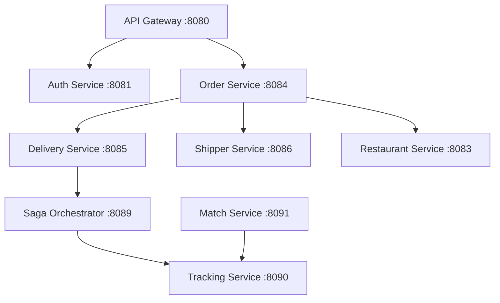

# 🤖 Advanced AI Coding Instructions - DeliveryVN Microservices Platform

*These instructions enhance the existing backend development guidelines with specific AI coding patterns, debugging workflows, and platform-specific knowledge.*

## 🎯 **AI Agent Quick Start**

### Essential Context Understanding
When working with this codebase, AI agents must understand:

1. **Microservices Architecture**: 11 services with clear separation of concerns
2. **Port Allocation**: Fixed ports 8080-8091 for different services  
3. **Reference Implementation**: Restaurant Service is the golden standard
4. **Constructor Injection**: Mandatory pattern replacing @Autowired field injection
5. **BaseResponse Wrapper**: All APIs return BaseResponse<T> format
6. **Header-based Auth**: X-User-Id and X-Role headers for security

### Services Overview & Capabilities
```yaml
# Core Services Portfolio
api-gateway: 8080      # Routing & centralized security
auth-service: 8081     # JWT authentication & sessions  
user-service: 8082     # User profile management
restaurant-service: 8083  # Reference implementation (GOLDEN STANDARD)
order-service: 8084    # Complete CRUD with shipper assignment
delivery-service: 8085 # Delivery lifecycle & status tracking
shipper-service: 8086  # Shipper profiles & balance management
notification-service: 8087  # Push notifications & alerts
search-service: 8088   # Search & filtering capabilities
saga-orchestrator: 8089     # Event-driven distributed transactions
tracking-service: 8090      # Redis GEO spatial location tracking
match-service: 8091         # Non-blocking shipper matching with WebFlux
```

---

## 🛠️ **AI Development Patterns**

### 1. Service Creation Workflow
When creating a new service, AI agents should follow this sequence:

```java
// ✅ STEP 1: Copy pom.xml from restaurant-service (Reference Implementation)
// ✅ STEP 2: Update application.properties with unique port & database
// ✅ STEP 3: Implement core structure following BaseResponse pattern
// ✅ STEP 4: Add Constructor Injection (never @Autowired fields)
// ✅ STEP 5: Create Constants classes for paths & headers
// ✅ STEP 6: Implement GlobalExceptionHandler
```

### 2. Controller Pattern (Mandatory Structure)
```java
@RestController
@RequestMapping(ApiPathConstants.{ENTITIES})
public class {Entity}Controller {
    
    private final {Entity}Service {entity}Service;
    
    // ✅ Constructor Injection (NEVER @Autowired)
    public {Entity}Controller({Entity}Service {entity}Service) {
        this.{entity}Service = {entity}Service;
    }
    
    @PostMapping
    public ResponseEntity<BaseResponse<{Entity}Response>> create(
            @RequestBody Create{Entity}Request request,
            @RequestHeader(value = HttpHeaderConstants.X_USER_ID) Long userId,
            @RequestHeader(value = HttpHeaderConstants.X_ROLE, required = false) String role) {
        
        {Entity}Response response = {entity}Service.create{Entity}(request, userId, role);
        return ResponseEntity.ok(new BaseResponse<>(1, response));
    }
}
```

### 3. Service Implementation Pattern
```java
@Service
public class {Entity}ServiceImpl implements {Entity}Service {
    
    private final {Entity}Repository {entity}Repository;
    private final {Entity}Mapper {entity}Mapper;
    
    // ✅ Constructor Injection Pattern (MANDATORY)
    public {Entity}ServiceImpl({Entity}Repository {entity}Repository, 
                               {Entity}Mapper {entity}Mapper) {
        this.{entity}Repository = {entity}Repository;
        this.{entity}Mapper = {entity}Mapper;
    }
    
    @Override
    @Transactional  // For multi-database operations
    public {Entity}Response create{Entity}(Create{Entity}Request request, Long userId, String role) {
        // Implementation logic here
    }
}
```

---

## 🚨 **Critical Debugging Knowledge**

### Redis GEO Spatial Operations (Tracking Service)
The platform implements advanced Redis GEO spatial queries for location-based features:

```java
// ✅ Core Redis GEO Commands Used
GEOADD shippers:geo:locations {longitude} {latitude} {shipperId}    // Add location
GEORADIUS shippers:geo:locations {lng} {lat} {radius} km WITHDIST   // Find nearby
GEODIST shippers:geo:locations {shipper1} {shipper2} km           // Calculate distance
GEOPOS shippers:geo:locations {shipperId}                         // Get coordinates

// ✅ Service Integration Pattern
@Service
public class RedisGeoService {
    private final RedisTemplate<String, Object> redisTemplate;
    private final GeoOperations<String, Object> geoOps;
    
    public List<ShipperLocationResponse> findShippersWithinRadius(
            double latitude, double longitude, double radiusKm, int limit) {
        
        GeoResults<GeoLocation<Object>> results = geoOps.radius(
            GEO_KEY,
            new Circle(new Point(longitude, latitude), new Distance(radiusKm, Metrics.KILOMETERS)),
            GeoRadiusCommandArgs.newGeoRadiusArgs()
                .includeDistance()
                .includeCoordinates()
                .sortAscending()
                .limit(limit)
        );
        
        return results.getContent().stream()
            .map(this::convertToShipperLocationResponse)
            .collect(Collectors.toList());
    }
}
```

### LocalDateTime Serialization Fix (Critical Issue)
AI agents must be aware of LocalDateTime serialization issues with Redis:

```xml
<!-- ✅ Required Dependency for LocalDateTime Support -->
<dependency>
    <groupId>com.fasterxml.jackson.datatype</groupId>
    <artifactId>jackson-datatype-jsr310</artifactId>
</dependency>
```

```java
// ✅ RedisConfig with Jackson JSR310 Support
@Configuration
public class RedisConfig {
    
    @Bean
    public RedisTemplate<String, Object> redisTemplate(RedisConnectionFactory connectionFactory) {
        RedisTemplate<String, Object> template = new RedisTemplate<>();
        template.setConnectionFactory(connectionFactory);
        
        // ✅ Critical: Use GenericJackson2JsonRedisSerializer for LocalDateTime support
        template.setValueSerializer(new GenericJackson2JsonRedisSerializer());
        template.setHashValueSerializer(new GenericJackson2JsonRedisSerializer());
        
        template.setKeySerializer(new StringRedisSerializer());
        template.setHashKeySerializer(new StringRedisSerializer());
        
        return template;
    }
}
```

### WebFlux Non-blocking Patterns (Match Service)
For reactive service-to-service communication:

```java
// ✅ WebClient Configuration for Non-blocking Calls
@Configuration
public class WebClientConfig {
    
    @Bean
    public WebClient trackingServiceWebClient() {
        return WebClient.builder()
                .baseUrl("http://localhost:8090")
                .exchangeStrategies(ExchangeStrategies.builder()
                    .codecs(codecs -> codecs.defaultCodecs().maxInMemorySize(1024 * 1024)) // 1MB
                    .build())
                .defaultHeader(HttpHeaders.CONTENT_TYPE, MediaType.APPLICATION_JSON_VALUE)
                .build();
    }
}

// ✅ Service Implementation with WebClient
@Service
public class MatchServiceImpl implements MatchService {
    
    private final WebClient trackingServiceWebClient;
    
    public MatchServiceImpl(WebClient trackingServiceWebClient) {
        this.trackingServiceWebClient = trackingServiceWebClient;
    }
    
    @Override
    public Mono<BaseResponse<List<ShipperLocationResponse>>> findNearbyShippers(
            FindNearbyShippersRequest request, Long userId, String role) {
        
        return trackingServiceWebClient
                .get()
                .uri("/api/shipper-locations/nearby?latitude={lat}&longitude={lng}&radius={radius}&limit={limit}",
                     request.getLatitude(), request.getLongitude(), request.getRadius(), request.getLimit())
                .accept(MediaType.APPLICATION_JSON, MediaType.TEXT_PLAIN)  // ✅ Flexible content-type
                .retrieve()
                .bodyToMono(String.class)
                .map(this::parseResponse)  // ✅ Custom parsing with fallbacks
                .onErrorReturn(new BaseResponse<>(0, Collections.emptyList(), "Service temporarily unavailable"));
    }
}
```

---

## 🔧 **AI Troubleshooting Playbook**

### Common Issues & Solutions

#### 1. Content-Type Errors (Service Communication)
**Symptom**: `Content-Type 'text/plain' not supported`
**Root Cause**: WebClient expecting JSON but receiving text/plain
**Solution**: Add flexible media type handling
```java
.accept(MediaType.APPLICATION_JSON, MediaType.TEXT_PLAIN)
.retrieve()
.bodyToMono(String.class)  // Raw string first
.map(this::parseJsonWithFallback)  // Custom parsing
```

#### 2. Redis LocalDateTime Serialization 
**Symptom**: `Could not read JSON: Cannot deserialize value of type java.time.LocalDateTime`
**Root Cause**: Missing Jackson JSR310 support
**Solution**: Add dependency + configure RedisTemplate with GenericJackson2JsonRedisSerializer

#### 3. Constructor Injection Migration
**Symptom**: NullPointerException in service methods
**Root Cause**: Still using @Autowired field injection instead of constructor injection
**Solution**: Convert to constructor pattern (see Service Implementation Pattern above)

#### 4. Port Conflicts
**Symptom**: `Port 808X already in use`
**Root Cause**: Multiple services using same port or service not shut down properly
**Solution**: Check port allocation table, ensure unique ports 8080-8091

#### 5. Database Connection Issues
**Symptom**: `Could not create connection to database server`
**Root Cause**: Wrong database name or PostgreSQL not running
**Solution**: Each service needs separate database: `{service_name}_db`

---

## 📚 **Platform-Specific Knowledge Base**

### Service Dependencies & Communication Flow


### Data Flow Patterns
1. **Order Creation**: Order Service → Delivery Service → Saga Orchestrator
2. **Shipper Matching**: Match Service → Tracking Service (Redis GEO) → Available Shippers
3. **Location Tracking**: Shipper App → Tracking Service → Redis GEO → Real-time Updates
4. **Authentication**: All Services → API Gateway → Auth Service → JWT Validation

### Key Configuration Files
```yaml
# application.properties Template
spring.application.name={service-name}
server.port=808X
spring.datasource.url=jdbc:postgresql://localhost:5432/{service_name}_db
spring.datasource.username=postgres
spring.datasource.password=123456
spring.jpa.hibernate.ddl-auto=update
logging.level.org.springframework.security=DEBUG
```

### Essential Dependencies (pom.xml)
```xml
<!-- Core Spring Boot -->
<dependency>
    <groupId>org.springframework.boot</groupId>
    <artifactId>spring-boot-starter-web</artifactId>
</dependency>
<dependency>
    <groupId>org.springframework.boot</groupId>
    <artifactId>spring-boot-starter-data-jpa</artifactId>
</dependency>

<!-- Database -->
<dependency>
    <groupId>org.postgresql</groupId>
    <artifactId>postgresql</artifactId>
    <scope>runtime</scope>
</dependency>

<!-- Mapping & Serialization -->
<dependency>
    <groupId>org.mapstruct</groupId>
    <artifactId>mapstruct</artifactId>
    <version>1.5.5.Final</version>
</dependency>
<dependency>
    <groupId>com.fasterxml.jackson.datatype</groupId>
    <artifactId>jackson-datatype-jsr310</artifactId>
</dependency>

<!-- Utilities -->
<dependency>
    <groupId>org.projectlombok</groupId>
    <artifactId>lombok</artifactId>
    <scope>provided</scope>
</dependency>

<!-- For Reactive Services (Match Service) -->
<dependency>
    <groupId>org.springframework.boot</groupId>
    <artifactId>spring-boot-starter-webflux</artifactId>
</dependency>

<!-- For Redis Services (Tracking) -->
<dependency>
    <groupId>org.springframework.boot</groupId>
    <artifactId>spring-boot-starter-data-redis</artifactId>
</dependency>
```

---

## 🎯 **AI Code Generation Guidelines**

### 1. Always Reference Restaurant Service
When implementing any feature, examine restaurant-service first as the reference implementation.

### 2. Naming Conventions (Strict)
- Package: `com.delivery.{service_name}` (snake_case)
- Controller: `{Entity}Controller`
- Service: `{Entity}Service` + `{Entity}ServiceImpl`
- DTO: `Create{Entity}Request`, `{Entity}Response`
- Exception: `{Purpose}Exception`

### 3. Constants Management
```java
// ✅ HTTP Headers
public class HttpHeaderConstants {
    public static final String X_USER_ID = "X-User-Id";
    public static final String X_ROLE = "X-Role";
}

// ✅ API Paths  
public class ApiPathConstants {
    public static final String ORDERS = "/api/orders";
    public static final String DELIVERIES = "/api/deliveries";
}

// ✅ Roles
public class RoleConstants {
    public static final String ADMIN = "ADMIN";
    public static final String USER = "USER";
    public static final String SHIPPER = "SHIPPER";
    public static final String RESTAURANT_OWNER = "RESTAURANT_OWNER";
}
```

### 4. Global Exception Handling (Required)
Every service MUST implement GlobalExceptionHandler with BaseResponse format.

### 5. Testing Requirements
- Use H2 database for testing
- Minimum 70% test coverage
- Unit tests for all service methods

---

## 🚀 **Advanced Implementation Patterns**

### Redis GEO Service Implementation
```java
@Service
public class RedisGeoService {
    
    private static final String GEO_KEY = "shippers:geo:locations";
    private static final String DETAIL_KEY_PREFIX = "shipper:location:";
    private static final String ONLINE_SET_KEY = "shippers:online";
    
    private final RedisTemplate<String, Object> redisTemplate;
    private final GeoOperations<String, Object> geoOps;
    private final SetOperations<String, Object> setOps;
    
    // Triple storage strategy for optimal performance
    public void cacheShipperLocation(Long shipperId, ShipperLocationResponse location) {
        String shipperKey = shipperId.toString();
        
        // 1. Store in GEO index for spatial queries
        geoOps.add(GEO_KEY, new Point(location.getLongitude(), location.getLatitude()), shipperKey);
        
        // 2. Store detailed data with Map to avoid serialization issues
        Map<String, Object> locationMap = convertToMap(location);
        redisTemplate.opsForValue().set(DETAIL_KEY_PREFIX + shipperKey, locationMap, Duration.ofMinutes(5));
        
        // 3. Track online status
        if (location.getIsOnline()) {
            setOps.add(ONLINE_SET_KEY, shipperKey);
        } else {
            setOps.remove(ONLINE_SET_KEY, shipperKey);
        }
    }
}
```

### WebClient Error Handling Strategy
```java
// ✅ Comprehensive error handling with fallbacks
public Mono<BaseResponse<List<ShipperLocationResponse>>> callTrackingService(String endpoint) {
    return trackingServiceWebClient
            .get()
            .uri(endpoint)
            .accept(MediaType.APPLICATION_JSON, MediaType.TEXT_PLAIN)
            .retrieve()
            .onStatus(HttpStatus::is4xxClientError, response -> 
                Mono.error(new MatchServiceException("Client error from tracking service: " + response.statusCode())))
            .onStatus(HttpStatus::is5xxServerError, response -> 
                Mono.error(new MatchServiceException("Server error from tracking service: " + response.statusCode())))
            .bodyToMono(String.class)
            .map(this::parseJsonResponse)
            .onErrorResume(WebClientRequestException.class, ex -> {
                log.error("🔥 Connection error to tracking service: {}", ex.getMessage());
                return Mono.just(new BaseResponse<>(0, Collections.emptyList(), "Tracking service unavailable"));
            })
            .onErrorResume(Exception.class, ex -> {
                log.error("💥 Unexpected error calling tracking service: {}", ex.getMessage(), ex);
                return Mono.just(new BaseResponse<>(0, Collections.emptyList(), "Service temporarily unavailable"));
            });
}
```

---

## 🔍 **AI Code Review Checklist**

Before submitting any code changes, AI agents should verify:

### ✅ **Architecture Compliance**
- [ ] Constructor Injection used (no @Autowired field injection)
- [ ] BaseResponse wrapper applied to all API responses
- [ ] Constants classes used instead of hardcoded strings  
- [ ] GlobalExceptionHandler implemented
- [ ] Service follows repository → service → controller layering

### ✅ **Performance & Scalability**
- [ ] @Transactional applied to multi-database operations
- [ ] Proper Redis TTL configured (5 minutes for location data)
- [ ] WebClient used for non-blocking service calls where applicable
- [ ] Efficient database queries (no N+1 problems)

### ✅ **Security & Validation**
- [ ] X-User-Id and X-Role headers validated
- [ ] Input validation in Controller layer
- [ ] Proper exception handling with meaningful messages
- [ ] No sensitive data in logs

### ✅ **Redis & Spatial Features**
- [ ] GEO operations use proper coordinate order (longitude, latitude)
- [ ] LocalDateTime serialization configured with Jackson JSR310
- [ ] Spatial queries include WITHDIST and WITHCOORD flags
- [ ] TTL applied to prevent memory leaks

### ✅ **Testing & Documentation**
- [ ] Unit tests cover all service methods
- [ ] H2 database configured for testing
- [ ] API documentation follows established patterns
- [ ] README.md updated with new endpoints

---

## 📖 **Quick Reference Commands**

### Starting the Platform
```bash
# 1. Start PostgreSQL database
# 2. Start Redis server
# 3. Run services in dependency order:
cd api-gateway && mvn spring-boot:run
cd auth-service && mvn spring-boot:run  
cd restaurant-service && mvn spring-boot:run
cd order-service && mvn spring-boot:run
cd delivery-service && mvn spring-boot:run
cd tracking-service && mvn spring-boot:run
cd match-service && mvn spring-boot:run
```

### Testing Redis GEO Operations
```bash
# Connect to Redis CLI
redis-cli

# View all shipper locations
ZRANGE shippers:geo:locations 0 -1 WITHSCORES

# Test spatial query
GEORADIUS shippers:geo:locations 106.665000 10.765000 5 km WITHDIST WITHCOORD ASC

# Check online shippers
SMEMBERS shippers:online
```

### Common Development Commands
```bash
# Clean and rebuild service
mvn clean install

# Run with specific profile
mvn spring-boot:run -Dspring-boot.run.profiles=dev

# Check service health
curl http://localhost:808X/api/health
```

---

**🎯 Remember: Restaurant Service is the reference implementation. When in doubt, check how restaurant-service implements the feature you're working on.**

**🚨 Critical: Always use Constructor Injection, BaseResponse wrapper, and proper error handling. These are non-negotiable platform standards.**
