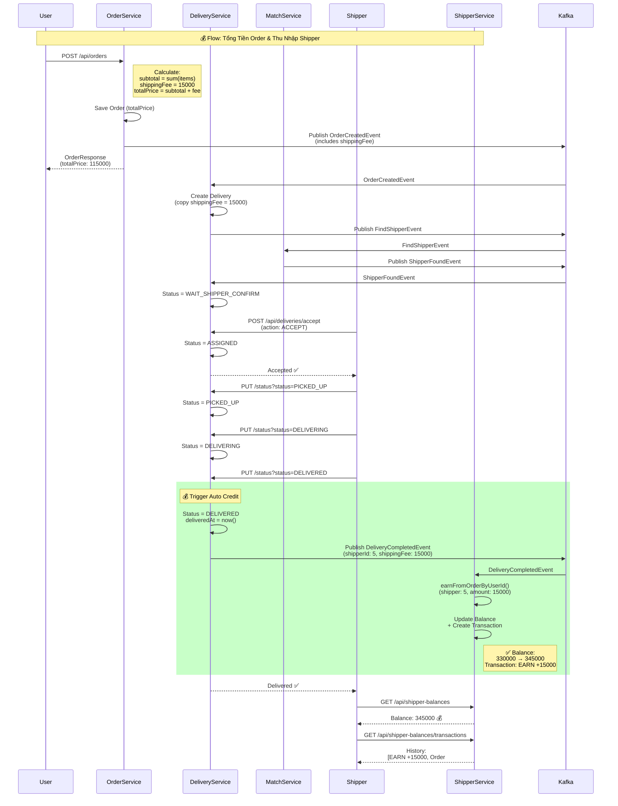

## Các thành phần chính

### 1. Order Service
- Tính `totalPrice` = subtotal + shippingFee - discount
- Publish `OrderCreatedEvent` (có shippingFee)

### 2. Delivery Service  
- Copy `shippingFee` từ OrderCreatedEvent
- Khi status = DELIVERED → Publish `DeliveryCompletedEvent`

### 3. Shipper Service
- Listen `DeliveryCompletedEvent`
- Auto call `earnFromOrderByUserId()`
- Update balance + tạo transaction record

### 4. Kafka Topics
- `order.created` - Order → Delivery
- `delivery.find-shipper` - Delivery → Match
- `shipper.found` - Match → Delivery
- **`delivery.completed`** - Delivery → Shipper (NEW)
