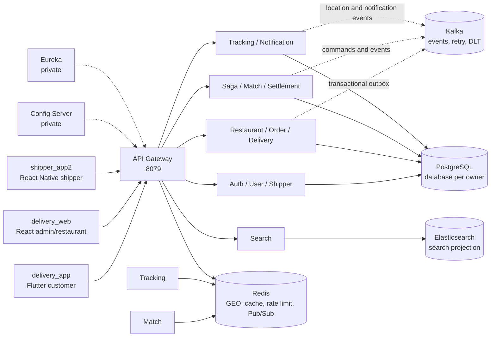

# Delivery Backend

> Backend microservices cho nền tảng đặt và giao đồ ăn end-to-end: khách tạo
> đơn, nhà hàng xác nhận, hệ thống tìm shipper, shipper giao hàng, khách theo dõi
> vị trí realtime và Settlement ghi nhận COD.

Đây là repo backend của polyrepo Delivery. Ba client (`delivery_app`,
`delivery_web`, `shipper_app2`) chỉ đi vào hệ thống qua API Gateway; các service,
database, Kafka, Config Server và Eureka nằm trong private network.

## Kiến trúc tổng quan



### Boundary quan trọng

- Gateway là application edge duy nhất. Client không gọi trực tiếp service port,
  database, Kafka, Redis, Config Server hoặc Eureka.
- Gateway route theo path/method, rate-limit và loại bỏ legacy
  `X-User-Id`/`X-Role`; Gateway không tự quyết định quyền và không inject identity.
- Auth Service phát access JWT RS256 và public JWKS. Mỗi resource service tự
  kiểm tra `kid`, issuer, audience, `token_type=access`, role và ownership.
- Mỗi service sở hữu database riêng. Giao tiếp liên service dùng HTTP nội bộ
  khi cần dữ liệu đồng bộ hoặc Kafka event khi công việc có thể xử lý độc lập.
- State change quan trọng ghi outbox cùng transaction local. Consumer deduplicate,
  retry/DLT và chỉ ACK sau khi transaction của service sở hữu hoàn tất.

## Service catalog

| Nhóm | Module/service | Trách nhiệm |
| --- | --- | --- |
| Shared platform | `observability-starter`, `runtime-platform-starter`, `identity-contracts`, `auth-resource-server-starter`, `kafka-operations-tool` | Convention dùng chung cho telemetry, runtime, identity và vận hành Kafka |
| Control plane | `config-server`, `discovery-server`, `api-gateway` | Cấu hình, service discovery và public routing |
| Identity | `auth-service`, `user-service`, `shipper-service` | Đăng nhập/JWKS, profile/địa chỉ và hồ sơ shipper |
| Commerce | `restaurant-service`, `order-service` | Catalog/menu, quyết định nhà hàng, checkout quote và order state |
| Fulfilment | `saga-orchestrator-service`, `delivery-service`, `match-service` | Điều phối workflow, offer/lifecycle giao hàng và chọn shipper qua Redis GEO |
| Realtime | `tracking-service`, `notification-service` | Raw WebSocket vị trí, lịch sử location bất đồng bộ, inbox notification và FCM wake-up |
| Finance/search | `settlement-service`, `search-service`, `routing-service` | COD ledger idempotent, search projection và hỗ trợ route/ETA |
| Capability mở rộng | `promotion-service`, `flashsale-service`, `analytics-service`, `livestream-service` | Voucher, flash sale, analytics và livestream; chạy theo profile/flag riêng |
| Tooling | `simulator-service` | Mô phỏng actor và kịch bản dev/test |

## Luồng COD canonical

```text
Customer app
  → Gateway → Order (checkout preview / create order)
  → order.created (Kafka outbox)
  → Saga tạo Delivery
  → Restaurant confirm/reject
  → Saga → Match đọc Redis GEO
  → Delivery lưu offer và expiry
  → Notification ghi durable inbox + FCM wake-up
  → Shipper app gọi GET /api/deliveries/offers/current rồi accept
  → ASSIGNED → PICKED_UP → DELIVERING → DELIVERED
  → raw /ws/shipper-locations qua Gateway
  → delivery.completed → Settlement ghi COD ledger idempotent
```

Một offer chỉ được gửi sau khi Delivery đã lưu trạng thái/expiry. FCM chỉ là
wake-up; client shipper luôn khôi phục offer canonical qua API. Saga là authority
cho ordering và compensation, còn Order, Delivery và Settlement vẫn do service
sở hữu aggregate/database của mình. `SHIPPER_NOT_FOUND` được giữ khác với
`CANCELLED`; replay event trùng phải là no-op và conflict phải fail-closed qua
retry/DLT.

## Capability status

| Trạng thái | Phạm vi hiện tại |
| --- | --- |
| Active MVP | Auth/profile, catalog/menu, checkout COD, restaurant decision, matching, delivery lifecycle, tracking raw WebSocket, durable notification/FCM wake-up và COD settlement |
| Gated/default-off | Batch canary, POD/return exception, polygon serviceability/ETA provider, menu inventory reservation, voucher/flash-sale checkout, analytics processing, marketing dispatch, online payment/payout và livestream extras |
| Không được suy diễn | Local Compose/startup proof không đồng nghĩa production HA, sustained load, cloud secret/PITR, provider thật hoặc native device E2E |

## Chạy local

### Yêu cầu

- JDK 17 và Maven
- Docker Desktop với Compose v2
- `jq`, `curl`, OpenSSL

### Khởi động core

```bash
# Tạo key/secret local vào các file bị Git ignore
bash scripts/gen-keys.sh

# Đóng gói JAR trước khi Docker build
JAVA_HOME=$(/usr/libexec/java_home -v 17) mvn -DskipTests package

# Kiểm tra Compose và khởi động COD core theo thứ tự dependency
bash scripts/verify-compose-config.sh
JAVA_HOME=$(/usr/libexec/java_home -v 17) \
  RUNTIME_REBUILD_IMAGES=true \
  STARTUP_TIMEOUT_SECONDS=480 \
  bash scripts/verify-runtime-startup.sh
```

Chỉ Gateway được publish cho application traffic tại
`http://localhost:8079`. Hạ tầng local mặc định dùng PostgreSQL `5432`, Redis
`6379`, Kafka `29092` và Elasticsearch `9200`; service port nội bộ không phải
client contract. Không chạy `docker compose down -v` nếu chưa chủ ý xóa volume
database local.

Các capability mở rộng không chạy trong core mặc định. Khi cần rehearsal,
enable profile sau khi đã đọc runbook:

```bash
COMPOSE_PROFILES=optional-capabilities \
  docker compose -f docker-compose.yml -f docker-compose.secrets.yml \
  up -d --build livestream-service promotion-service analytics-service flashsale-service
```

Secret, RSA key, Firebase credential và Mapbox/provider credential phải được cấp
qua env hoặc Docker secret ngoài source tree; không commit giá trị thật.

## Validation

```bash
mvn -DskipTests validate
bash scripts/verify-build-baseline.sh
bash scripts/verify-compose-config.sh
bash scripts/verify-mvp-cod-flow.sh
```

Để chạy local full-stack/recovery proof, dùng các runbook trong `docs/runbook-local.md`
và `docs/platform/system/operations/`. Build hoặc readiness pass không tự chứng
minh production reliability.

## Đọc tiếp

- [Platform product overview](docs/platform/product/overview.md)
- [Editable architecture diagrams](docs/platform/ARCHITECTURE.md)
- [System documentation map](docs/platform/system/README.md)
- [Service catalog và contract](docs/platform/system/service-catalog.md)
- [HTTP API inventory](docs/http-api-inventory.md)
- [Local runbook](docs/runbook-local.md)
- [Docker guide](DOCKER_GUIDE.md)
- [MVP → production roadmap](ROADMAP_MVP_TO_PRODUCTION.md)
- [Testing readiness](docs/platform/TESTING_READINESS.md)

Khi thay đổi API, Kafka event, WebSocket payload, role hoặc capability dùng
chung với client, hãy cập nhật tài liệu canonical và tạo plan cấp workspace trong
`../docs/plans/active/` trước khi sửa nhiều repo.
