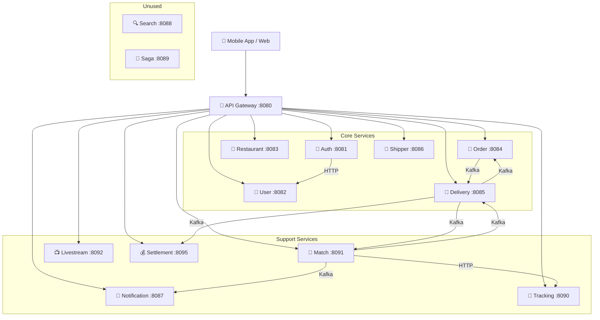
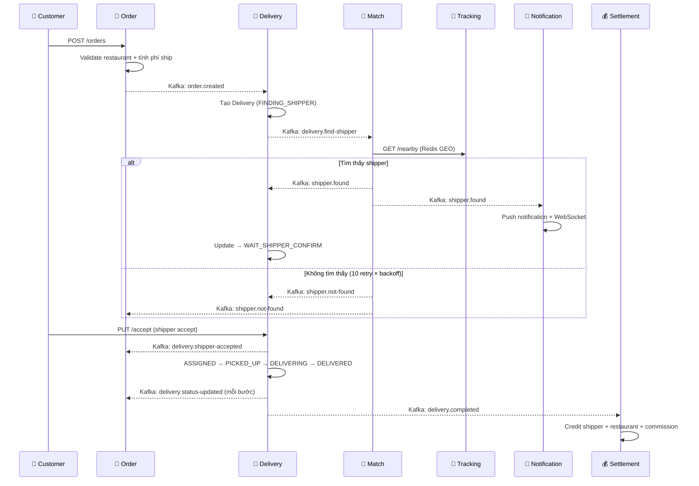

# 📋 Tổng Quan Hệ Thống - Delivery Backend

> Ngày review: 2026-04-25

## 1. Kiến Trúc Tổng Quan

| Kỹ thuật | Stack |
|---|---|
| Framework | Spring Boot 3.x |
| Messaging | Apache Kafka |
| Cache/GEO | Redis (GEO, TTL, Pub/Sub) |
| Real-time | WebSocket (STOMP) + gRPC |
| Push | Firebase Cloud Messaging |
| Auth | JWT (RSA public/private key) |
| Gateway | Spring Cloud Gateway |
| Livestream | Agora RTC |
| DB | MySQL/PostgreSQL (JPA/Hibernate) |

---

## 2. Luồng Đặt Hàng Chính

---

## 3. Phân Tích Từng Service

### 3.1 Auth Service (:8081)

| Điểm | Chi tiết |
|---|---|
| ✅ Tốt | JWT RSA key pair, refresh token, multi-device session, block/unblock |
| ✅ Tốt | Sync tạo user sang user-service khi register |
| ❌ Sai | **Hard-coded secret** `"GATEWAY_INTERNAL_SECRET_ABC123"` trong code. Cần dùng env variable |
| ❌ Sai | Dùng `System.out.println` thay vì `log.info` (nhiều chỗ) |
| ⚠️ Thiếu | Chưa có forgot password / reset password |
| ⚠️ Thiếu | Chưa có email verification |
| ⚠️ Thiếu | Chưa có OAuth2 social login (Google, Facebook) |
| 🔧 Tối ưu | `deactivateSessions` gọi `save()` trong loop → dùng `saveAll()` batch |

### 3.2 User Service (:8082)

| Điểm | Chi tiết |
|---|---|
| ✅ Tốt | CRUD đầy đủ, block/unblock với audit trail (blockedBy, reason) |
| ✅ Tốt | Có UserAddress cho nhiều địa chỉ, statistics API |
| ❌ Sai | Role `SHOP_OWNER` trong statistics nhưng auth dùng `RESTAURANT_OWNER` — **mismatch** |
| ⚠️ Thiếu | Không có avatar upload (chỉ setUrl), cần integrate file storage |
| ⚠️ Thiếu | Không có soft delete (deleteUser xóa cứng) |

### 3.3 Restaurant Service (:8083)

| Điểm | Chi tiết |
|---|---|
| ✅ Tốt | CRUD restaurant + menu items + search + cache (Redis) |
| ✅ Tốt | Order validation API, location service (Mapbox), catalog service |
| ✅ Tốt | Cache warmup service |
| ❌ Sai | Controller dùng `@Autowired` field injection thay vì constructor injection |
| ⚠️ Thiếu | **Không có API confirm/reject order** từ restaurant (luồng quan trọng) |
| ⚠️ Thiếu | Không có giờ mở cửa / trạng thái đóng cửa |
| ⚠️ Thiếu | Không validate menu item availability khi đặt hàng |

### 3.4 Order Service (:8084)

| Điểm | Chi tiết |
|---|---|
| ✅ Tốt | Đầy đủ CRUD, cancel, status update, Kafka event listeners |
| ✅ Tốt | Phí ship tính từ khoảng cách Haversine |
| ✅ Tốt | Event handling: delivery status, shipper accept/reject, payment, restaurant |
| ❌ **BUG** | `getOrdersByRestaurantOwner()` gọi `findAll()` → **trả TẤT CẢ orders** (lộ data) |
| ❌ **BUG** | `mapDeliveryStatusToOrderStatus()` thiếu nhiều status (FINDING_SHIPPER, WAIT_SHIPPER_CONFIRM, DELIVERING) |
| ❌ **BUG** | NPE khi `order.getNotes() == null` → concatenate string crash |
| ❌ Sai | Order status dùng plain `String` thay vì `Enum` → dễ lỗi typo |
| ⚠️ Thiếu | Không có pagination cho list APIs |

### 3.5 Delivery Service (:8085)

| Điểm | Chi tiết |
|---|---|
| ✅ Tốt | DeliveryStatus enum rõ ràng 9 trạng thái |
| ✅ Tốt | WebSocket broadcast status updates, Redis waiting state mechanism |
| ✅ Tốt | Cancel propagation qua Kafka đến match-service |
| ❌ **BUG** | `DeliveryCompletedEvent` **không set** `restaurantId` → settlement skip restaurant payment |
| ❌ **BUG** | `DeliveryStatusUpdateEvent` dùng field `newStatus/oldStatus` nhưng consumer đọc `status/previousStatus` |
| ⚠️ Thiếu | `DeliveryWaitingService` chưa được gọi từ luồng chính (auto-retry chưa active) |
| ⚠️ Thiếu | Không có API shipper hủy đơn sau accept → tìm shipper mới |

### 3.6 Shipper Service (:8086)

| Điểm | Chi tiết |
|---|---|
| ✅ Tốt | CRUD, validate trùng CCCD/bằng lái, online/offline toggle |
| ⚠️ Thiếu | Không liên kết với user-service (mỗi shipper có `userId` nhưng không gọi sync) |
| ⚠️ Thiếu | Không có rating hệ thống |
| ⚠️ Thiếu | Không có vehicle type (xe máy, ô tô, xe đạp) |
| ⚠️ Thiếu | Không có trạng thái availability (IDLE / ON_DELIVERY / OFFLINE) |
| ⚠️ Thiếu | Không auto-tạo balance khi tạo shipper mới (code bị comment) |

### 3.7 Tracking Service (:8090)

| Điểm | Chi tiết |
|---|---|
| ✅ Tốt | Redis GEO (GEORADIUS) cho tìm kiếm không gian |
| ✅ Tốt | Multi-protocol: REST + WebSocket + gRPC |
| ✅ Tốt | Online shipper management, distance calculation |
| ❌ Sai | WebSocket broadcast bị comment out (line 50-51) → real-time tracking chưa hoạt động |
| ⚠️ Thiếu | Không filter shipper theo availability (đang giao hàng thì không nên match) |
| ⚠️ Thiếu | Không lưu location history (chỉ cache real-time) |

### 3.8 Match Service (:8091)

| Điểm | Chi tiết |
|---|---|
| ✅ Tốt | Reactive retry với exponential backoff (30s → 5 phút, max 10 retry) |
| ✅ Tốt | Cancellation flag trên Redis để dừng matching khi order bị hủy |
| ✅ Tốt | Null-safe location handling with fallback |
| ❌ Sai | Retry backoff chạy trên Kafka consumer thread → **block thread lên đến 50 phút** |
| ⚠️ Thiếu | Không filter shipper đã reject trước đó → cùng shipper nhận notification liên tục |
| ⚠️ Thiếu | Chỉ match theo khoảng cách, thiếu: rating, loại xe, đang rảnh/bận |

### 3.9 Settlement Service (:8095)

| Điểm | Chi tiết |
|---|---|
| ✅ Tốt | Balance model (available, pending, holding), recalculate từ transactions |
| ✅ Tốt | Withdrawal + approval flow, admin management |
| ✅ Tốt | Auto-credit khi delivery completed qua Kafka |
| ❌ Sai | **Không bao giờ** credit cho restaurant vì `restaurantId` = null trong event |
| ⚠️ Thiếu | Không có idempotency check → risk duplicate transaction nếu Kafka retry |
| ⚠️ Thiếu | Không có refund mechanism khi order bị hủy |

### 3.10 Notification Service (:8087)

| Điểm | Chi tiết |
|---|---|
| ✅ Tốt | Multi-channel: Firebase push + WebSocket + Redis cache |
| ✅ Tốt | Rich notification types: match found, delivery status, order status, shipper assigned |
| ✅ Tốt | Read/unread tracking, unread count, mark all as read |
| ⚠️ Thiếu | Firebase token registration chưa hoàn thiện → push notification có thể thất bại |
| ⚠️ Thiếu | Notification preferences (user chọn loại notification muốn nhận) |

### 3.11 API Gateway (:8080)

| Điểm | Chi tiết |
|---|---|
| ✅ Tốt | JWT validation extract userId + role → forward headers |
| ✅ Tốt | Public vs protected route split cho auth endpoints |
| ✅ Tốt | WebSocket passthrough cho tracking |
| ❌ Sai | Không remove/replace existing X-User-Id header → client có thể **spoof** identity |
| ⚠️ Thiếu | Không có rate limiting |
| ⚠️ Thiếu | Không có circuit breaker (Resilience4j) |
| ⚠️ Thiếu | Hardcode localhost URLs → cần service discovery (Eureka/Consul) |

### 3.12 Livestream Service (:8092)

| Điểm | Chi tiết |
|---|---|
| ✅ Tốt | Agora token generation, pin/unpin product, Kafka events |
| ⚠️ Thiếu | Chưa có viewer count, chat system, live order từ stream |

### 3.13 Search & Saga (chưa dùng)
- **Search**: Chưa implement (cần Elasticsearch)
- **Saga**: Chưa implement (cần cho distributed transaction)

---

## 4. Luồng Thiếu Cho App Giao Hàng

### Cần bổ sung sớm

| # | Luồng | Chi tiết |
|---|-------|---------|
| 1 | **Shipper hủy sau accept** | Shipper gặp sự cố → hệ thống tìm shipper thay thế |
| 2 | **Payment (COD)** | Logic thu tiền mặt khi hoàn thành đơn |
| 3 | **Tích hợp WaitingService** | Gắn Redis TTL auto-retry vào luồng chính delivery |

### Sau này

| # | Luồng | Chi tiết |
|---|-------|---------|
| 4 | **Rating & Review** | Customer đánh giá shipper + restaurant |
| 5 | **Promotion / Voucher** | Mã giảm giá, freeship |
| 6 | **Customer tracking** | Customer xem vị trí realtime shipper trên bản đồ |
| 7 | **Shipper earnings dashboard** | Xem thu nhập ngày/tuần/tháng |

### ⏸️ Tạm hoãn (không cần trong giai đoạn này)

- ~~Restaurant confirm/reject order~~
- ~~Thanh toán online (VNPay/Momo)~~
- ~~Hoàn tiền (refund)~~
- ~~Xác nhận giao hàng (OTP/chữ ký)~~
- ~~Restaurant chuẩn bị (PREPARING → READY)~~

---

## 5. Hành Động Ưu Tiên

### P0 — Sửa ngay (bugs & sai logic)

| # | Vấn đề | Service | File |
|---|--------|---------|------|
| 1 | `getOrdersByRestaurantOwner` trả **tất cả orders** | order | `OrderServiceImpl.java:212` |
| 2 | `DeliveryCompletedEvent` thiếu `restaurantId` → settlement skip | delivery | `DeliveryServiceImpl.java` |
| 3 | Event field name mismatch (newStatus vs status) | delivery→order | `DeliveryEventPublisher.java` ↔ `OrderEventServiceImpl.java` |
| 4 | NPE khi `notes == null` + string concat | order | `OrderEventServiceImpl.java:49,70,89...` |
| 5 | Gateway không strip X-User-Id header → spoof risk | gateway | `JwtAuthenticationFilter.java:46-49` |
| 6 | Hard-coded internal secret trong code | auth | `AuthController.java:84` |
| 7 | `mapDeliveryStatusToOrderStatus()` thiếu status mapping | order | `OrderEventServiceImpl.java` |
| 8 | WebSocket broadcast bị comment out | tracking | `ShipperLocationService.java:50-51` |
| 9 | Role mismatch: `SHOP_OWNER` vs `RESTAURANT_OWNER` | user ↔ auth | Cần thống nhất |

### P1 — Bổ sung luồng sớm

| # | Luồng | Services |
|---|-------|----------|
| 1 | Shipper cancel after accept | delivery, match, order |
| 2 | Tích hợp WaitingService | delivery |
| 3 | Payment COD | order, settlement |

### P2 — Tối ưu kỹ thuật

| # | Vấn đề | Giải pháp |
|---|--------|-----------|
| 1 | Match retry block Kafka thread 50 phút | Dùng delayed topic hoặc scheduler |
| 2 | Thiếu Kafka idempotency | Thêm eventId + dedup check |
| 3 | Thiếu DLQ | Config DLQ cho consumers |
| 4 | Order status dùng String | Chuyển sang Enum |
| 5 | Gateway hardcode localhost | Service discovery |
| 6 | Tracking không filter busy shipper | Thêm trạng thái IDLE/ON_DELIVERY |
