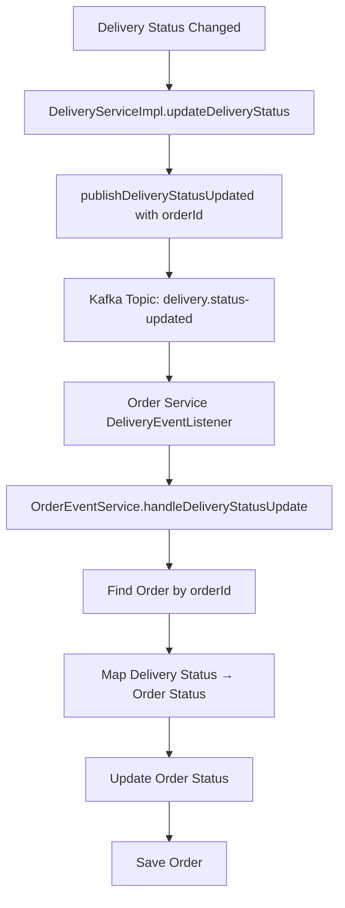

# 🔗 Delivery Status Update với OrderId Integration

## ✅ Problem Statement

Trước đây, khi delivery status thay đổi, chỉ có Delivery Service biết về sự thay đổi này. Order Service không được thông báo và order status không được cập nhật đồng bộ.

## 🛠️ Solution Implementation

### 1. **Updated DeliveryEventPublisher**

#### Method Signature Change:
```java
// ❌ Before
public void publishDeliveryStatusUpdated(Long deliveryId, String status, String previousStatus)

// ✅ After  
public void publishDeliveryStatusUpdated(Long deliveryId, Long orderId, String status, String previousStatus)
```

#### Event Structure Update:
```java
public static class DeliveryStatusUpdateEvent {
    public final Long deliveryId;
    public final Long orderId; // ✅ NEW: For order status synchronization
    public final String newStatus;
    public final String oldStatus;
    public final String eventType = "DELIVERY_STATUS_UPDATED";
    public final LocalDateTime timestamp = LocalDateTime.now();
}
```

### 2. **Updated DeliveryServiceImpl**

#### Event Publishing:
```java
// ✅ Now includes orderId for order status updates
deliveryEventPublisher.publishDeliveryStatusUpdated(
    deliveryId, delivery.getOrderId(), status.name(), oldStatus);
```

### 3. **Enhanced Order Service Integration**

#### Updated DeliveryStatusUpdatedEvent DTO:
```java
@Data
public class DeliveryStatusUpdatedEvent {
    private Long deliveryId;
    private Long orderId; // ✅ Key field for order updates
    private String status;
    private String previousStatus;
    private String newStatus; // ✅ Alias for compatibility
    private String oldStatus; // ✅ Alias for compatibility
    
    // ✅ Smart getters for backward compatibility
    public String getStatus() {
        return status != null ? status : newStatus;
    }
    
    public String getPreviousStatus() {
        return previousStatus != null ? previousStatus : oldStatus;
    }
}
```

#### Enhanced Event Listener:
```java
@KafkaListener(topics = KafkaTopicConstants.DELIVERY_STATUS_UPDATED_TOPIC)
public void handleDeliveryStatusUpdated(DeliveryStatusUpdatedEvent event) {
    // ✅ Validate orderId presence
    if (event.getOrderId() == null) {
        log.error("💥 Invalid DeliveryStatusUpdatedEvent: orderId is null");
        return;
    }

    // ✅ Use orderId to find and update order
    orderEventService.handleDeliveryStatusUpdate(event);
}
```

## 🔄 Event Flow



## 📊 Status Mapping

### Delivery Status → Order Status Mapping:
```java
private String mapDeliveryStatusToOrderStatus(String deliveryStatus) {
    switch (deliveryStatus) {
        case "ASSIGNED":
            return "ASSIGNED_TO_SHIPPER";
        case "PICKED_UP":
        case "DELIVERING":
            return "IN_DELIVERY";
        case "DELIVERED":
            return "DELIVERED";
        case "CANCELLED":
            return "CANCELLED";
        default:
            return null; // No status change
    }
}
```

## 🧪 Testing Strategy

### Integration Test Coverage:
```java
@Test
void testPublishDeliveryStatusUpdatedWithOrderId() {
    // ✅ Verify orderId is included in event
    // ✅ Verify proper Kafka topic usage
    // ✅ Verify event structure compatibility
}

@Test
void testEventStructureForOrderServiceCompatibility() {
    // ✅ Verify all required fields present
    // ✅ Verify backward compatibility
    // ✅ Verify event type correctness
}

@Test  
void testDeliveryStatusMappingScenarios() {
    // ✅ Test all delivery status transitions
    // ✅ Verify proper event publishing
    // ✅ Verify order status synchronization
}
```

## 🎯 Benefits

### 1. **Automatic Order Synchronization**
- Order status tự động cập nhật khi delivery status thay đổi
- Không cần manual intervention
- Real-time consistency across services

### 2. **Improved Data Consistency** 
- Delivery và Order status luôn đồng bộ
- Single source of truth cho status updates
- Reduced data inconsistency issues

### 3. **Better User Experience**
- Customer thấy order status update real-time
- Accurate delivery tracking information
- Consistent status across all interfaces

### 4. **Scalable Architecture**
- Event-driven design
- Loose coupling between services
- Easy to add more consumers

## 📈 Performance Impact

### Before:
- ❌ Manual order status updates required
- ❌ Potential data inconsistency
- ❌ Multiple API calls needed

### After:
- ✅ Automatic synchronization via events
- ✅ Single event triggers multiple updates
- ✅ Consistent data across services
- ✅ Minimal network overhead

## 🔮 Future Enhancements

### 1. **Enhanced Event Data**
```java
// Add more delivery context
private Double shipperLat;
private Double shipperLng;
private LocalDateTime estimatedDeliveryTime;
private String shipperNotes;
```

### 2. **Event Deduplication**
```java
// Prevent duplicate status updates
private String eventId; // UUID for deduplication
private Long version;   // Event version for ordering
```

### 3. **Retry Mechanism**
```java
// Handle failed order updates
@RetryableTopic(attempts = "3", backoff = @Backoff(delay = 1000))
@KafkaListener(topics = "delivery.status-updated")
public void handleDeliveryStatusUpdated(DeliveryStatusUpdatedEvent event) {
    // Retry logic for failed updates
}
```

---

**🎯 Result: Order và Delivery status giờ đây được đồng bộ hoàn toàn thông qua event-driven architecture!** 🚀

## 💡 Usage Example

```java
// When delivery status changes in Delivery Service:
delivery.setStatus(DeliveryStatus.DELIVERED);
deliveryRepository.save(delivery);

// Event automatically published with orderId:
deliveryEventPublisher.publishDeliveryStatusUpdated(
    delivery.getId(), 
    delivery.getOrderId(), // ✅ Key addition
    "DELIVERED", 
    "DELIVERING"
);

// Order Service automatically receives and processes:
// → Order status updated to "DELIVERED"
// → Customer notifications sent
// → Analytics updated
```
