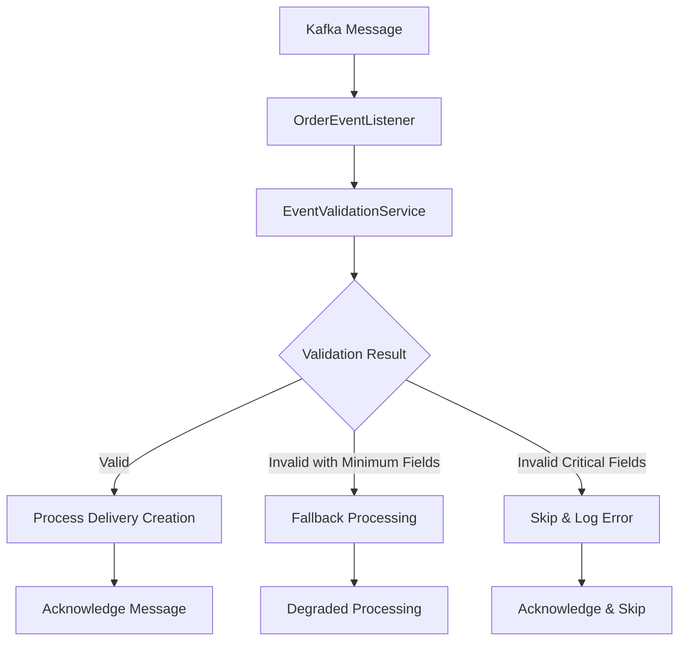

# 🛡️ **Event Validation System Documentation**

## 📋 **Validation Architecture**



## 🔧 **Validation Rules Implementation**

### **Critical Fields (Required)**
```java
// Must-have fields for delivery creation
- orderId: Long > 0
- userId: Long > 0  
- restaurantId: Long > 0
- deliveryAddress: String (min 10 chars)
- customerName: String (min 2 chars)
- customerPhone: String (10-11 digits)
```

### **Financial Validation**
```java
// Business logic validation
- subtotalPrice: BigDecimal > 0
- totalPrice: BigDecimal > 0
- paymentMethod: "COD" | "ONLINE"
- discountAmount: BigDecimal >= 0 (if present)
- shippingFee: BigDecimal >= 0 (if present)
```

### **Location Validation**
```java
// Coordinates validation (if present)
- deliveryLat: -90.0 to 90.0
- deliveryLng: -180.0 to 180.0
- pickupLat: -90.0 to 90.0
- pickupLng: -180.0 to 180.0
```

### **Text Field Validation**
```java
// String field validation
- restaurantName: min 2 chars
- restaurantAddress: min 10 chars
- customerPhone: regex "^[0-9]{10,11}$"
- restaurantPhone: regex "^[0-9]{10,11}$" (if present)
```

## 🚀 **Usage Examples**

### **1. Valid Event Processing**
```java
// Event with all valid fields
OrderCreatedEvent validEvent = new OrderCreatedEvent();
validEvent.setOrderId(123L);
validEvent.setUserId(456L);
validEvent.setSubtotalPrice(new BigDecimal("100000"));
// ... all other required fields

// Result: ✅ Full processing
```

### **2. Invalid Event with Fallback**
```java
// Event with validation errors but minimum required fields
OrderCreatedEvent invalidEvent = new OrderCreatedEvent();
invalidEvent.setOrderId(123L);
invalidEvent.setUserId(456L);
invalidEvent.setSubtotalPrice(new BigDecimal("-100")); // ❌ Invalid
invalidEvent.setDeliveryAddress("123 Main St"); // ✅ Valid
// ... minimum required fields present

// Result: ⚠️ Fallback processing with warning logs
```

### **3. Critical Invalid Event**
```java
// Event missing critical fields
OrderCreatedEvent criticalInvalid = new OrderCreatedEvent();
criticalInvalid.setOrderId(null); // ❌ Critical field missing
// ... other fields

// Result: 🚫 Skip processing, acknowledge message
```

## 🧪 **Testing Validation**

### **Test Valid Event**
```bash
# Test với valid order data
curl -X POST http://localhost:8084/api/orders \
  -H "Content-Type: application/json" \
  -H "X-User-Id: 123" \
  -H "X-Role: USER" \
  -d '{
    "restaurantId": 1,
    "restaurantName": "Valid Restaurant",
    "restaurantAddress": "123 Valid Street, District 1",
    "restaurantPhone": "0901234567",
    "deliveryAddress": "456 Customer Avenue, District 3",
    "deliveryLat": 10.762622,
    "deliveryLng": 106.660172,
    "customerName": "Valid Customer",
    "customerPhone": "0987654321",
    "paymentMethod": "COD",
    "items": [
      {
        "menuItemId": 101,
        "menuItemName": "Test Item",
        "quantity": 1,
        "price": 50000
      }
    ]
  }'

# Expected logs:
# ✅ OrderCreatedEvent validation passed for order: 123
# ✅ Successfully processed OrderCreatedEvent for order: 123
```

### **Test Invalid Event (Fallback)**
```bash
# Tạo order với invalid data nhưng có minimum fields
# (This would need to be simulated or injected)

# Expected logs:
# ⚠️ OrderCreatedEvent validation failed for order: 123 - Errors: ...
# 🔄 Attempting fallback processing với minimum required fields for order: 123
# ✅ Successfully processed OrderCreatedEvent for order: 123
```

### **Test Critical Invalid Event**
```bash
# Event với missing critical fields
# (This would need to be simulated)

# Expected logs:
# 💥 Invalid OrderCreatedEvent for order: null - Errors: ...
# 🚫 Order null không có minimum required fields, skipping processing
```

## 📊 **Validation Metrics**

### **Success Scenarios**
- ✅ **Full Validation Pass**: Event meets all validation rules
- ⚠️ **Fallback Processing**: Event has errors but minimum required fields
- 🔍 **Coordinate Fallback**: Missing pickup coordinates, using delivery/default

### **Failure Scenarios**  
- ❌ **Critical Field Missing**: orderId, userId, restaurantId null
- ❌ **Invalid Business Data**: Negative prices, invalid payment method
- ❌ **Malformed Text**: Too short names, invalid phone numbers

### **Monitoring Commands**
```bash
# Monitor validation logs
tail -f delivery-service.log | grep "validation\|fallback\|Invalid"

# Count validation results
grep "✅.*validation passed" delivery-service.log | wc -l
grep "⚠️.*validation failed" delivery-service.log | wc -l
grep "🚫.*skipping processing" delivery-service.log | wc -l
```

## 🎯 **Benefits of Validation System**

### **Data Quality Assurance**
- ✅ **Prevents Corruption**: Invalid data blocked at entry point
- ✅ **Business Rule Enforcement**: Financial và logical validation
- ✅ **Graceful Degradation**: Fallback processing for recoverable errors

### **System Reliability**
- ✅ **Error Prevention**: Catch issues before database operations
- ✅ **Service Continuity**: Skip invalid events without stopping processing
- ✅ **Debug Capability**: Detailed validation error logs

### **Operational Benefits**
- ✅ **Monitoring**: Clear validation metrics và alerts
- ✅ **Troubleshooting**: Specific error messages for debugging
- ✅ **Performance**: Early validation prevents expensive operations

---

**🛡️ Event validation system ensures robust và reliable event processing trong microservices architecture!**
