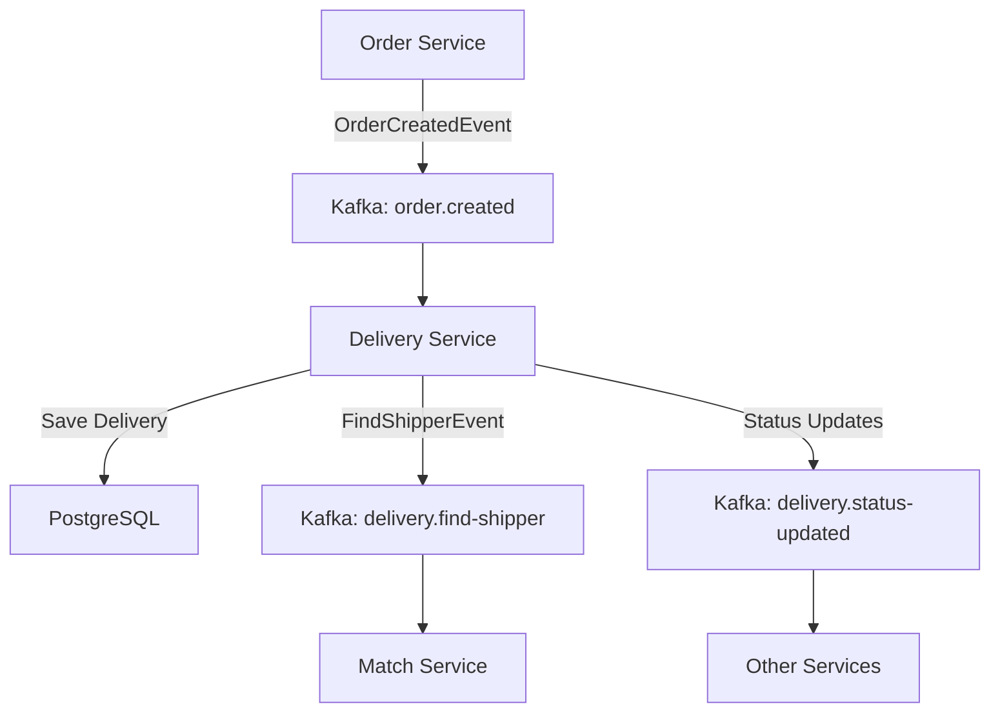

# 🚀 **Kafka Integration Documentation - Match Service Integration**

## 📋 **Event Flow Architecture**



## 🎯 **New Event Types**

### **1. FindShipperEvent (Outgoing)**
```json
{
  "deliveryId": 12345,
  "orderId": 67890,
  "pickupAddress": "123 Restaurant St, District 1",
  "pickupLat": 10.762622,
  "pickupLng": 106.660172,
  "deliveryAddress": "456 Customer Ave, District 3",
  "deliveryLat": 10.786785,
  "deliveryLng": 106.700806,
  "estimatedDeliveryTime": "2024-08-04T11:00:00",
  "notes": "Giao hàng nhanh",
  "createdAt": "2024-08-04T10:30:00",
  "eventType": "FIND_SHIPPER_REQUESTED",
  "timestamp": "2024-08-04T10:30:05"
}
```

### **2. DeliveryStatusUpdated (Outgoing)**
```json
{
  "deliveryId": 12345,
  "newStatus": "ASSIGNED",
  "oldStatus": "PENDING",
  "eventType": "DELIVERY_STATUS_UPDATED",
  "timestamp": "2024-08-04T10:35:00"
}
```

## 🔧 **Implementation Details**

### **Service Updates**
1. **DeliveryServiceImpl**: 
   - ✅ Thêm MatchServiceEventPublisher injection
   - ✅ Publish FindShipperEvent sau khi tạo delivery thành công
   - ✅ Publish status updates khi trạng thái thay đổi

2. **KafkaConfig**:
   - ✅ Thêm Producer configuration với reliability settings
   - ✅ JsonSerializer cho outgoing events
   - ✅ Idempotent producer với retries

3. **Event Publisher**:
   - ✅ Async publishing với callbacks
   - ✅ Error handling và logging
   - ✅ Constructor injection pattern

## 🚀 **Kafka Topics**

| Topic | Direction | Purpose | Consumer |
|-------|-----------|---------|----------|
| `order.created` | Incoming | Nhận order events từ Order Service | Delivery Service |
| `delivery.find-shipper` | Outgoing | Request shipper matching | Match Service |
| `delivery.status-updated` | Outgoing | Notify status changes | Multiple Services |

## 🧪 **Testing Workflow**

### **1. End-to-End Test Flow:**
```bash
# 1. Tạo order từ Order Service
POST /api/orders

# 2. Delivery Service tự động:
#    - Tạo delivery record (PENDING)
#    - Publish FindShipperEvent to Match Service

# 3. Match Service sẽ:
#    - Nhận FindShipperEvent
#    - Tìm shipper phù hợp
#    - Response với shipper recommendations

# 4. Khi assign shipper:
#    - Update delivery status (ASSIGNED)
#    - Publish DeliveryStatusUpdated event
```

### **2. Manual Testing Commands:**
```bash
# Check Kafka topics
kafka-topics.bat --bootstrap-server localhost:9092 --list

# Monitor delivery.find-shipper topic
kafka-console-consumer.bat --bootstrap-server localhost:9092 --topic delivery.find-shipper --from-beginning

# Monitor delivery.status-updated topic  
kafka-console-consumer.bat --bootstrap-server localhost:9092 --topic delivery.status-updated --from-beginning
```

## ✅ **Benefits của Integration**

### **Event-Driven Architecture**
- ✅ **Loose Coupling**: Services communicate via events
- ✅ **Scalability**: Async processing không block UI
- ✅ **Reliability**: Kafka guarantees message delivery
- ✅ **Observability**: Event logs để trace workflow

### **Business Logic**
- ✅ **Auto Shipper Matching**: Tự động tìm shipper khi có delivery mới
- ✅ **Real-time Updates**: Status changes được notify ngay lập tức  
- ✅ **Fault Tolerance**: Retry mechanism và error handling
- ✅ **Audit Trail**: Đầy đủ event history cho debugging

### **Performance**
- ✅ **Non-blocking**: Delivery creation không phải chờ shipper matching
- ✅ **Parallel Processing**: Match Service có thể process multiple requests
- ✅ **Caching**: Match Service có thể cache shipper locations
- ✅ **Load Distribution**: Kafka partitioning để scale

## 🔍 **Monitoring & Debugging**

### **Key Metrics:**
- FindShipperEvent publish success rate
- Average shipper matching time
- Delivery status transition times
- Kafka consumer lag

### **Error Scenarios:**
- Match Service down → Events queued in Kafka
- Kafka cluster issues → Local retry + DLQ
- Deserialization errors → Custom error handling
- Network timeouts → Async callbacks handle gracefully

---

**🎯 Integration hoàn tất! Delivery Service bây giờ tự động gửi requests đến Match Service để tìm shipper phù hợp khi có delivery mới.**
