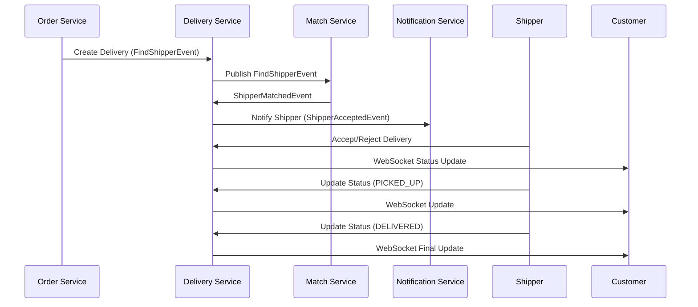

# 📦 **Delivery Service - Delivery Lifecycle Management**

## 🎯 **Service Overview**

**Port**: `8085`  
**Database**: `delivery_db`  
**Primary Purpose**: Manages complete delivery lifecycle with real-time tracking capabilities

## 🏗️ **Core Architecture**

### Service Responsibilities
- **Delivery Status Management**: PENDING → IN_PROGRESS → DELIVERED
- **Shipper Assignment & Communication**: Accept/Reject delivery requests
- **Event-Driven Integration**: Publishes events to Match & Notification services
- **Real-time WebSocket Updates**: Delivery status tracking for customers
- **Service Integration**: Consumes events from Order and Match services

### Clean Architecture Pattern
```
📁 controller/          # REST API & WebSocket endpoints
📁 service/            # Business logic layer
📁 repository/         # Data access layer
📁 entity/             # JPA entities
📁 dto/                # Data transfer objects
📁 constants/          # API paths & headers
📁 config/             # WebSocket & Kafka configuration
📁 exception/          # Custom exception handling
```

## 🔌 **WebSocket Infrastructure**

### Real-time Delivery Tracking
```javascript
// Customer connects to track delivery
const socket = new SockJS('/ws');
const stompClient = Stomp.over(socket);

// Subscribe to delivery updates
stompClient.subscribe('/topic/delivery/123/status', (message) => {
    const delivery = JSON.parse(message.body);
    console.log('Delivery status:', delivery.status);
});

// Request current status
stompClient.send('/app/delivery/123/status', {}, '{}');
```

### WebSocket Endpoints
- `ws://localhost:8085/ws` - Main WebSocket connection
- `/topic/delivery/{deliveryId}/status` - Delivery status updates
- `/app/delivery/{deliveryId}/status` - Request status inquiry
- `/app/delivery/ping` - Heartbeat/connectivity check

## 🔄 **Event-Driven Architecture**

### Kafka Topics Integration

#### **Consumes Events:**
```yaml
# From Order Service - New delivery creation
delivery.find-shipper:
  event: FindShipperEvent
  action: Create new delivery & publish to Match Service
  
# From Match Service - Shipper found
match.shipper-matched:
  event: ShipperMatchedEvent  
  action: Update delivery with shipper assignment
```

#### **Publishes Events:**
```yaml
# To Match Service - Request shipper search
delivery.find-shipper:
  event: FindShipperEvent
  data: { deliveryId, pickupLocation, deliveryLocation, orderValue }
  
# To Notification Service - Shipper accepted/rejected
delivery.shipper-accepted:
  event: ShipperAcceptedEvent
  data: { deliveryId, shipperId, action, estimatedTime }
```

## 📋 **API Endpoints**

### Core Delivery Management
```http
# Get delivery by ID
GET /api/deliveries/{id}
Headers: X-User-Id, X-Role

# Shipper accept/reject delivery
POST /api/deliveries/accept
Content-Type: application/json
Headers: X-User-Id: {shipperId}, X-Role: SHIPPER
{
  "deliveryId": 123,
  "action": "ACCEPT|REJECT",
  "estimatedPickupTime": "2024-01-20T15:30:00",
  "rejectReason": "Too far from pickup location"
}

# Update delivery status
PUT /api/deliveries/{id}/status
Headers: X-User-Id, X-Role: SHIPPER
{
  "status": "PICKED_UP|DELIVERED",
  "notes": "Package delivered to customer"
}
```

### WebSocket Health & Testing
```http
# WebSocket connectivity test
WS /ws
Message: /app/delivery/ping → Response: /topic/delivery/pong
```

## 🗂️ **Key Components**

### 1. **DeliveryService & Implementation**
```java
@Service
public class DeliveryServiceImpl implements DeliveryService {
    
    // ✅ Constructor Injection (MANDATORY)
    public DeliveryServiceImpl(DeliveryRepository deliveryRepository,
                               DeliveryMapper deliveryMapper,
                               DeliveryEventPublisher eventPublisher,
                               DeliveryWebSocketService webSocketService) {
        // Business logic for delivery lifecycle
    }
    
    // Accept/Reject delivery with WebSocket updates
    public DeliveryResponse acceptDelivery(AcceptDeliveryRequest request, Long shipperId) {
        // Handle ACCEPT/REJECT actions + real-time updates
    }
}
```

### 2. **Event Publishing & Consumption**
```java
@Component
public class DeliveryEventPublisher {
    
    // Publish to Match Service
    public void publishFindShipperEvent(FindShipperEvent event) {
        kafkaTemplate.send("delivery.find-shipper", event);
    }
    
    // Publish to Notification Service  
    public void publishShipperAcceptedEvent(ShipperAcceptedEvent event) {
        kafkaTemplate.send("delivery.shipper-accepted", event);
    }
}

@EventListener
public class MatchEventListener {
    
    // Consume shipper matched events
    @KafkaListener(topics = "match.shipper-matched")
    public void handleShipperMatched(ShipperMatchedEvent event) {
        matchEventService.processShipperMatched(event);
    }
}
```

### 3. **Real-time WebSocket Updates**
```java
@Service
public class DeliveryWebSocketService {
    
    // Send delivery updates to customers
    public void sendDeliveryUpdateToCustomer(Long customerId, DeliveryResponse delivery) {
        messagingTemplate.convertAndSend("/topic/delivery/" + delivery.getId() + "/status", delivery);
    }
    
    // Broadcast to all subscribers
    public void broadcastDeliveryUpdate(DeliveryResponse delivery) {
        messagingTemplate.convertAndSend("/topic/delivery/" + delivery.getId() + "/updates", delivery);
    }
}
```

## 🎛️ **Configuration**

### Database Configuration
```properties
# application.properties
spring.application.name=delivery-service
server.port=8085
spring.datasource.url=jdbc:postgresql://localhost:5432/delivery_db
spring.datasource.username=postgres
spring.datasource.password=123456
spring.jpa.hibernate.ddl-auto=update
```

### Kafka Configuration  
```properties
# Kafka settings
spring.kafka.bootstrap-servers=localhost:9092
spring.kafka.consumer.group-id=delivery-service-group
spring.kafka.consumer.key-deserializer=org.apache.kafka.common.serialization.StringDeserializer
spring.kafka.consumer.value-deserializer=org.springframework.kafka.support.serializer.JsonDeserializer
```

### WebSocket Configuration
```java
@Configuration
@EnableWebSocketMessageBroker
public class WebSocketConfig implements WebSocketMessageBrokerConfigurer {
    
    @Override
    public void configureMessageBroker(MessageBrokerRegistry config) {
        config.enableSimpleBroker("/topic");
        config.setApplicationDestinationPrefixes("/app");
    }
    
    @Override  
    public void registerStompEndpoints(StompEndpointRegistry registry) {
        registry.addEndpoint("/ws").withSockJS();
    }
}
```

## 🔄 **Business Flow**

### Complete Delivery Lifecycle


## 🧪 **Testing & Development**

### Build & Run Service
```bash
cd delivery-service
mvn clean compile
mvn spring-boot:run
```

### Service Health Check
```bash
# Basic health check
curl http://localhost:8085/actuator/health

# WebSocket connectivity test
curl -H "Upgrade: websocket" http://localhost:8085/ws
```

### Testing WebSocket Integration
```bash
# Use wscat for WebSocket testing
npm install -g wscat
wscat -c ws://localhost:8085/ws
```

## 📊 **Monitoring & Observability**

### Key Metrics to Monitor
- **Delivery Creation Rate**: Events consumed from Order Service
- **Shipper Response Time**: Time from assignment to accept/reject
- **WebSocket Connections**: Active real-time tracking sessions  
- **Event Publishing Success**: Kafka publish success rate
- **Status Update Frequency**: Delivery status change patterns

### Logging Pattern
```java
log.info("📦 Creating delivery for order {} at {}", orderId, LocalDateTime.now());
log.info("🚚 Shipper {} {} delivery {} at {}", shipperId, action, deliveryId, timestamp);
log.info("📡 Broadcasting delivery {} update: {}", deliveryId, status);
```

## 🏆 **Production Readiness**

### ✅ **Completed Features**
- Constructor injection pattern implementation
- BaseResponse wrapper for all APIs  
- Event-driven Kafka integration
- Real-time WebSocket delivery tracking
- Accept/Reject delivery functionality
- Global exception handling
- Service layer architecture
- Clean separation of concerns

### 🔧 **Configuration Notes**  
- **Port 8085**: Fixed allocation for delivery service
- **Database**: Separate `delivery_db` for data isolation
- **WebSocket**: `/ws` endpoint with SockJS fallback
- **Kafka Topics**: Clear event publishing/consuming pattern
- **Authentication**: X-User-Id & X-Role header-based

---

**🎯 Reference Implementation**: This service follows the platform's golden standard architecture established in restaurant-service with enhancements for real-time tracking and event-driven integration.

**🚨 Critical Dependencies**: Ensure Order Service, Match Service, and Notification Service are running for full functionality. WebSocket requires SockJS support for production deployment.**

## 🎯 **Service Boundaries & Separation of Concerns**

### ✅ **What Delivery Service Handles:**
- Delivery lifecycle management (PENDING → IN_PROGRESS → DELIVERED)
- Shipper accept/reject functionality 
- Real-time delivery status updates via WebSocket
- Event publishing to Match & Notification services
- Delivery-related business logic and validation

### ❌ **What Delivery Service Does NOT Handle:**
- **Shipper Location Management**: Handled by Tracking Service
- **Location Storage & GEO Operations**: Redis GEO managed by Tracking Service  
- **Real-time Location Updates**: Direct from Tracking Service to clients
- **Location-based Matching**: Handled by Match Service + Tracking Service integration

This ensures clean separation of concerns where each service manages its own domain expertise.
