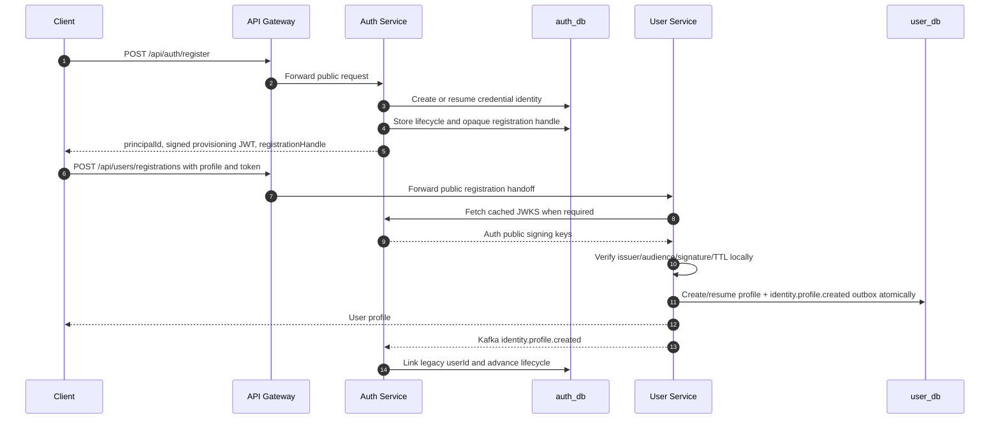
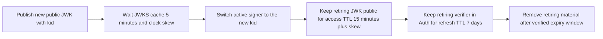
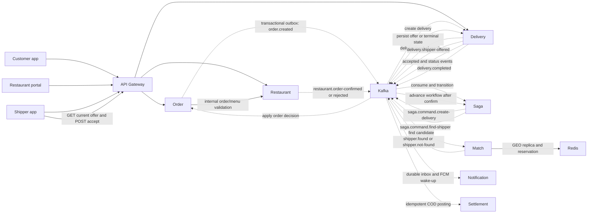
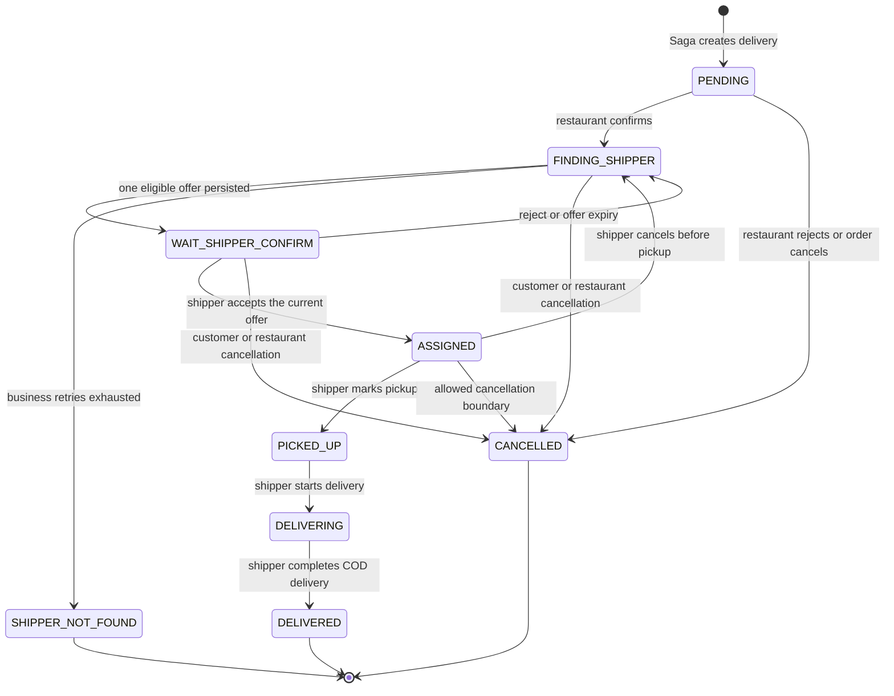
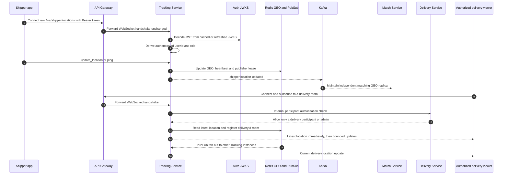
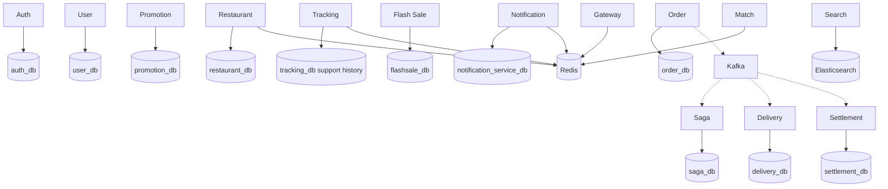

# Kiến trúc hệ thống Delivery

> Cập nhật từ source: 2026-08-09. Đây là file nguồn Mermaid có thể sửa trực
> tiếp; GitHub và VS Code Markdown Preview đều render được các sơ đồ bên dưới.

Tài liệu mô tả kiến trúc trong code hiện tại và JWKS resource-server boundary.
JWKS cutover đã được rollout và xác minh trên local/staging Compose theo
[migration record](./plans/completed/jwks-auth-migration.md). Điều đó không tự
chứng minh một môi trường production đã chuyển đổi: production vẫn cần evidence
rollout riêng theo runbook, window token và readiness/traffic gates của nó.

## 1. Phạm vi, nguồn sự thật và quy ước

| Câu hỏi | Nguồn chi tiết |
| --- | --- |
| Contract HTTP, actor và route | [HTTP API inventory](../http-api-inventory.md) |
| Service, persistence, Kafka topic và capability MVP | [System contract inventory](../system-contract-inventory.md) |
| Auth/JWKS decision | [ADR 0001](../decisions/0001-jwks-resource-server-authentication.md) |
| Luồng backend chi tiết | [Backend documentation map](../README.md) |
| Migration/JWKS Compose evidence | [JWKS migration record](./plans/completed/jwks-auth-migration.md) |
| Mermaid syntax and view conventions | [System diagram standards](./system/diagram-standards.md) |

- Mũi tên liền là HTTP, WebSocket hoặc truy cập storage đồng bộ; mũi tên đứt là
  Kafka, Redis Pub/Sub hoặc tích hợp ngoài.
- Client chỉ dùng Gateway origin. Không service port nào là public contract cho
  client.
- Mỗi service sở hữu dữ liệu của nó. Không đọc trực tiếp database của service
  khác; dùng HTTP internal hoặc event đã định nghĩa.
- Capability ghi “hidden/off” có code và/hoặc schema, nhưng không được coi là
  API MVP công khai.

## 2. Bản đồ toàn hệ thống

```mermaid
flowchart TB
    subgraph Clients["Client applications"]
        Customer["delivery_app (Flutter customer app)"]
        ShipperApp["shipper_app2 (React Native shipper app)"]
        Web["delivery_web (React admin and restaurant portal)"]
    end

    Gateway["API Gateway public edge :8079"]

    subgraph Identity["Identity and profile"]
        Auth["auth-service :8081 (RS256 issuer and JWKS)"]
        User["user-service :8082 (profiles and addresses)"]
        Shipper["shipper-service :8089 (shipper profile)"]
    end

    subgraph Commerce["Ordering and fulfilment"]
        Restaurant["restaurant-service :8083 (catalog and restaurant decisions)"]
        Order["order-service :8084 (checkout and order state)"]
        Delivery["delivery-service :8085 (offers and delivery state)"]
        Saga["saga-orchestrator :8095 (workflow transitions)"]
        Match["match-service :8092 (shipper selection)"]
        Settlement["settlement-service :8090 (COD ledger)"]
    end

    subgraph Realtime["Realtime and customer communication"]
        Tracking["tracking-service :8093 (raw location WebSocket)"]
        Notification["notification-service :8091 (durable inbox and FCM)"]
    end

    subgraph Supporting["Search, campaigns and gated capabilities"]
        Search["search-service :8088 (Elasticsearch projection)"]
        Promotion["promotion-service :8096 (voucher reservations)"]
        FlashSale["flashsale-service :8092 container (flash-sale reservations)"]
        Analytics["analytics-service :8097 (hidden by default)"]
        Live["livestream-service :8094 (hidden by default)"]
    end

    Kafka["Kafka (events, retry and DLT)"]
    Redis["Redis (rate limit, cache, GEO and PubSub)"]
    Postgres[("PostgreSQL (separate database per JPA service)")]
    Elasticsearch[("Elasticsearch search projections")]
    FCM["Firebase Cloud Messaging"]
    Mapbox["Mapbox"]
    Config["Config Server :8888 (private)"]
    Discovery["Eureka :8761 (private)"]

    Customer -->|"HTTPS REST and Bearer token"| Gateway
    ShipperApp -->|"HTTPS REST and Bearer token"| Gateway
    Web -->|"HTTPS REST and Bearer token"| Gateway
    Customer <-->|"raw WebSocket location"| Gateway
    ShipperApp <-->|"raw WebSocket location"| Gateway

    Gateway --> Auth
    Gateway --> User
    Gateway --> Shipper
    Gateway --> Restaurant
    Gateway --> Order
    Gateway --> Delivery
    Gateway --> Tracking
    Gateway --> Notification
    Gateway --> Search
    Gateway --> Settlement
    Gateway --> Promotion
    Gateway --> FlashSale

    Order -.->|"order events"| Kafka
    Restaurant -.->|"restaurant decision events"| Kafka
    Delivery -.->|"delivery events"| Kafka
    Tracking -.->|"location and assignment events"| Kafka
    Kafka -.-> Saga
    Kafka -.-> Match
    Kafka -.-> Notification
    Kafka -.-> Settlement
    Kafka -.-> Search
    Kafka -.-> Promotion
    Kafka -.-> FlashSale
    Kafka -.-> Analytics

    Gateway --> Redis
    Restaurant --> Redis
    Tracking --> Redis
    Match --> Redis
    Notification --> Redis
    Auth --> Postgres
    User --> Postgres
    Restaurant --> Postgres
    Order --> Postgres
    Delivery --> Postgres
    Shipper --> Postgres
    Saga --> Postgres
    Settlement --> Postgres
    Notification --> Postgres
    Tracking --> Postgres
    Promotion --> Postgres
    FlashSale --> Postgres
    Analytics --> Postgres
    Live --> Postgres
    Search --> Elasticsearch
    Notification -.->|"wake-up only"| FCM
    Customer -.->|"maps and directions"| Mapbox
    ShipperApp -.->|"maps and directions"| Mapbox
    Config -.->|"versioned non-secret config"| Gateway
    Config -.->|"versioned non-secret config"| Auth
    Discovery -.->|"logical service names"| Gateway
```



Gateway là public edge duy nhất cho application traffic. Trong staging/production,
Config Server, Eureka, management endpoints, service ports, databases và Kafka ở
private network; Local Compose có thể publish một số hạ tầng cho developer tool,
nhưng không publish application service port cho client. Gateway route theo path và
method, rate-limit theo direct peer IP, và loại bỏ header legacy X-User-Id/X-Role;
nó chỉ dùng địa chỉ đầu tiên của X-Forwarded-For khi cờ trusted proxy bật và peer
khớp CIDR allow-list cấu hình. Nó không giữ JWT key, không xác thực JWT và không
inject identity. Các mũi tên tới
Config/Eureka trong sơ đồ là đại diện: tất cả active service bootstrap/configure
theo cùng private control plane.

## 3. Client boundary và giao tiếp bên ngoài

| Client | Kết nối chuẩn | Auth/session | Realtime và tích hợp trực tiếp |
| --- | --- | --- | --- |
| delivery_app | Gateway origin qua API_BASE_URL; app thêm /api đúng một lần | Dio gắn Bearer access token; một refresh in-flight khi protected request trả 401; lưu cặp token mới | Raw WebSocket Gateway cho vị trí shipper; Mapbox cho map/directions; checkout voucher/flash-sale mặc định off |
| delivery_web | Gateway origin qua VITE_API_BASE_URL | Axios gắn Bearer; refresh single-flight, lưu refresh token mới trước access token; hết session thì về login | REST cho admin và SHOP_OWNER. Không gọi service port trực tiếp |
| shipper_app2 | Gateway origin qua API_BASE_URL | Axios gắn Bearer; refresh single-flight và chỉ chấp nhận role SHIPPER | Raw WebSocket Gateway có Authorization handshake; polling GET current offer để recover offer; FCM wake-up là best effort; Mapbox trực tiếp |

Client không nhận hoặc gửi Internal-Token, không tự khai userId/role trong
header để xin quyền, và không truy vấn JWKS để tự authorize nghiệp vụ. Quyền
được quyết định ở resource service sở hữu endpoint/dữ liệu.

## 4. Authentication, authorization và đăng ký hai bước

### 4.1 Đăng ký password: hai request client điều phối

Public registration cố ý không dùng một API tạo cả Auth lẫn User. Bước đầu chỉ
tạo hoặc resume credential identity; bước sau mới tạo profile. Điều này giữ rõ
quyền sở hữu database và cho phép retry an toàn khi lỗi giữa hai service.



Các bất biến của luồng này:

- Provisioning JWT do Auth ký RS256, audience riêng và TTL 15 phút; User verify
  cục bộ bằng Auth JWKS, không gọi Auth trên hot path. Registration handle opaque
  chỉ phục vụ recovery/status UI.
- User service không tin authId/email/role do client gửi; claims chỉ đến từ JWT
  đã verify. Profile và `identity.profile.created` outbox cùng một transaction.
- Create profile theo principalId và Auth consumer link legacy profile ID đều
  idempotent. Retry/crash không tạo profile thứ hai.
- Public password registration chỉ tạo USER hoặc SHOP_OWNER. ADMIN và SHIPPER
  dùng operator provisioning; password account phải verify email trước login.
- Login fail-closed khi lifecycle chưa `ACTIVE` (bao gồm khi profile event chưa
  được Auth consume).

### 4.2 Bearer token và JWKS resource-server boundary

```mermaid
sequenceDiagram
    autonumber
    participant C as Client
    participant G as API Gateway
    participant A as Auth Service
    participant R as Resource Service
    participant DB as Service-owned database

    C->>G: Protected request with Authorization Bearer access JWT
    G->>G: Strip X-User-Id and X-Role; apply IP rate limit
    G->>R: Forward original Authorization header
    R->>A: Fetch or refresh cached GET /.well-known/jwks.json
    A-->>R: Active and, during overlap, retiring public JWKs
    R->>R: Validate RS256, kid, issuer, audience and token_type=access
    R->>R: Build AuthenticatedActor and ROLE authorities from claims
    R->>DB: Apply route role and resource ownership policy
    R-->>C: Authorized response through Gateway

    alt Access token expired or invalid
        R-->>C: 401 Unauthorized
        C->>G: POST /api/auth/refresh-token with refresh token
        G->>A: Forward refresh request
        A-->>C: Rotated access and refresh token pair
    end
```

Auth phát access JWT RS256 với kid, iss, aud, sub, email, roles, role compatibility
claim, token_type=access, jti, iat và exp. Access token TTL là 15 phút. Refresh
token có token_type=refresh, token family theo device và TTL 7 ngày; raw refresh
token không lưu trong database, chỉ có fingerprint/digest.

Shared module auth-resource-server-starter tạo JwtDecoder và converter dùng
chung, nhưng không ép SecurityFilterChain toàn cục. Mỗi resource service tự khai
anonymous, bearer và internal route chính xác, rồi dựng AuthenticatedActor với
ROLE_USER, ROLE_SHOP_OWNER, ROLE_SHIPPER hoặc ROLE_ADMIN. Auth Service cũng dùng
chính resource-server boundary cho endpoint session/admin của nó.

### 4.3 Rotation và rollout key



Không có legacy-token fallback ở Gateway. Operator phải deploy Auth trước, đợi
ít nhất access-token TTL cộng clock skew để mọi access token mang kid, sau đó
rollout resource services và cuối cùng Gateway. Chi tiết recovery/secret nằm ở
[runbook secrets](../runbooks/secrets-management.md).

## 5. Luồng đặt hàng, matching, giao hàng và COD

### 5.1 Luồng sự kiện canonical



Order, Restaurant, Delivery và Saga dùng transactional outbox cho event làm thay
đổi state. Consumer phải deduplicate theo eventId/business key và chỉ ACK sau
khi transaction local commit. Retry có terminal DLT policy; không được ACK im
lặng một side effect lỗi.

### 5.2 Delivery state machine



- Một shipper.found chỉ nhắm một shipper. Delivery persist offer/expiry trước
  khi Notification gửi FCM wake-up; app shipper luôn recover source of truth qua
  GET /api/deliveries/offers/current trước khi accept.
- Nhánh SHIPPER_NOT_FOUND không bị viết lại thành CANCELLED. Order phát
  order.refund-eligible với immutable monetary snapshot để reservation/refund
  boundary xử lý idempotent.
- Voucher, flash-sale checkout và relay mặc định off trong COD MVP. Dù có
  reservation model, chúng không là điều kiện của public checkout hiện tại.
- Settlement chỉ post ledger khi Delivery đã DELIVERED. Một transaction local
  ghi receipt, bốn ledger rows và balance projection; replay exact event là no-op,
  conflict hoặc thiếu deposit fail-closed để retry/DLT.

Chi tiết event field, compensation và bằng chứng runtime ở
[order lifecycle](../workflows/order_lifecycle_flow.md),
[delivery/matching](../workflows/delivery_matching_tracking.md)
và [settlement/COD](../workflows/settlement_finance_flow.md).

## 6. Tracking realtime và notification



Tracking dùng raw WebSocket JSON, không dùng STOMP/gRPC. Handshake chấp nhận
Authorization Bearer; với client không đặt được header, token bearer protocol
được xử lý ở Sec-WebSocket-Protocol. Tracking kiểm token qua JWKS, còn quyền xem
delivery được kiểm tiếp qua Delivery internal API. Một shipper chỉ có một active
publisher generation; Redis-backed lease, 30-second disconnect grace và stale
generation fence chống socket cũ ghi location mới.

Redis GEO là hot-path realtime source; PostgreSQL tracking_db chỉ giữ support
history sample không nằm trên hot path. Fan-out chia room theo deliveryId, dùng
Redis Pub/Sub giữa instance và coalesce/backpressure per-session để ưu tiên
location mới nhất/final state. Notification không còn STOMP graph: nó persist
inbox, deduplicate event và gửi FCM như wake-up best effort.

## 7. Ownership dữ liệu và service catalog

Port là port module/container private; client không được dùng chúng làm URL.
Flashsale và Match cùng có default dev port 8092 nhưng chạy container/route riêng;
điều đó không tạo public port conflict vì Gateway là entrypoint.

| Thành phần | Dữ liệu sở hữu / storage chính | Giao tiếp và trách nhiệm hiện tại |
| --- | --- | --- |
| api-gateway :8079 | Redis rate-limit; không có JWT key hay business DB | Public route theo path/method, peer-IP rate limit, CORS và strip legacy identity headers |
| auth-service :8081 | auth_db: credential, lifecycle, email verification, session, refresh family/digest, registration handle, identity outbox/inbox | Password/social login, issuer RS256/JWKS, refresh rotation, account block; consume profile event and publish lifecycle projection |
| user-service :8082 | user_db: profile/principal projection, address, block audit, identity outbox/inbox | Current-user/profile/address; verify public registration handoff via JWKS; profile-created/status projections |
| restaurant-service :8083 | restaurant_db: restaurant, menu, rating, restaurant decision/outbox; Redis cache | Public catalog, owner menu/restaurant, confirm/reject order, internal order validation |
| order-service :8084 | order_db: immutable checkout snapshot, order state, receipt/outbox | Create/preview/read/cancel; validates catalog internally; emits order.created/cancelled |
| delivery-service :8085 | delivery_db: delivery state, offer, assignment, receipts/outbox | Saga command consumer; self current-offer, accept/cancel/status; emits delivery lifecycle events |
| shipper-service :8089 | shipper_db: shipper profile, online state, ratings | Self profile/online status and admin read; fulfilment identity is auth userId |
| saga-orchestrator :8095 | saga_db: workflow transition, inbound receipt, command outbox | Coordinates order, restaurant decision, delivery creation, matching, rematch and terminal convergence |
| match-service :8092 | Redis GEO replica/reservation; no public HTTP controller | Consumes Saga commands/location state; finds one candidate, emits found/not-found |
| tracking-service :8093 | Redis GEO/routing/lease, tracking_db sampled support history | Shipper update/offline, raw WebSocket rooms, Delivery participant authorization |
| notification-service :8091 | notification_service_db inbox/dedup/read state; Redis token ownership | Kafka consumer, durable notification, FCM token registration and wake-up |
| settlement-service :8090 | settlement_db receipt, ledger, balance projection, refund case/outbox | Internal COD eligibility; delivery.completed idempotent COD ledger; public surface is read-only admin/refund in MVP |
| search-service :8088 | Elasticsearch projections | Anonymous restaurant/dish search; consumes entity-sync; unavailable returns sanitized failure |
| promotion-service :8096 | promotion_db wallet, campaign, voucher reservation/outbox | User voucher/admin campaign; internal calculate/reserve/commit/release; checkout gate off by default |
| flashsale-service :8092 container-private | flashsale_db campaign, item, reservation/line/outbox; Redis non-authoritative | Public/admin reads; merchant/internal reservation gated; checkout/relay off by default |
| analytics-service :8097 | analytics_db projections/dedup | Experimental listener/dashboard/reconciliation all off by default |
| livestream-service :8094 | livestream_db; Agora integration | Experimental and hidden from Gateway until ownership/provider proof exists |
| config-server :8888 | Versioned non-secret configuration | Service bootstrap; production uses protected config repository and immutable label |
| discovery-server :8761 | Eureka registry metadata | Resolves logical service names. It is not a public edge |

### Data topology của hot path



PostgreSQL is deployed as one server in local Compose but each JPA service has a
separate logical database and migration/schema ownership. Redis is not source of
truth for order/delivery/ledger data; its roles are cache, rate-limit, live GEO,
lease and Pub/Sub. Kafka carries durable event contracts, not a substitute for
each service's local state transaction.

## 8. Cơ chế giao tiếp, độ tin cậy và vận hành

| Cơ chế | Quy tắc hiện tại | Boundary lỗi/khôi phục |
| --- | --- | --- |
| Client HTTP | Gateway origin, exact route/method allow-list, BaseResponse compatibility envelope; rate-limit direct peer IP | X-Forwarded-For chỉ được dùng khi trusted proxy bật và direct peer thuộc CIDR allow-list; endpoint owner xác thực JWT/ownership; unknown/publicly hidden route fail closed |
| Internal HTTP | Logical service name qua Eureka/LoadBalancer; Internal-Token cho exact internal route | Không chuyển client identity header. Controller tự kiểm Internal-Token; timeout/circuit behavior nằm trong service client |
| Kafka | Transactional outbox cho producer state-change; receipt/idempotency cho consumer | Commit DB trước ACK; retry/DLT finite, exact replay no-op, contradictory replay fail closed |
| JWT/JWKS | Auth phát private-key-signed RS256; public JWK cache max-age 300 | Resource service verify kid, alg, iss, aud, token_type; access token sau revoke vẫn valid tối đa 15 phút theo MVP |
| Redis | Rate limit, cache, GEO, publisher lease, rooms và Pub/Sub | Không được dùng Redis làm ledger/order authority; reconnect lấy latest location từ Redis; stale lease/generation bị reject |
| Raw WebSocket | Gateway forwards /ws/shipper-locations; Tracking authorizes handshake and delivery subscription | Raw JSON only; deliveryId room, bounded coalescing, reconnect/final-state recovery, no STOMP fallback |
| FCM | Notification durable inbox trước, FCM sau | FCM là wake-up best effort; shipper recover offer bằng authenticated REST, không accept từ push payload |
| Config/discovery | Non-secret config from Config Server; logical service discovery by Eureka | Required Compose config fails fast; deploy/rollback image cùng immutable config label; no dynamic refresh |
| Observability | Actuator health/readiness, Prometheus metrics, correlation ID and tracing | Readiness + discovery UP là điều kiện nhận Gateway traffic; runbook/metrics là nguồn vận hành |

## 9. Kiểm kê tài liệu và thay đổi đã bổ sung

| Khu vực | Tài liệu đã có | Kết quả kiểm tra/bổ sung |
| --- | --- | --- |
| Tổng quan polyrepo | [product overview](./product/overview.md) | Có; liên kết tới file kiến trúc này và được cập nhật boundary JWKS |
| Backend service map và API | [backend overview](../product/overview.md), [HTTP inventory](../http-api-inventory.md) | Có, là authority cho ports, route và status capability |
| Auth/User | [auth and users](../services/auth_and_users.md), [JWKS ADR](../decisions/0001-jwks-resource-server-authentication.md) | Có và đã mô tả registration hai bước/JWKS; file này thêm bức tranh client-to-service và rotation |
| Order/delivery/tracking/settlement | [order lifecycle](../workflows/order_lifecycle_flow.md), [delivery matching](../workflows/delivery_matching_tracking.md), [settlement](../workflows/settlement_finance_flow.md) | Có; order lifecycle được cập nhật về COD-first canonical flow, không còn mô tả Payment Service như active dependency |
| Operations | [operations index](../README.md), [rollout runbook](../runbooks/rollout-and-rollback.md) | Có; file này chỉ tóm tắt boundary, không thay runbook |
| Client action contracts | [web matrix](../../../delivery_web/docs/action-contract-matrix.md), source/test client | Web có matrix; Flutter/Shipper được đối chiếu runtime config, interceptor và WebSocket code rồi ghi boundary ở mục 3 |

Khi đổi API/Kafka payload/role claim/WebSocket message hoặc ownership policy,
cập nhật file này cùng source contract owner và tạo plan cấp hệ thống nếu thay đổi
chạm nhiều repository. Không thêm service port vào client configuration để né
Gateway; đó sẽ phá security, routing và deployment boundary.
