# Architecture and Trust Boundaries

> Status: current as-built architecture, checked 2026-08-09. Detailed editable
> diagrams and individual source references remain in
> [`../ARCHITECTURE.md`](../ARCHITECTURE.md).

## Design intent

Delivery is a polyrepo food-ordering and delivery platform. It optimizes the
MVP core for a durable COD order lifecycle, explicit service ownership and
recoverable asynchronous work rather than a single distributed transaction.

The architecture has four non-negotiable boundaries:

1. **Public edge:** application clients enter through API Gateway only.
2. **Identity:** Auth signs bearer access tokens; resource services validate
   them using Auth's public JWKS and decide authorization locally.
3. **Data ownership:** each service writes only its own store.
4. **Reliability:** state changes create an outbox record in the same local
   transaction; downstream services deduplicate/retry rather than trust
   exactly-once delivery from Kafka.

## System map

```mermaid
flowchart TB
    subgraph Clients["Client applications"]
        Customer["delivery_app<br/>Flutter customer"]
        Web["delivery_web<br/>React admin + restaurant"]
        ShipperApp["shipper_app2<br/>React Native shipper"]
    end

    Gateway["API Gateway<br/>public application edge"]

    subgraph Control["Private control plane"]
        Config["Config Server"]
        Discovery["Eureka"]
        OTel["OTel Collector"]
        Prom["Prometheus / Grafana"]
    end

    subgraph Domain["Private domain services"]
        Auth["Auth<br/>RS256 issuer + JWKS"]
        User["User"]
        Restaurant["Restaurant + Menu"]
        Order["Order"]
        Saga["Saga Orchestrator"]
        Delivery["Delivery"]
        Match["Match"]
        Shipper["Shipper"]
        Tracking["Tracking"]
        Notify["Notification"]
        Settlement["Settlement"]
        Search["Search"]
    end

    subgraph Stores["Private state and event infrastructure"]
        PG[("PostgreSQL<br/>DB per service")]
        Kafka["Kafka<br/>commands, events, retry/DLT"]
        Redis["Redis<br/>rate limit, cache, GEO, PubSub"]
        ES[("Elasticsearch<br/>search projection")]
    end

    Customer -->|"HTTPS REST / Bearer"| Gateway
    Web -->|"HTTPS REST / Bearer"| Gateway
    ShipperApp -->|"HTTPS REST + raw WebSocket / Bearer"| Gateway
    Gateway --> Auth
    Gateway --> User
    Gateway --> Restaurant
    Gateway --> Order
    Gateway --> Delivery
    Gateway --> Shipper
    Gateway --> Tracking
    Gateway --> Notify
    Gateway --> Settlement
    Gateway --> Search

    Auth --> PG
    User --> PG
    Restaurant --> PG
    Order --> PG
    Saga --> PG
    Delivery --> PG
    Shipper --> PG
    Tracking --> PG
    Notify --> PG
    Settlement --> PG
    Order -. "outbox events" .-> Kafka
    Restaurant -. "decision events" .-> Kafka
    Saga -. "commands" .-> Kafka
    Delivery -. "lifecycle events" .-> Kafka
    Kafka -.-> Saga
    Kafka -.-> Match
    Kafka -.-> Notify
    Kafka -.-> Settlement
    Kafka -.-> Search
    Match --> Redis
    Tracking --> Redis
    Notify --> Redis
    Gateway --> Redis
    Search --> ES
    Config -.->|"bootstrap (representative)"| Gateway
    Config -.->|"bootstrap (representative)"| Auth
    Config -.->|"bootstrap (representative)"| Order
    Discovery -.->|"registration/discovery"| Gateway
    Discovery -.->|"registration/discovery (representative)"| Order
    Auth -. "traces / metrics (representative)" .-> OTel
    Tracking -. "traces / metrics (representative)" .-> OTel
    Auth -. "metrics (representative)" .-> Prom
    Tracking -. "metrics (representative)" .-> Prom
```

Solid arrows denote synchronous HTTP, WebSocket or store access. Dotted arrows
denote Kafka, Redis Pub/Sub, control-plane bootstrap/discovery or telemetry. The
control-plane and telemetry edges are representative of the private workloads;
they are not a complete registration/configuration matrix. The map omits
disabled/experimental services for readability; they are listed in the service
catalog.

## Network zones

| Zone | May receive traffic from | Must not be reachable from |
| --- | --- | --- |
| Internet/public application edge | Customer app, browser portal, shipper app | Direct client access to services and stores |
| Gateway private upstream network | Gateway only | Public Internet |
| Service data/event network | Owning service and approved consumers | Client apps and browser code |
| Control/management network | Workload identities and operators | Public traffic; ordinary app users |
| Operations access | Authenticated operators through a controlled proxy | Anonymous public clients |

Local Compose publishes developer infrastructure ports for diagnosis in some
profiles, but that is not a production network contract.

## Request and identity path

1. A client sends an HTTPS request with its bearer access JWT to Gateway.
2. Gateway matches an exact public route/method, applies IP rate limiting and
   removes legacy `X-User-Id`/`X-Role` headers. It forwards the original
   `Authorization` header; it does not make an authorization decision.
3. The target service fetches/caches Auth public JWKs and validates `RS256`,
   `kid`, issuer, audience and `token_type=access`.
4. The service derives `AuthenticatedActor` and roles from claims, then checks
   endpoint role plus resource ownership against its own data.
5. Service-to-service routes are not a user-token bypass. They use exact
   private paths and an internal credential, then still validate the supplied
   payload/ownership constraints.

See [security.md](./security.md) for key rotation, registration and secret rules.

## Synchrony versus events

Use synchronous internal HTTP only when the caller must validate current
authoritative information before committing its own state. Examples are Order's
Restaurant checkout validation, Tracking's Delivery participant check and
Match's Settlement COD eligibility check. Use Kafka when a downstream concern
may run independently or must survive caller restarts: delivery creation,
restaurant decisions, matching commands, notifications, projections and COD
posting.

No service reads another service's PostgreSQL tables to avoid an event. That
would make ownership, migration and disaster recovery ambiguous.

## State and consistency strategy

The platform has local ACID transactions, not a global transaction manager.

- A producer persists business state and outbox row atomically.
- An outbox relay emits a stable event identity after commit.
- A consumer writes its own state/receipt/dedup record in a local transaction.
- It acknowledges Kafka only after that transaction commits.
- Exact replay is a no-op; same business identity with contradictory data fails
  closed and proceeds through retry/DLT/operator handling.

Saga coordinates the multi-service lifecycle as state transitions and commands;
it does not own the Order, Delivery or Settlement databases.

## Topology assumptions that are true today

| Concern | Current as-built mechanism | Do not infer |
| --- | --- | --- |
| Service names | Spring Cloud Config + Eureka logical IDs; static-routes Compose overlay is recovery-only | That Kubernetes DNS has replaced Eureka |
| Images | Local Compose builds from checked Maven artifacts | Immutable production images or a registry promotion policy |
| Database | PostgreSQL 16 local Compose, separate databases per owner | Multi-AZ/PITR production posture |
| Kafka | Single-node KRaft local Compose; retry/DLT infrastructure exists | Production replication, ACLs or capacity sizing |
| Search | Elasticsearch 7.17 local projection | Long-term supported version compatibility |
| Secret delivery | Docker secret files locally; workload-identity secret injection specified for higher environments | A selected cloud/Vault product |
| Observability | Actuator, Prometheus/Grafana, OTLP collector, correlation IDs | An external log/trace retention backend or approved SLO values |

Production requirements and decisions are deliberately separated in
[operations/README.md](./operations/README.md).

## Detailed architecture source material

- [Full editable Mermaid architecture](../ARCHITECTURE.md)
- [Backend product overview](../../product/overview.md)
- [System contract inventory](../../system-contract-inventory.md)
- [HTTP route inventory](../../http-api-inventory.md)
- [JWKS authentication ADR](../../decisions/0001-jwks-resource-server-authentication.md)
- [Runtime topology ADR](../decisions/0002-phase-3-runtime-topology.md)
