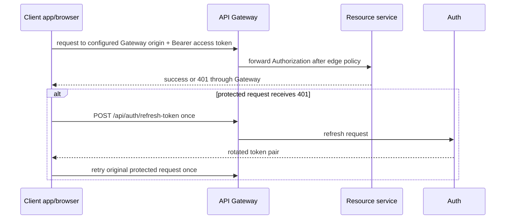

# Client Applications and Cross-Repository Contract

> Status: current repository structure and supported client boundary, checked
> 2026-08-08. Code/test behavior is authoritative; client folders still contain
> inactive/legacy feature code that must not be mistaken for an enabled backend
> contract.

## Client matrix

| Repository | Stack | Primary audience | Supported boundary |
| --- | --- | --- | --- |
| `delivery_app/` | Flutter/Dart, Riverpod, Dio/Retrofit, Mapbox, Firebase | Customer | Gateway REST with bearer/refresh; Mapbox direct for maps; customer-facing order, profile, restaurant, search and notification flows |
| `delivery_web/` | React 19, Vite, Axios, React Router, Tailwind, Firebase | Admin and restaurant owner | Gateway REST with bearer/refresh; admin/restaurant dashboard and management flows |
| `shipper_app2/` | React Native 0.80, React 19, Redux Toolkit, Axios, Mapbox, Firebase Messaging | Shipper | Gateway REST and raw Gateway WebSocket with bearer; current-offer recovery and delivery lifecycle updates |

None of the clients is allowed to call a backend service port, Config Server,
Eureka, database, Kafka or an internal endpoint. All use the same canonical role
names: `USER`, `SHOP_OWNER`, `SHIPPER`, `ADMIN`.

## Shared client network/auth behavior



Rules:

- Configure the **Gateway origin**, not an individual service address. Each
  runtime adds the `/api` path prefix exactly once.
- Refresh is single-flight: concurrent 401s wait on one refresh operation.
  Persist a successful rotated refresh token before replacing the access token.
- A client may use role-based navigation to improve UX, but the service is the
  authority for role/ownership. Browser/mobile code never sends trust headers.
- After refresh/revoke/login failure, clear local session state and take the
  user to the supported login path rather than retrying indefinitely.

## Customer Flutter app

### Structure

`lib/core/` contains configuration, Dio network setup, storage, routing, socket,
location/push/map services, theme and reusable UI. `lib/features/` is organized
by auth, restaurants, cart, orders, profile, addresses, search, notification and
other capability folders. The supported runtime uses the Gateway `API_BASE_URL`;
the local fallback is for developer use only.

### Important integrations

- Mapbox token comes from the ignored `.env`/native build configuration.
- Firebase configuration/credentials are deployment-supplied and must not be
  committed with product code.
- Customer cart/checkout calls the current order contract. It must treat server
  price/fee/discount snapshots as authoritative.
- Some promotion, flash sale, livestream, IAP or admin code may exist in the
  app tree, but its presence does not turn hidden backend capabilities on.

### Local setup contract

```text
fvm flutter pub get
fvm dart run build_runner build --delete-conflicting-outputs
fvm flutter run --dart-define=API_BASE_URL=https://gateway.example.test
```

Use a device-reachable Gateway origin rather than `localhost` when testing on a
physical device.

## Admin and restaurant web portal

### Structure

`src/services/api/` owns Axios/session behavior. `src/modules/admin/` and
`src/modules/restaurant/` own their application flows; `src/modules/auth/`
contains login/session integration. Routing/components should use typed action
contracts instead of embedding arbitrary backend URL strings.

### Runtime contract

- `VITE_API_BASE_URL` is a Gateway origin.
- Axios adds bearer token and performs one coordinated refresh operation.
- SHOP_OWNER actions use the canonical Restaurant order decision endpoints;
  the service verifies actual restaurant ownership.
- Web admin pages must not expose disabled payment/refund mutation, analytics or
  experimental livestream functionality merely because a screen/component still
  exists.

The repository's `npm run verify` runs lint, unit tests, action-contract checks
and production build. The action-contract script is a valuable client/API drift
gate; update it when a deliberately approved public route changes.

## Shipper React Native app

### Structure

`src/config/`, `src/navigation/`, `src/presentation/`, Redux state and service
modules separate base configuration, UI/navigation, state and API behavior. The
application runs Metro on port 8070; this is unrelated to the backend Gateway
port 8079.

### Offer and tracking flow

1. A notification may wake the app, but is not authoritative.
2. The app fetches `GET /api/deliveries/offers/current` with its bearer token.
3. It accepts/rejects only that current offer through the Delivery API.
4. It uses the raw Gateway WebSocket for authenticated location updates and
   receives only authorized delivery-room location data.
5. It performs lifecycle transitions only in the Delivery state-machine order.

FCM availability, background execution and a device's socket connectivity are
not guarantees. REST current-offer/current-delivery state must let the app
recover after a process kill or missed push.

## Cross-repository contract change checklist

Before changing a public HTTP route, response field, role, raw WebSocket action
or business-state transition:

1. Update the backend controller/DTO/test and
   `backend_delivery/docs/http-api-inventory.md`.
2. Locate every client call via `rg`; do not mass-replace URLs without checking
   base-prefix and actor semantics.
3. Update client adapters/types/tests and the web action-contract gate where
   applicable.
4. Update [api/README.md](./api/README.md), [workflows.md](./workflows.md) and the
   source map when the behavior is architecture-significant.
5. For an event/data change, create/update one root active plan because it has
   cross-service/repository migration and rollback implications.

## Sources and validation

- [Customer app README](../../../../delivery_app/README.md)
- [Web portal README and verification script](../../../../delivery_web/README.md)
- [Shipper app README](../../../../shipper_app2/README.md)
- [Cross-repository product overview](../product/overview.md)
- [Completed client alignment plan](../plans/completed/mvp-client-alignment.md)
