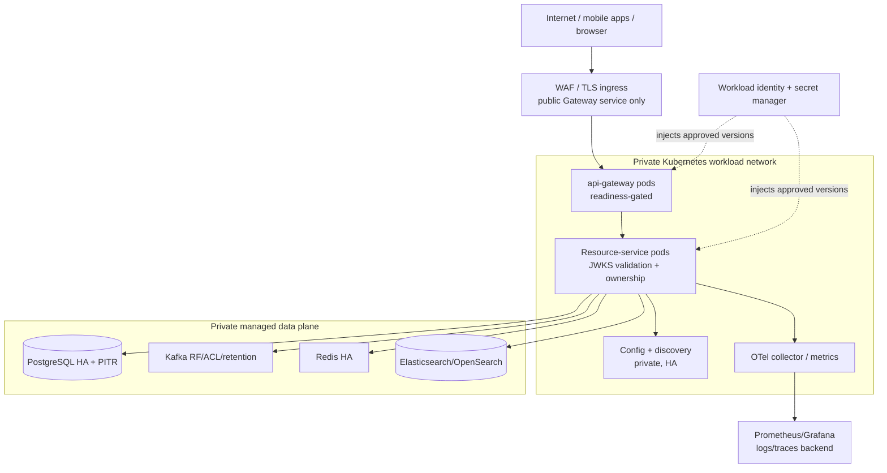

# Operations and Deployment Foundation

> Status: deployment-first system guide, checked 2026-08-09. This page separates
> verified local/staging Compose behavior from the requirements for a real
> production platform. It does not claim Kubernetes or cloud rollout is complete.

## What exists now

| Area | Verified as-built evidence | Boundary of that evidence |
| --- | --- | --- |
| Local runtime | Docker Compose runs PostgreSQL, Redis, Kafka KRaft, Elasticsearch, Config/Eureka, the 13-service COD MVP core, OTel collector, Prometheus and Grafana; application workloads are health-gated on Config/Eureka and each startup wave waits for an actual Eureka `UP` lease before Gateway smoke; four disabled capability services require the `optional-capabilities` profile for a full capability rehearsal | Single-host/developer topology, mutable local images and local data volumes |
| Health | All services expose private Actuator liveness/readiness on management port `9090`; image/Compose health uses readiness | No external production load balancer or cluster probe evidence |
| Discovery/config | Private Eureka + Config Server with logical routes and immutable config-label convention | Local native config backend; production config repo/HA remains environment work |
| Secrets | Local Docker secret files, startup fail-fast and secret scan | No selected production secret manager/workload identity implementation |
| Observability | Prometheus scrape config, Grafana dashboard, alert rule, OTLP collector and correlation IDs | Collector currently uses debug exporter; no selected durable logs/traces backend/retention |
| Data recovery | Encrypted logical backup, isolated restore and critical-data reconciliation rehearsal scripts | No managed physical base backup/WAL archive, production KMS/object storage or DR exercise |
| JWKS | Auth → wait → resource services → Gateway Compose runner completed with no legacy token fallback | Local/staging Compose result only; production canary/traffic evidence absent |
| Clean full-stack E2E runner | A disposable Compose overlay removes fixed names/infra ports, allocates a loopback Gateway port dynamically and uses run-scoped PostgreSQL/Kafka volumes; every child seed/COD/failure script inherits that exact Compose file/project rather than falling back to the canonical stack | Isolation config/probe is verified; a fresh 13-service double-stack execution still needs sufficient Docker Desktop capacity and remains local evidence only |

When Docker Desktop memory pressure kills the local Elasticsearch container,
use the volume-preserving [local Search recovery runbook](../../../runbooks/local-runtime-search-recovery.md).
It stops only disabled capability services, waits for Elasticsearch and Search
readiness, and proves the public Gateway search response; it is not a production
HA procedure.

### Local Compose capability profile

The normal local profile is the 13-service COD core. `promotion-service`,
`flashsale-service`, `analytics-service` and `livestream-service` use Compose
profile `optional-capabilities`, so a plain `docker compose up` does not start
them. Promotion/Flash Sale route mappings and read models remain in source, but
are not an availability guarantee of the default COD runtime. Start the profile
only for an explicit capability rehearsal with sufficient Docker Desktop memory;
do not infer that doing so authorizes its checkout/payment behavior.

For local monitoring wiring, run the [Prometheus/Grafana verifier](../../../../scripts/verify-observability-runtime.sh).
It proves scrape targets and the provisioned dashboard from the private network;
it does not imply durable production logs, traces or alert routing.

### Disposable clean E2E rehearsal

`backend_delivery/scripts/verify-clean-compose-e2e.sh` can now run against a
different Compose project without stopping the canonical developer stack. It
uses [`docker-compose.isolated-e2e.yml`](../../../../docker-compose.isolated-e2e.yml)
to remove fixed container names/host ports and lets Docker choose a loopback
Gateway port. The script refuses volume/project reuse and tears down only its
own project at the end. It passes its `COMPOSE_FILE` and project environment to
the seed, COD and failure-matrix scripts, whose database/Kafka `exec`/operator
fixture commands use that inherited target; the build baseline rejects a direct
canonical `docker compose exec` regression. Start with its no-container safety
check:

```bash
CLEAN_E2E_CONFIG_ONLY=true \
  bash backend_delivery/scripts/verify-clean-compose-e2e.sh
```

The full runner needs a second 13-service COD stack, so do not run it on a
memory-constrained Docker Desktop instance beside the canonical stack. A clean
E2E success is stronger local proof, not Kubernetes/production evidence.

For the current workstation evidence (2026-08-08), Docker Desktop had 7.75 GiB
available and the 22-container canonical core consumed roughly 6.2 GiB. The
second stack was therefore not started: use a dedicated runner or increase the
Docker Desktop allocation rather than stopping the canonical project to make
room.

The canonical startup verifier defaults to reconciliation without image rebuild,
so a routine health proof does not recreate all application containers. A fresh
artifact/release uses `RUNTIME_REBUILD_IMAGES=true`; each wave verifies health
and a real Eureka registration, and a missing lease triggers at most one
targeted service recreation rather than an implicit full-stack reset.

## Production architecture target



Only the TLS/WAF/Ingress-to-Gateway path is public. The data plane and all
service/control/management endpoints remain private. Whether the data plane is
managed or self-operated is an explicit deployment decision; it must meet the
same availability, backup, network and operator requirements.

## Deployment principles

1. Deploy immutable image digests and immutable config labels together. Do not
   mutate a running release's tag or configuration branch to “fix” it.
2. A pod must mount required secrets, load config, register/resolve dependencies
   and report Actuator readiness before it receives traffic. Liveness only
   restarts a process.
3. Apply compatible Flyway migrations before code depends on them. Never use an
   application pod crash-loop as the migration controller.
4. Drain HTTP/WebSocket/Kafka work on termination; allow consumers to commit and
   rebalance. Use a PDB and termination grace period consistent with this.
5. Keep a one-step rollback: previous image digest, previous config label and
   still-compatible schema/secret version. Rollback never deletes financial or
   outbox records.
6. Treat the Gateway as the only public edge even during incident recovery.
   Static private routes can recover discovery incidents but must not publish
   service ports.

## Deployment delivery sequence

| Wave | What changes | Required proof before next wave |
| --- | --- | --- |
| 0 — foundation | Cluster/network/registry, secret delivery, managed data plane, backup, observability access | Private network and least-privilege policies verified; no public service/store exposure |
| 1 — control plane | Config Server/Eureka HA or approved replacement; telemetry collectors | Config label, discovery registration, metrics/traces and alert delivery verified |
| 2 — Auth | Auth image, key/secret material and public JWKS endpoint | Readiness, public-only JWKS shape, JWKS cache/rotation smoke, no private keys exposed |
| 3 — resource services | Stateless/resource service pods in dependency-aware batches | Each readiness, Kafka/DB connectivity, integration smoke and consumer lag stable |
| 4 — Gateway | Gateway/Ingress/route policy and client allow-list | External TLS/route smoke, rate-limit/proxy policy, auth/COD smoke, no direct upstream exposure |
| 5 — load/DR | HPA/capacity, canary, failure tests, PITR/recovery rehearsal | Measured SLO/load result and recovery result, documented rollback gates |

The Auth-first sequence is mandatory for the JWKS migration. For normal feature
releases, use the dependency and schema changes of that feature to choose the
batch order.

## Kubernetes baseline (requirements, not yet deployed manifests)

Every active workload needs:

- `Deployment` or appropriate controller with an immutable image digest,
  resource requests/limits, startup/readiness/liveness probes and explicit
  termination grace period.
- Private `Service`; only Gateway gets an Ingress/LoadBalancer attachment.
- ConfigMap for non-secret, versioned runtime settings and external secret
  reference/mounted files for secrets.
- Service account/workload identity with only its database/Kafka/secret access.
- Default-deny NetworkPolicy plus explicit ingress/egress to its documented
  dependencies, DNS, config/discovery and telemetry.
- PodDisruptionBudget, anti-affinity/topology spreading and HPA only after a
  measured request/consumer/load baseline exists.
- Deployment annotations/labels containing image digest, config label and
  secret version identifier (never value) for audit/recovery.

The guarded rollout command also rejects a rendered plaintext `Secret` and any
`LoadBalancer` or `NodePort` Service before it contacts the target namespace.
That is a defense-in-depth guard: a real approved overlay still has to expose
only the Gateway through the selected Ingress/WAF path.

Stateful infrastructure requires dedicated HA/backup/upgrade operators or a
managed offering. Running the current single-node Compose containers as generic
Kubernetes Deployments is not a production implementation.

## Decisions required before applying production infrastructure

| Decision | Why it blocks implementation | Safe default until approved |
| --- | --- | --- |
| Cloud/on-prem platform and regions | Determines identity, network, storage, load balancer and DR topology | Do not provision |
| DNS domains/TLS/WAF ownership | Defines public endpoint, cert rotation and origin policy | Gateway remains non-public outside local/staging |
| Managed versus self-hosted PostgreSQL/Kafka/Redis/search | Determines HA, backup, upgrades, ACLs and on-call ownership | Keep local Compose for development only |
| Secret manager/workload identity | Required to mount/rotate JWT, DB, broker, FCM/provider secrets safely | No production secret in repository/Kubernetes manifest |
| SLOs, traffic forecast and cost envelope | Required to size HPA, PDB, replicas, alerts and canary threshold | Use only readiness gate; do not invent production thresholds |
| RPO/RTO and retention approval | Determines PITR/WAL, backups, archive region and DR drills | Use documented local recovery rehearsal only |
| Log/trace backend and retention/data policy | OTel debug exporter is not operational retention | Keep no production log/trace claim |

## Required operational documents

- [Deployment architecture and decision gates](./deployment-foundation.md)
- [Renderable provider-neutral Kubernetes foundation](../../../../deploy/kubernetes/README.md)
- [Production platform decision packet](./production-platform-decision-packet.md)
- [Release, rollback and data recovery](./release-and-recovery.md)
- [Observability and reliability operations](./observability.md)
- [Current backend rollout runbook](../../../runbooks/rollout-and-rollback.md)
- [Current backup/restore runbook](../../../runbooks/data-backup-restore.md)
- [Current secrets runbook](../../../runbooks/secrets-management.md)

## Implementation status

The durable plan is
[`../../plans/active/system-reconstruction-and-production-foundation.md`](../../plans/active/system-reconstruction-and-production-foundation.md).
The next implementation step after this documentation foundation is to obtain
the decision table above, then create a provider-specific infrastructure plan
and manifests with executable render/validation and a staged environment
rollout. A generic Kubernetes YAML directory before those decisions would be a
template, not a deployable system.
