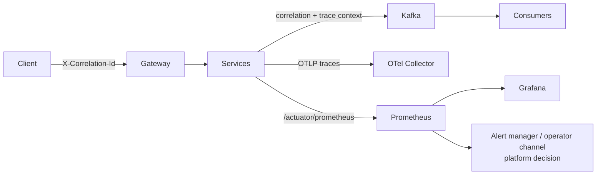

# Observability and Reliability Operations

> Status: current instrumentation plus production requirements, checked
> 2026-08-09. Metrics are present locally; durable production logs/traces,
> alert routing, retention and SLO thresholds still require an owner/platform.

## Signal flow

The correlation ID is validated/generated at the Gateway, returned to callers,
propagated through HTTP/Kafka and added to safe structured log context. It is not
an identity field and must not contain tokens/PII.

## Current metrics and dashboards

- Each backend service exposes private `/actuator/prometheus` on management port
  9090. Gateway does not route `/actuator/**`.
- Prometheus currently scrapes Gateway, Order, Restaurant, Delivery, Match,
  Settlement, Saga and Notification every 15 seconds.
- Grafana provisioning includes the `delivery-operations` dashboard.
- The current Prometheus rule alerts when
  `delivery_kafka_events_total{event="dlt"}` increases over five minutes.
- Micrometer HTTP, JVM, datasource and Redis metrics complement bounded custom
  domain/recovery metrics.

Metric labels must be bounded. Never use user, order, delivery, email, address,
token, event payload or exception message as a label.

## Operational views to keep

| View | Questions it answers |
| --- | --- |
| Gateway | Is client traffic succeeding? Which route group is rate-limited, slow or returning 5xx? |
| Service readiness | Which dependency prevents traffic? Are pods/processes restarting? |
| Kafka | Which consumer group/topic lags? Are retry/DLT rates growing? Is listener latency tied to DB/Redis failure? |
| COD business flow | Do `delivery_completed` and `settlement_completed` converge? Are reconciliation/receipt conflicts appearing? |
| Data dependencies | Are JDBC/Redis pools exhausted, query latency rising or search unavailable? |
| Realtime | Are connections, authorized rooms, send coalescing/rejections and publisher generation errors growing? |
| Security | Are auth/mutation/WebSocket rate-limit closed failures rising? Are secret/config/readiness errors preventing rollout? |

## Production requirements

1. Export OTel traces to a durable, access-controlled backend. The current local
   collector debug exporter is for diagnosis only.
2. Centralize structured logs with redaction, encryption/access controls,
   retention and an incident query path keyed by correlation/trace ID.
3. Select and approve SLI/SLO values before enforcing canary stop conditions.
   At minimum define availability/error, p95/p99 latency, Kafka lag/DLT, COD
   convergence and recovery RTO signals.
4. Deliver alerts to a named on-call escalation policy; test alert delivery and
   runbooks before production traffic.
5. Load-test Gateway, asynchronous consumers, Redis/WebSocket fan-out and the
   database pools to derive HPA/requests/limits rather than guessing them.

## Initial incident triage

1. Start with target health/readiness, then HTTP error rate and latency.
2. For Kafka lag, inspect listener time/retry/DLT before adding replicas;
   check dependent database/Redis health.
3. For COD divergence, trace `delivery.completed` by event/correlation ID, then
   inspect the durable settlement receipt before replaying any event.
4. For tracking issues, verify identity/participant access, current Redis
   generation/freshness and final-state recovery before blaming FCM/PubSub.
5. Do not claim a metric alone proves lost data; reconcile against owned durable
   state and the documented receipt/outbox contracts.

## Sources

- [Metrics/Prometheus runbook](../../../runbooks/metrics-prometheus.md)
- [Resilience/DLT operations](../../../runbooks/resilience-operations.md)
- [Prometheus config](../../../../monitoring/prometheus/prometheus.yml)
- [Grafana dashboard](../../../../monitoring/grafana/dashboards/delivery-operations.json)
