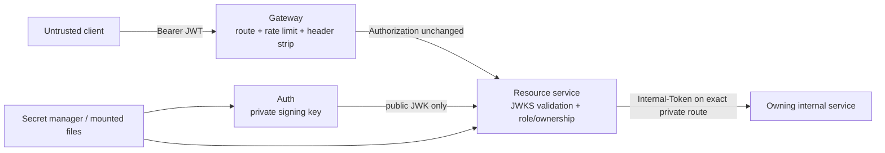

# Security, Identity and Secret Boundaries

> Status: as-built security boundary, checked 2026-08-09. This is a design and
> operations guide, not a location for credentials or a substitute for a threat
> model/security review.

## Trust model

Public JWKS is verification metadata; it never contains private key material.
Only resource services fetch it for token verification; clients do not fetch
JWKS and do not perform authorization themselves.
The internal credential is a separate service credential, not a browser/mobile
token and not a substitute for normal request validation.

## JWT/JWKS model

| Concern | Current rule |
| --- | --- |
| Issuer | Auth Service is the only RS256 signing authority |
| Discovery | `GET /.well-known/jwks.json` exposes active/retiring public JWKs with `kid` |
| Access token | Requires `kid`, `iss`, `aud`, `sub`, role claims, `token_type=access`, `jti`, `iat`, `exp`; default TTL 15 minutes |
| Refresh token | Separate token type/family, hashed/fingerprinted at rest; default TTL 7 days; rotation/revocation controlled by Auth |
| Validation | Each resource service checks RS256, `kid`, issuer, audience and token type before building its actor/authorities |
| Gateway | Does not mount keys, decode a JWT, inject actor headers or make ownership decisions |
| Revocation trade-off | A previously issued access token can remain valid until its 15-minute expiry after session/refresh revocation |

The shared `auth-resource-server-starter` makes decoding/conversion consistent,
but every service must retain an explicit `SecurityFilterChain` for anonymous,
bearer and internal routes. A generic `permitAll` rule for `/**/internal/**` is
not acceptable.

## Key rotation and deployment order

1. Publish a new public key with a new `kid` while Auth can still verify the
   retiring key where needed.
2. Wait at least the JWKS cache interval (five minutes) plus allowed clock skew.
3. Switch Auth signing to the new `kid`.
4. Retain the retired public JWK for access-token TTL (15 minutes) plus skew;
   Auth retains the verifier required for its refresh-token window.
5. Remove old material only after the verified expiry window and audit record.

The JWKS code path has a completed local/staging Compose three-wave rollout
record: Auth first, wait for token window, resource services, then Gateway. It
has no legacy-token fallback. This is **not** evidence that a production cluster
has run the rotation/rollout procedure; use the operations deployment gate.

## Authorization rules

Roles are exactly `USER`, `SHOP_OWNER`, `SHIPPER` and `ADMIN`.

- A role permits an endpoint category; it does not prove ownership of a
  particular order, restaurant, profile, delivery, address or balance.
- Path/body IDs are references, never authority. The target service obtains
  actor identity from validated JWT claims and checks its owned resource.
- Public registration lets callers create only `USER`/`SHOP_OWNER` password
  accounts. Shippers/admins require the documented operator path.
- User profile creation gets trusted identity from Auth by opaque provisioning
  token resolution; the client cannot choose an Auth identity in the profile
  payload.
- Internal endpoints require both an exact private route and the internal
  credential. They validate target IDs, payload shape and service-specific
  invariants rather than trusting the caller blindly.

## Gateway and proxy protections

- Gateway strips inbound legacy identity headers before routing.
- Rate-limit identity is direct peer IP by default. It reads the first
  `X-Forwarded-For` value only when `RATE_LIMIT_TRUSTED_PROXY=true` **and** the
  immediate peer matches an explicit `RATE_LIMIT_TRUSTED_PROXY_CIDRS` allow-list.
  An empty/default list fails closed to client-supplied forwarding headers.
- Current default 60-second limits: public auth 10/IP, public catalog 120/IP,
  authenticated reads 300/IP, mutation 30/IP, raw WebSocket handshake 10/IP.
- Redis outage behavior is intentional: catalog/authenticated reads fail open;
  auth, mutation and WebSocket handshakes fail closed with a safe 503 envelope.
- CORS origins are deployment configuration. A production deployment must
  enumerate trusted application origins; wildcard/CORS convenience from local
  development is not a production policy.

## Secret handling

| Secret | Allowed reader | Delivery rule |
| --- | --- | --- |
| JWT private signing key | Auth workload only | Mounted/injected secret file; never Config Server/repo/image layer |
| Retiring JWT public verifier | Auth workload only | Required only during documented overlap; public JWKS is served, not mounted elsewhere |
| Internal credential | Named backend workloads only | External secret injection with workload identity; no client access |
| Database/Kafka/Redis credential | Owning service and platform component | Per-service least privilege; do not reuse a broad developer password in production |
| FCM/OAuth/provider credential | Owning integration workload only | Feature remains disabled until credential/rotation/reconciliation are approved |
| Backup passphrase | Backup/restore operator job only | Mode-0600 file/secret manager; never command-line argument or log |

Locally, ignored Docker secret files are generated by
`backend_delivery/scripts/gen-keys.sh`. For staging/production, the documented
contract is workload identity backed by Vault, a cloud secret manager or
Kubernetes ExternalSecret. Selecting the actual provider remains a deployment
decision; a native Kubernetes Secret is only a delivery object, not a source of
truth or a reason to commit secret values.

## Safe observability and privacy

- Correlation IDs may travel through HTTP/Kafka and structured logs, but logging
  must redact credentials, auth headers, body payloads, full addresses, key
  material and raw tokens.
- Metrics labels must be bounded; never attach user/order/delivery/email/address,
  topic payload or exception message as a label.
- Health endpoints return aggregate status only and remain on the private
  management network.
- Location history is sampled, access-controlled support data with 90-day
  retention; live location authorization remains delivery-participant based.

## Incident basics

For a suspected secret exposure, revoke/rotate it through the approved secret
system, roll affected workloads, revoke sessions when relevant, and preserve
an audit record containing version identifiers—not secret values. For an auth
outage, do not bypass JWKS/ownership checks by reintroducing Gateway identity
headers. For a key rotation issue, use the prior verified secret version/overlap
plan and readiness/COD smoke rather than accepting unsigned or legacy tokens.

## Sources

- [JWKS resource-server ADR](../../decisions/0001-jwks-resource-server-authentication.md)
- [Secrets management/rotation runbook](../../runbooks/secrets-management.md)
- [Gateway resilience/rate-limit runbook](../../runbooks/resilience-operations.md)
- [Current Auth/Gateway configuration](../../../auth-service/src/main/resources/application.properties)
