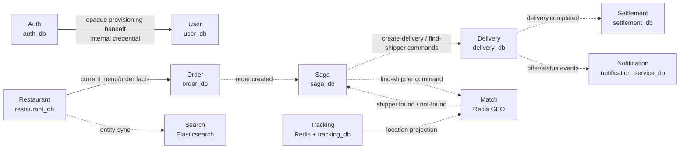

# Service Catalog and Ownership

> Status: as-built catalog, checked 2026-08-09. Ports are internal service
> ports in the local topology unless explicitly marked as the Gateway public
> edge. A port is not automatically a client contract.

## Runtime domain services

| Service ID / role | Local port | Owns | Main responsibilities | Interface/capability status |
| --- | ---: | --- | --- | --- |
| `api-gateway` — API Gateway | 8079 | Redis rate-limit keys only | Exact route/method edge policy, CORS, rate limit, correlation and stripping legacy identity headers | **Only public application edge**; does not validate JWT or own business data |
| `auth-service` — Auth | 8081 | `auth_db`, private signing keys/session families | Password/social identity, email verification/recovery, refresh/session revoke, account block, RS256 issuance/JWKS | Auth public/recovery paths plus protected session/admin; internal registration resolution/completion |
| `user-service` — User | 8082 | `user_db` | User profile, address book, Auth identity projection/block status | Current-user/address/admin-read protected; Auth projection paths internal |
| `restaurant-service` — Restaurant | 8083 | `restaurant_db`; cache invalidation/outbox | Restaurant/menu ownership, operating hours, menu availability, restaurant decision, ratings, polygon serviceability, prep estimate and menu inventory ledger | Public catalog reads; owner/admin mutation; private checkout/ownership/serviceability/inventory validation (serviceability and inventory gated) |
| `routing-service` — Routing | 8094 | no business database; provider boundary | Driving route/matrix authority and bounded ETA window with explicit provider/geodesic source | Private internal credential only; no Gateway public route |
| `order-service` — Order | 8084 | `order_db`, order outbox/decision receipts | Checkout preview/create, immutable price snapshot, order read/cancel, receives restaurant decision | Protected customer/owner/admin routes; private eligibility checks |
| `saga-orchestrator-service` — Saga Orchestrator | 8095 | `saga_db`, command outbox/dedup | Advances workflow after events; emits create-delivery/find-shipper/cancel/terminal commands | Kafka-only, no public controller |
| `delivery-service` — Delivery | 8085 | `delivery_db`, delivery outbox | Delivery state machine, offer persistence, accept/reject/cancel assignment, status changes | Protected shipper/customer/owner/admin reads/actions; private tracking authorization |
| `match-service` — Match | 8092 | Redis GEO matching projection/reservation state | Selects one eligible nearby shipper per Saga command; maintains cancellation/offer fences | Kafka-only, no HTTP controller |
| `shipper-service` — Shipper | 8089 | `shipper_db` | Shipper profile, fleet reads, online status and self rating reads | Protected self/admin; legacy write/delete/rating APIs hidden |
| `tracking-service` — Tracking | 8093 | Redis GEO/leases/rooms, `tracking_db` sampled history | Raw WebSocket location, participant fan-out, offline/freshness, asynchronous support history | Shipper self update/offline + `/ws/shipper-locations`; history private/admin-only |
| `notification-service` — Notification | 8091 | `notification_service_db`, Redis FCM token ownership | Durable inbox, read state, event notification, FCM best-effort wake-up | Protected self notification/FCM routes; manual send internal |
| `settlement-service` — Settlement | 8090 | `settlement_db`, receipts/ledger/balance projection | COD eligibility and immutable ledger posting after delivery complete | Admin reads and private COD eligibility active; payment/refund/self-service mutation hidden/default-off |
| `search-service` — Search | 8088 | Elasticsearch projection | Restaurant/dish search from events | Anonymous bounded reads; shipper search hidden |
| `promotion-service` — Promotion | 8096 | `promotion_db`, reservation/outbox | Voucher wallet/read, reservations and compensation model | Route/read mappings exist, but the default COD Compose runtime excludes this service via `optional-capabilities`; checkout relay/default behavior remains gated off |
| `flashsale-service` — Flash Sale | 8092 container-local | `flashsale_db`, Redis non-authoritative cache | Campaign/read model and stock reservation model | Route/read mappings exist, but the default COD Compose runtime excludes this service via `optional-capabilities`; merchant/internal checkout paths remain gated off |
| `analytics-service` — Analytics | 8097 | `analytics_db` | Event projection/dashboard/reconciliation | Experimental and disabled by default; Gateway surface closed |
| `livestream-service` — Livestream | 8094 | `livestream_db`, Agora integration boundary | Livestream metadata/products/token model | Experimental and disabled by default; Gateway surface closed |

The two services showing `8092` are distinct Compose services. Their port labels
are not a reason to expose either one beyond the private network.

## Shared and control-plane modules

| Module/service | Responsibility | Rebuild requirement |
| --- | --- | --- |
| `auth-resource-server-starter` | JWKS JwtDecoder, issuer/audience/algorithm/token-type validation and role conversion | Reuse one audited implementation but let each service own its `SecurityFilterChain` and endpoint policy |
| `runtime-platform-starter` | Config/bootstrap, health/readiness conventions and runtime prerequisites | Startup must fail for required config/secret dependencies rather than silently use production-like defaults |
| `observability-starter` | Correlation ID, structured-safe logging, HTTP/Kafka propagation | Propagate identifiers, never headers/payloads/secrets as log fields |
| Config Server | Versioned, non-secret bootstrap config | Config is immutable per process; choose a label then roll/restart instead of hot-refreshing a transaction |
| Eureka | Logical service registration/discovery | Private topology only; service IDs are lowercase hyphenated module IDs |
| OpenTelemetry collector | Receives tracing exports | Deployment must decide downstream trace retention/exporter |
| Prometheus/Grafana | Metrics scrape, dashboard and alert rule provisioning | Keep management endpoints private and metric labels bounded |

## Ownership map

Solid arrows are synchronous internal HTTP or a direct owned-store interaction;
dotted arrows are Kafka/event or projection dependencies. The map shows contract
direction, not permission to read another service's database.

Arrows describe a contract dependency; they do not authorize cross-database
reads. For example, User cannot write `auth_db`, and Saga cannot update a
delivery row directly.

## Service-level design rules

### API Gateway

- Match only the intended methods and paths; unknown/hidden routes are not
  pass-through traffic.
- Strip `X-User-Id` and `X-Role` from every inbound request.
- Trust `X-Forwarded-For` only when the immediate peer is in the configured
  trusted-proxy CIDR allow-list; default behavior is fail-closed/no trust.
- Apply rate limit at the edge. Authorization belongs to the target resource
  service.

### Auth and User

- Auth owns credentials, signing keys, token/session state and identity link.
- User owns profile/address data. It resolves an opaque one-time hand-off with
  Auth before creating a profile; never trusts client-supplied identity fields.
- The link from Auth account to User profile and retries after a partial failure
  must be idempotent by `authId`.

### Order, Restaurant, Saga, Delivery and Match

- Order owns the price/coordinate/payment snapshot persisted at checkout.
- Restaurant owns current menu/restaurant facts and emits its owner decision.
- Saga owns workflow transition orchestration, not the downstream aggregates.
- Delivery owns offer expiry, current assignment and every delivery state
  transition; it writes an event before Notification wakes an app.
- Match owns ephemeral candidate selection and Redis reservation fencing; it
  never creates a Delivery directly.

### Tracking and Notification

- Tracking authenticates the raw WebSocket bearer token, then asks Delivery for
  delivery-room participant authorization. Shipper location is a self-owned
  publisher action with one active generation/lease.
- Notification keeps an inbox record as durable truth. FCM is a wake-up channel;
  device delivery is not proof that a business action happened.

### Settlement

- Settlement accepts only a canonical COD completion event. It checks IDs,
  payment method and money conservation before touching balances.
- Receipt, four immutable ledger entries and balance projections commit in one
  transaction. The receipt/business constraints handle replay; never “fix” a
  mismatch by posting a compensating mutation automatically.

## Hidden capability safety rule

Payment/VNPay, provider refunds, promotion/flash-sale checkout, Analytics and
Livestream each have code/schema or API mappings but are not current public MVP
capabilities. Opening one requires its own owner-approved policy, role/ownership
proof, migration/rollback plan, external integration testing and Gateway route
review. The presence of a controller in the source tree is not authorization to
enable it.

## Authoritative detail

- [Runtime, dependency and capability inventory](../../system-contract-inventory.md)
- [Exact HTTP handlers](../../http-api-inventory.md)
- [Service-specific specifications](../../services)
- [Backend Maven module list](../../../pom.xml)
- [Local runtime topology](../../../docker-compose.yml)
