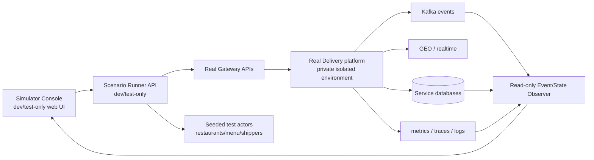

# End-to-End Scenario Simulator — Design and Delivery Plan

> Status: MVP runner + standalone console **partially implemented** (2026-08-21).
> The runner is dev/test-only, in-memory and Gateway-driven. A Kafka observer
> for the Match decision-trace topic is now implemented; DB/ledger observer,
> durable run storage and isolated fixture provisioning remain open.

## Objective

Create an operator/developer tool that can configure and observe realistic
multi-actor scenarios, for example:

- one customer orders from a restaurant;
- one or more shippers start at configured coordinates around the pickup;
- restaurant confirms or rejects;
- matching selects a shipper, an offer is delivered/accepted/rejected/expires;
- delivery transitions through pickup/delivering/completed;
- tracking, notifications, Kafka events and COD settlement can be watched on a
  single correlated timeline.

It must use the real Gateway/service/Kafka contracts in a disposable environment
and visibly distinguish an expected failure/retry/DLT path from a successful
business transition.

## Non-negotiable safety boundary

- Simulator never runs against production or a shared customer/staging database.
- It uses isolated Compose/Kubernetes namespace, generated test identities and
  namespaced/test databases/topics/consumer groups.
- It never needs a production private key, real FCM credential, payment provider
  credential or real customer location.
- Scenario actions use public Gateway APIs or documented internal test seams;
  they do not mutate another service's database to “force” a state.
- Fault injection is explicit, reversible and logged (e.g. pause consumer,
  inject retryable dependency failure, withhold shipper response). It must not
  silently alter business amounts/ledger data.

## Recommended shape



The current implementation follows the recommended **separate dev/test-only
simulator console and scenario runner** shape. `simulator-service` is disabled
unless `SIMULATOR_ENABLED=true`, has a local Gateway host allowlist, and is not
registered in the production Gateway route table. A read-only Kafka/DB observer
is still future work and must not interfere with production consumer groups.

The console's candidate table is an explicit **scenario oracle**: it is seeded
from configured coordinates, online state and COD balance, then updated when a
real offer or assignment is observed. It is not an exported Match Service
internal candidate stream. The runner therefore reports Kafka/DB/ledger
assertions as `SKIPPED` until the corresponding read-only observer phase is
implemented. The separate Decision Trace panel is the exception: it renders
the real, versioned `matching.decision-trace` events from Match, not the
scenario oracle.

## Runnable local sandbox

The implemented operator path is documented in
[`backend_delivery/docs/runbooks/production-like-sandbox.md`](../../../runbooks/production-like-sandbox.md).
It starts a disposable Compose project with synthetic actors, loopback-only
dynamic ports, the real Gateway/Kafka/Saga/Match/Delivery/Tracking path, and
safe `sandbox-up.sh` / `sandbox-run.sh` / `sandbox-down.sh` commands. This is a
runtime rehearsal boundary, not evidence of production HA or load readiness.

### Match algorithm Decision Trace

The active matching path emits one read-only trace after its durable result:

```text
GEO_QUERY → COD_ELIGIBILITY → RESERVE → OUTCOME
```

The trace identifies `nearest-cod-v1`, the selected shipper (if any), the
post-filter candidate list, distances/ranks, COD eligibility and rejection
reasons. It includes total/stage latency and marks a candidate resumed from a
durable Match replay. The simulator consumes it with a dedicated group and
correlates using both order and delivery identity. A short pending buffer
covers the race where Kafka delivers the trace before the runner's next poll
learns those IDs. The trace is never an input to assignment and has no business
retry/DLT path; it is safe to lose without changing the scenario outcome.

## User interface requirements

### Scenario builder

- Select a saved template (happy COD, restaurant rejection, no shipper,
  offer expiry/rematch, shipper cancellation, settlement replay, tracking
  reconnect, rate-limit/dependency failure).
- Configure deterministic seed, customer/restaurant/menu, item quantity,
  pickup/drop-off coordinates, number/locations/availability of shippers,
  timing/response choices and optional fault switch.
- Validate configuration before launch: valid coordinates, supported payment
  method, no hidden payment/promotion behavior accidentally enabled, compatible
  actor roles and isolated namespace.
- Start, pause/cancel only before irreversible test action, reset/clean
  disposable scenario data, and export a redacted result bundle.

### Live timeline

- Show a correlation ID, scenario ID, order ID, delivery ID and stable event IDs.
- Render state transitions, Gateway calls, Kafka topic/partition/offset,
  consumer/receipt outcomes, notification/inbox state, location updates and
  settlement receipt/ledger invariant checks.
- Show source, timestamp and status for each event; link to safe log/trace view.
- Mark **expected**, **recovered retry**, **DLT**, **assertion failure** and
  **unobserved/timeout** differently. Do not mark “success” merely because an
  HTTP request returned 2xx.

### Assertions

Each template specifies expected end state and invariants, e.g.:

| Scenario | Assertions |
| --- | --- |
| Happy COD | one order/delivery, one valid offer, shipper accepts, `DELIVERED`, one settlement receipt/four ledger entries |
| Restaurant reject | no delivery assignment; Order/Destination converge as cancelled/rejected; no ledger posting |
| No shipper | Delivery/Order converge on terminal no-shipper semantics; refund-eligible snapshot exists; no fake payment/refund |
| Offer expiry/rematch | expired shipper cannot accept stale offer; a new eligible shipper may receive a new generation |
| Duplicate completion | replay causes no additional receipt/ledger rows; conflict is visible/fail-closed |
| Tracking reconnect | stale publisher cannot overwrite current location; authorized viewer receives final current location |

## Architecture contract for the runner

| Component | Responsibility | Constraints |
| --- | --- | --- |
| Fixture provisioner | Creates test-only accounts/profiles, restaurant/menu, deposits and shipper positions | Uses documented operator/test setup; idempotent namespaced fixture IDs |
| Scenario orchestrator | Calls real APIs, schedules actor actions, waits for observable criteria | Does not synthesize direct DB writes for normal business actions |
| Shipper/customer agents | Simulate HTTP/WebSocket behavior with real auth/session flow | Store test tokens only in process memory/secure temp files; never display them |
| Read-only observer | Correlates Gateway responses, Kafka records, service-safe reads and telemetry | No consumer offset/mutation impact on real services |
| Assertion engine | Applies template invariants/timeout rules and emits machine-readable report | Checks durable state/receipts, not just UI messages |
| Console | Configures/runs/displays scenarios | Dev/test auth only; no production build route |

## Delivery phases

| Phase | Scope | Evidence |
| --- | --- | --- |
| S0 — contract/fixtures | Documented; simulator flag/target allowlist/redaction implemented; fixture provisioning still manual | Static safety tests and isolated target guard |
| S1 — CLI/runner | MVP runner calls real Gateway order/restaurant/delivery and Tracking REST contracts; no durable persistence | Runner service tests + real isolated runtime required |
| S2 — observer | SSE state stream implemented from runner polling; Match decision-trace Kafka observer implemented; DB/ledger observer not implemented | Decision Trace is real Match evidence; other Kafka/DB/ledger assertions remain `SKIPPED` |
| S3 — web console | Scenario builder, multi-shipper config, live map, SSE timeline and report wired to backend; explicit mock mode retained | Typecheck + production build; runtime isolated E2E pending |
| S4 — faults/load | Controlled retry/DLT, restart, reconnect, scale/fan-out and chaos templates | Assertions prove recovery/invariant preservation |
| S5 — CI/nightly | Stable selected scenarios in isolated environment, artefacts retained | Non-flaky run policy and failure diagnosis guide |

## First implementation choice to confirm later

Before code begins, decide whether the console is a standalone dev-only React
application or a strictly excluded development package inside `delivery_web`.
The recommended standalone option gives the clearest safety boundary and avoids
accidentally shipping simulation controls in an admin bundle. Either option must
remain isolated and use the same scenario-runner API/contract.

## Dependencies before implementation

- Canonical docs and API/event/state inventories in this folder stay current.
- A disposable Compose/Kubernetes environment can start the active services and
  receive isolated fixture data.
- Correlation, safe logging and basic telemetry are available.
- Test fixture provisioning is explicit for COD deposits and roles; it must not
  depend on a developer's retained local state.
- Deployment decisions do not need to be production-complete, but a stable
  test-environment topology and cleanup mechanism are required.
