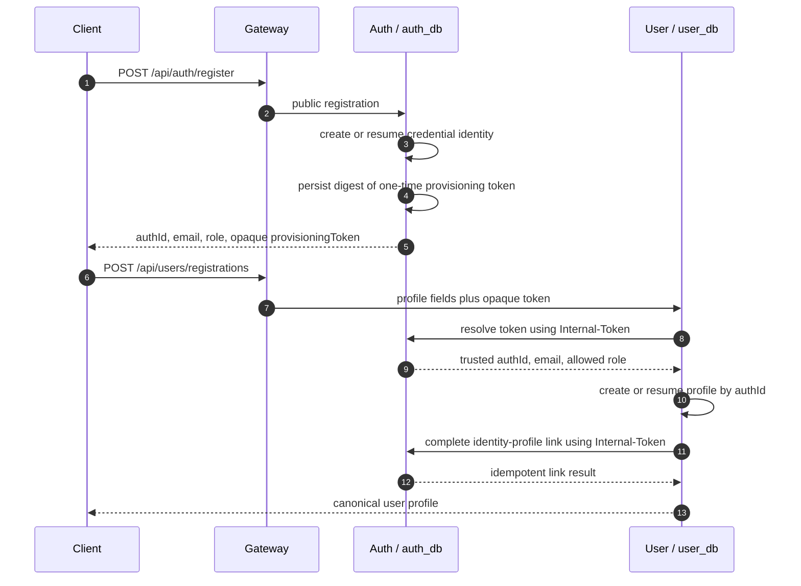
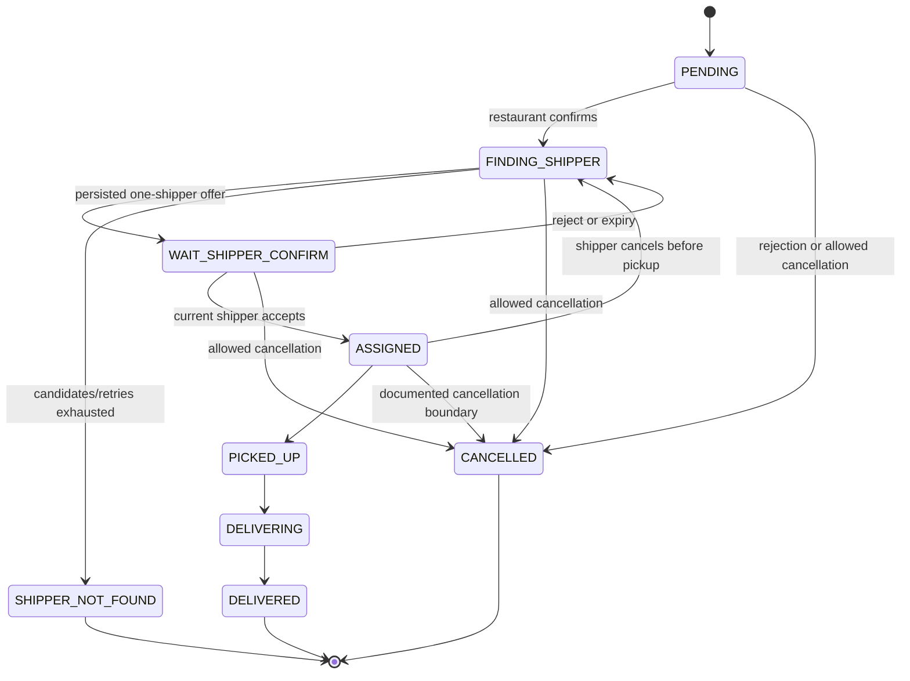

# Domain Workflows and Failure Semantics

> Status: current MVP behavior, checked 2026-08-09. This page is a reconstruction
> guide; detailed event field definitions and proof records remain in the linked
> backend workflow and contract documents.

## 1. Password registration: two independently retryable requests

The client deliberately coordinates two calls instead of calling a distributed
“create account” endpoint. Auth and profile ownership remain separated, and a
retry after a crash does not create a second profile.



Invariants:

- The hand-off token is opaque, one-time, SHA-256-digested at rest and expires
  after 15 minutes.
- User Service never uses `authId`, email or role from the client body as proof
  of identity.
- Public password registration permits only `USER` or `SHOP_OWNER`; `ADMIN` and
  `SHIPPER` are operator-provisioned paths.
- Password login is blocked until email verification and identity/profile link
  requirements are met.

## 2. Authenticated request and refresh

```mermaid
sequenceDiagram
    participant C as Client
    participant G as Gateway
    participant R as Resource service
    participant A as Auth JWKS

    C->>G: protected request + Bearer access JWT
    G->>G: strip legacy identity headers; rate limit
    G->>R: forward Authorization unchanged
    R->>A: fetch/cache public JWK by kid when needed
    R->>R: validate RS256, issuer, audience, token_type=access
    R->>R: role plus resource-ownership authorization
    R-->>C: response through Gateway
    Note over C,A: On 401, client performs one refresh request then retries once.
```

Access tokens have a 15-minute TTL; refresh-token families have a 7-day TTL.
Refresh rotation/revocation is not instantaneous revocation of a previously
issued access JWT: a revoked access token may remain valid until it expires.
This is an explicit MVP security trade-off, not an implicit guarantee.

## 3. COD order-to-delivery lifecycle

```mermaid
sequenceDiagram
    autonumber
    participant C as Customer
    participant O as Order
    participant G as API Gateway
    participant R as Restaurant
    participant K as Kafka
    participant S as Saga
    participant D as Delivery
    participant M as Match
    participant N as Notification
    participant Sh as Shipper
    participant St as Settlement

    participant Owner as Restaurant portal

    C->>G: POST /api/orders/checkout-preview
    G->>O: calculate canonical total + quoteId (5-minute TTL)
    C->>G: POST /api/orders with quoteId + Idempotency-Key
    G->>O: validate customer quote and retry receipt, then re-price
    O->>R: synchronous canonical menu/restaurant validation
    O->>O: store immutable money/location snapshot + outbox
    O-->>K: order.created
    K-->>S: start workflow
    S-->>K: saga.command.create-delivery
    K-->>D: create PENDING delivery + outbox
    Owner->>G: confirm/reject restaurant order
    G->>R: forward owner decision
    R->>R: persist decision + outbox
    R-->>K: restaurant.order-confirmed or rejected
    K-->>S: on confirmation, advance state
    S-->>K: saga.command.find-shipper
    K-->>M: find one eligible candidate from Redis GEO
    M-->>K: shipper.found or shipper.not-found
    K-->>D: persist offer/expiry or terminal state
    D-->>K: delivery.shipper-offered
    K-->>N: durable inbox then best-effort FCM wake-up
    Sh->>G: GET current offer; POST accept
    G->>D: forward shipper request
    D-->>K: accepted/status/completed events
    K-->>St: delivery.completed only after DELIVERED
    St->>St: receipt + ledger transaction then ACK
```

The lifecycle is intentionally not “Order directly tells a nearby shipper.”
Saga emits commands, Match proposes an offer, and Delivery remains the authority
that persists the offer and assignment before a notification is sent.

### Delivery state machine



### Critical ordering and replay rules

- The Order stores a server-derived, immutable money snapshot; clients do not
  calculate authoritative fee, discount or total.
- Restaurant confirmation/rejection has an atomic decision/outbox record and
  payload fingerprint. Contradictory replay must not overwrite an accepted
  decision.
- Delivery offer identity/expiry is persisted before Notification sends FCM.
  A shipper always reads `GET /api/deliveries/offers/current` as the canonical
  recovery point before accepting.
- One Match result reserves one shipper; cancellation records a tombstone before
  releasing the exact reservation so stale work cannot resurrect an offer.
- `SHIPPER_NOT_FOUND` is its own terminal state, not an alias for cancellation.
  It emits a typed refund-eligibility/compensation boundary; payment/refund
  execution remains disabled unless separately approved.

## 4. Tracking and realtime delivery visibility

```mermaid
sequenceDiagram
    participant Sh as Shipper app
    participant G as API Gateway
    participant T as Tracking
    participant R as Redis GEO/PubSub
    participant K as Kafka
    participant M as Match
    participant V as Authorized delivery viewer
    participant D as Delivery

    Sh->>G: raw WebSocket handshake with Bearer token
    G->>T: forward handshake through private route
    T->>T: JWKS validation; derive shipper identity
    Sh->>G: update_location / ping WebSocket frame
    G->>T: forward WebSocket frame
    T->>R: GEO location, heartbeat and publisher-generation lease
    T-->>K: shipper.location-updated
    K-->>M: update independent matching projection
    V->>G: subscribe to delivery room
    G->>T: forward viewer handshake/subscription
    T->>D: internal participant authorization check
    T->>R: send latest known delivery location then join exact room
    R-->>T: Pub/Sub fan-out across Tracking instances
    T-->>G: bounded/coalesced current location updates
    G-->>V: current location updates
```

Only an authenticated shipper can publish its own location. One shipper has one
active publisher generation; a stale socket cannot overwrite a newer session.
Disconnect has a 30-second grace period. Redis GEO is volatile current state;
PostgreSQL history is asynchronously sampled (10 seconds/25 m) for support and
is not restored as live tracking state after a disaster.

## 5. COD settlement

`delivery.completed` is processed only when `paymentMethod=COD` and the
canonical amounts conserve:

`totalPrice = restaurant earnings + platform restaurant commission + shipping fee`

Settlement takes balance-row locks, writes a unique receipt, four immutable
ledger entries and balance projections in one transaction. It acknowledges the
Kafka record only after commit. The exact same event is a no-op; same event ID
with different payload, one order under another event ID, insufficient shipper
deposit or an amount mismatch roll back and go to retry/DLT/operator handling.

There is no public customer top-up/payment/refund behavior in the active COD MVP.
The local seed deposit script exists solely to make a test flow possible.

## 6. Failure, compensation and recovery

| Failure | Required behavior |
| --- | --- |
| Process dies after business commit but before Kafka ACK | Restart/replay sees the durable receipt/dedup record and does not duplicate the effect. |
| Event delivery duplicates | Consumer deduplicates by stable event/business key before side effect. |
| Same business key, contradictory payload | Fail closed; never silently treat it as a duplicate. |
| Consumer temporary dependency failure | Do not ACK; use configured retry/backoff then DLT. |
| Restaurant rejects / customer cancels before fulfillment | Order emits the canonical cancellation contract; reservation release is idempotent. |
| No shipper found | Preserve terminal reason; emit refund-eligible snapshot, do not rewrite as `CANCELLED`. |
| FCM fails | Durable inbox and current-offer endpoint remain source of truth; FCM may be retried/best-effort. |
| Redis tracking state is lost | Recreate it from reconnecting authenticated publishers; do not restore stale GEO/lease/offer state. |

## Detail and evidence

- [Order lifecycle](../../workflows/order_lifecycle_flow.md)
- [Delivery, matching and tracking](../../workflows/delivery_matching_tracking.md)
- [Settlement and COD](../../workflows/settlement_finance_flow.md)
- [Kafka and state-machine inventory](../../system-contract-inventory.md)
- [Refund boundary (policy-gated)](../../runbooks/refund-workflow.md)
