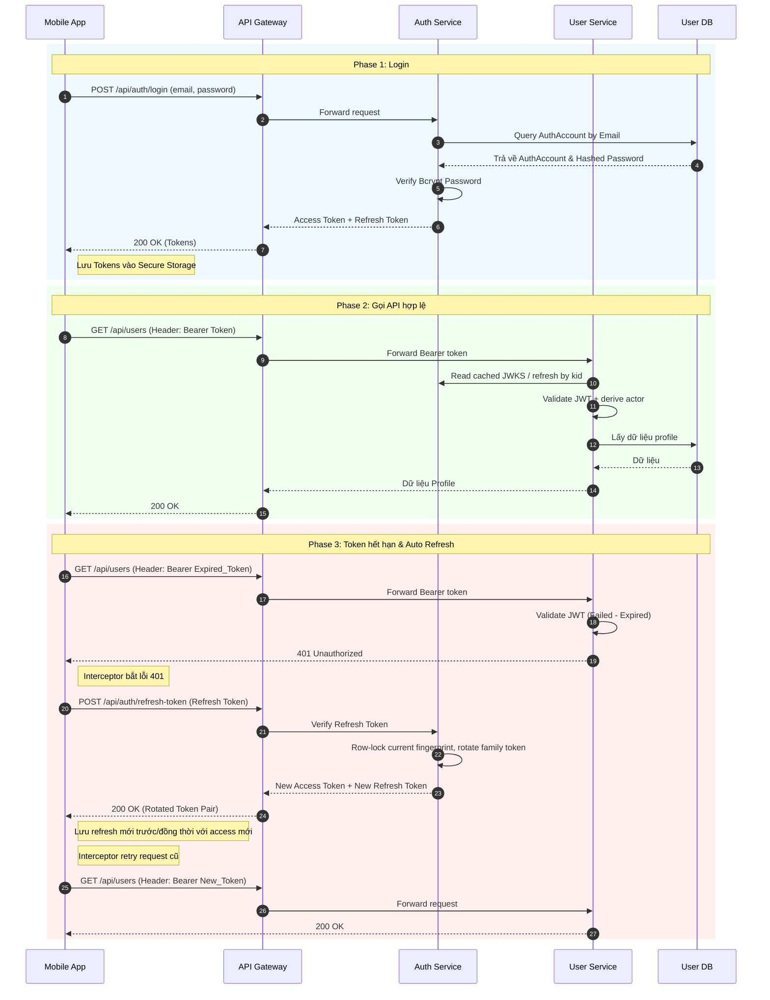

# 🔐 Auth & User Management

## 1. Đặc tả (Specification)
**Mục tiêu:** Quản lý toàn bộ vòng đời của người dùng (Customer, Shipper, Admin), bao gồm quá trình xác thực (Authentication), phân quyền (Authorization) và quản lý hồ sơ cá nhân.

**Microservices liên quan:**
- `api-gateway`: Route request, IP rate limit và loại bỏ legacy identity headers.
- `auth-service`: Cấp phát JWT RS256/JWKS, xử lý logic đăng nhập, verify Refresh Token, tích hợp Social Login.
- `user-service`: Quản lý thông tin hồ sơ của Customer và Admin (Tên, SĐT, Địa chỉ).
- `shipper-service`: Quản lý hồ sơ chuyên biệt của Shipper (Bằng lái xe, CCCD, Biển số xe, Trạng thái hoạt động).

## 2. Danh sách Use Cases

| Mã UC | Tên Use Case | Nền tảng | Trạng thái |
|-------|--------------|----------|------------|
| UC-1.1 | Đăng ký / Đăng nhập (Email/Password) | All | ✅ Done |
| UC-1.2 | Đăng nhập Social (Google) | Customer App | ✅ Done |
| UC-1.3 | Cập nhật hồ sơ Customer (Avatar, SĐT) | Customer App | ✅ Done |
| UC-1.4 | Cập nhật hồ sơ Shipper (CCCD, Biển số) | Shipper App | ✅ Done |
| UC-1.5 | Quản lý sổ địa chỉ giao hàng | Customer App | ✅ Done |
| UC-1.6 | Quản lý Users (Khóa tài khoản, Phân quyền) | Admin Web | 🔧 Partial |
| UC-1.7 | Tự động Refresh Token (Silent Login) | Mobile Apps | ✅ Done |
| UC-1.8 | Forgot/reset password và email verification | All | ✅ Done |

Public registration chỉ tạo `USER` hoặc `SHOP_OWNER`. `ADMIN` và `SHIPPER` cần
operator provisioning; SHIPPER chỉ được mở self-registration sau khi có luồng
tạo Auth + User + Shipper profile atomic/recoverable. Existing SHIPPER đã được
provision vẫn có thể dùng password/social login bình thường.

Password account mới phải xác minh email trước khi login. Existing account được
grandfather khi migration; Google login chỉ đánh dấu verified sau khi Google đã
xác nhận đúng email. Reset/verification dùng token one-time có expiry và chỉ lưu
digest. Provider, threat model, rate limit, session revocation và incident flow:
`../runbooks/account-recovery-email-verification.md`.

Local runtime harness dùng one-shot runner trong auth-service để tạo fixture đặc
quyền bằng AuthService + User internal provisioning, không qua public
self-registration hoặc SQL patching:

- `OperatorShipperProvisioningRunner`: bật bằng
  `APP_OPERATOR_SHIPPER_PROVISIONING_ENABLED=true` cùng email/password env cho
  SHIPPER fixture.
- `OperatorAdminProvisioningRunner`: bật bằng
  `APP_OPERATOR_ADMIN_PROVISIONING_ENABLED=true` cùng email/password env cho
  ADMIN fixture.

Hai runner không mở public API, không ghi log password, chỉ resume account cùng
role và cùng password; existing account lệch role/password hoặc inactive sẽ
fail-closed. Public self-registration vẫn không được tạo `ADMIN` hoặc `SHIPPER`.

Public password registration đang chuyển dần sang contract hai request do client
điều phối, không có User → Auth synchronous callback trong event mode:

1. `POST /api/auth/register` tạo/resume credential identity trong Auth và
   trả `principalId` canonical cùng `authId` compatibility alias, provisioningToken RS256 với audience
   `delivery-user-registration`, cùng opaque `registrationHandle` TTL 15 phút.
   Email verification được tạo bền vững trước khi notification được gửi sau
   commit.
2. `POST /api/users/registrations` nhận token và profile fields. User service
   xác thực token cục bộ qua Auth JWKS, không tin identity từ client, tạo profile
   idempotent theo `principalId` rồi ghi `identity.profile.created` vào outbox
   trong cùng transaction.
3. Auth consume event để liên kết legacy `auth_account.user_id` trong giai đoạn
   migration và chuyển lifecycle `PENDING_PROFILE → PENDING_EMAIL_VERIFICATION`
   hoặc `ACTIVE`. Client không poll trên happy path. Khi bước User bị timeout
   hoặc trả lỗi sau khi Auth đã nhận request, client có thể đọc
   `GET /api/auth/registrations/{handle}` đúng một lần để phân biệt profile đã
   hội tụ với profile cần retry. Response trả `profileLinked` authoritative;
   client không suy diễn profile tồn tại từ lifecycle/`nextAction`, vì account
   có thể bị block trước khi profile được tạo. Sau đó client retry lại hai
   request idempotent bằng cùng credentials nếu cần.

`registrationHandle` chỉ là recovery metadata, không phải credential đăng nhập
và không được lưu vào Hive/plain preferences. Auth lưu hash của handle; job
cleanup xóa các handle đã hết hạn sau `REGISTRATION_HANDLE_RETENTION_DAYS`
(mặc định một ngày) để rollout không tích lũy bảng này vô hạn.

Nếu bước 2 lỗi sau khi Auth đã thành công, client chạy lại từ bước 1 để nhận
handoff mới. Nếu profile đã persist nhưng event relay/Auth consume bị gián đoạn,
retry User registration trả lại đúng profile theo `authId`; User outbox sẽ tiếp
tục hội tụ Auth link. Login vẫn fail-closed khi `user_id` chưa được link. Token
chỉ lưu SHA-256 digest, one-time nhưng replay profile event được dedup theo
`eventId` trong inbox. Password account vẫn phải verify email trước login.
Social login và operator provisioning tiếp tục dùng internal server
orchestration, không thuộc public two-request flow này.

User service không giữ Auth registration HTTP client hay `Internal-Token` cho
public flow: signed provisioning JWT + JWKS là boundary duy nhất. Legacy opaque
Auth resolve/complete registration endpoints and `USER_PROVISIONING` security
tokens were removed because no caller remains; they cannot be used as a public
registration rollback rail. The enum value remains temporarily readable in
Auth persistence for rows issued by older releases; no new value is issued and
it is removed only in the later retention-drain cleanup release.

`authId` trên bảng `users` chỉ là tên cột compatibility; mọi public handoff và
internal fixture path phải đặt `authId == principalId == auth_account.id`.
User reject giá trị lệch thay vì cố map một profile sang hai credential. Handoff
JWT cũng bắt buộc `principal_id`; không fallback sang `sub` vì `sub` thay đổi
nghĩa ở R5 và không phải registration authority.

Auth canonicalize email bằng `trim + lowercase` trước registration/login/social
lookup. Auth DB có unique expression index cùng rule; T0 fail-closed nếu data
lịch sử chứa hai identity chỉ khác hoa/thường hoặc whitespace, để operator
remediate thay vì hệ thống tự chọn nhầm account.

Gateway dùng cùng limit/fail-closed policy của public auth cho bước User nhưng
một Redis bucket riêng, để một đăng ký hợp lệ không bị tính hai lần vào quota
Auth trong khi cả hai anonymous endpoints vẫn được giới hạn theo peer IP.

### Rollout admission cho public registration

`POST /api/auth/register` không được mở 0 → 100% chỉ bằng một feature flag.
Auth áp dụng admission theo thứ tự sau, trước khi tạo `auth_account`:

1. `PUBLIC_REGISTRATION_ENABLED=false`: từ chối toàn bộ (`503`), không tạo
   identity.
2. Master flag true, `REGISTRATION_CANARY_PERCENTAGE=0`: chỉ email trong
   Auth-owned private allowlist được nhận; phù hợp staff/partner canary.
3. Percentage 1–99: Auth tính `HMAC-SHA-256(normalizedEmail, private key) mod
   100`; bucket ổn định nhỏ hơn percentage được nhận. Key không ở ConfigMap,
   log hay metric, để client không thể chủ động chọn email thuộc cohort.
4. Percentage 100: mở toàn bộ traffic. Allowlist vẫn hữu ích ở mức 0%.

`delivery_identity_registration_admission_total{outcome,mechanism}` chỉ ghi
outcome/mechanism (`master_disabled`, `allowlist`, `percentage`,
`cohort_closed`), không mang PII. Các thông số cohort được đổi bằng ConfigMap
và chỉ restart `auth-service`; private allowlist/key được mount từ secret
`delivery-auth-registration-canary`. Runbook bắt buộc giữ mỗi cohort cho tới khi
outbox age, consumer lag, retry/DLT và HTTP error signals sạch.

## 3. Luồng nghiệp vụ (Business Flow)

### 3.1. Đăng ký password hai bước

```mermaid
sequenceDiagram
    participant App as Customer App
    participant GW as API Gateway
    participant Auth as Auth Service
    participant User as User Service

    App->>GW: POST /api/auth/register
    GW->>Auth: email, password, role
    Auth-->>App: principalId, provisioningToken, recovery handle + expiry
    App->>GW: POST /api/users/registrations
    GW->>User: provisioningToken + profile
    User->>Auth: fetch/cache public JWKS when needed
    User->>User: verify provisioning JWT, create/resume profile + outbox
    User-->>Auth: Kafka identity.profile.created
    Auth->>Auth: link profile and advance lifecycle idempotently
    User-->>App: user profile
    Note over App,Auth: Chỉ một GET status sau lỗi/timeout; không polling
```

### 3.2. Phân quyền qua JWKS
1. Khi user đăng nhập thành công, `auth-service` trả về Access Token TTL 15 phút
   và Refresh Token/session TTL 7 ngày. Mỗi device session có một token family
   độc lập. Mỗi refresh bắt buộc trả cả access token và refresh token mới; token
   cũ chuyển sang `ROTATED` và mọi reuse sẽ revoke toàn family của device đó.
   Logout/device revoke vô hiệu family phía server; access token đã cấp hiện
   stateless-valid tới khi hết 15 phút.
2. Các request tiếp theo từ App phải đính kèm header `Authorization: Bearer <Access_Token>`.
3. `api-gateway` chỉ forward request theo exact route/method và strip mọi
   `X-User-Id`/`X-Role` do client gửi; Gateway không parse, xác thực JWT hoặc
   inject lại identity header.
4. Mỗi resource service lấy public keys từ
   `GET /.well-known/jwks.json` của Auth và xác thực RS256, `kid`, issuer,
   audience và `token_type=access`. Converter chung dựng `AuthenticatedActor`
   từ `principal_id`, `legacy_user_id`, `identity_claims_version=1`, `email`,
   `roles`; service là nơi áp dụng role/ownership policy. `sub` là
   compatibility-only: trước R5 nó là profile ID, sau R5 là principal ID,
   nhưng resource service không đọc nó để authorize. Ownership mới ưu tiên
   `principal_id` và chỉ fallback legacy khi row chưa backfill. Access JWT thiếu
   các identity claim bắt buộc hoặc có version khác `1` bị reject; `sub` không
   bao giờ được suy diễn thành `principalId`.

### 3.3. Cấu trúc an toàn cho Shipper
Hồ sơ Shipper yêu cầu bảo mật cao do chứa dữ liệu nhạy cảm (CCCD, Bằng lái). Do đó, thông tin này được tách riêng ra `shipper-service`, không nằm chung trong bảng User thông thường để tối ưu query và phân chia rõ ràng context.

Analytics chỉ là projection của event domain nên giữ `userId` làm fact aggregate
và không có authorization ownership để migrate. Livestream đang hidden/default-off;
`sellerId` hiện còn là Agora numeric UID nên phải có mapping contract riêng trước
khi biến `seller_principal_id` thành authority.

## 4. Biểu đồ tuần tự (Sequence Diagram)

### 4.1. Luồng Authentication & Tự động Refresh Token
Dưới đây là luồng xử lý khi User gọi một API cần xác thực (ví dụ: Lấy thông tin cá nhân). Nếu Access Token hết hạn, hệ thống tự động sử dụng Refresh Token để gia hạn mà không làm gián đoạn trải nghiệm người dùng.



### 4.2. Refresh-token family và reuse

- `auth_session.token_family_id` là boundary theo device. Đăng nhập cùng account
  trên device khác tạo family khác; login lại cùng device revoke family cũ.
- `auth_refresh_token` chỉ lưu SHA-256 fingerprint, không lưu raw bearer token.
  Row hiện tại có state `CURRENT`; refresh thành công đổi nó sang `ROTATED` và
  insert đúng một successor `CURRENT` trong cùng transaction.
- Refresh bằng token `ROTATED`/`REVOKED` là reuse: Auth lock row, revoke mọi token
  trong family và deactivate session, commit revocation rồi trả 401. Hai refresh
  đồng thời vì vậy không thể tạo hai descendant còn valid.
- `POST /api/auth/logout` revoke family tìm được từ current hoặc historical token.
  `DELETE /api/auth/sessions/{deviceId}` cho account đã xác thực revoke riêng
  device được chọn; các device khác tiếp tục refresh độc lập.
- Web, Flutter và Shipper chỉ refresh protected request 401, dùng một in-flight
  promise/queue, retry mỗi request đúng một lần và phát session-expired một lần
  khi refresh bị revoke/invalid. Login, refresh và logout 401 không tự refresh.
