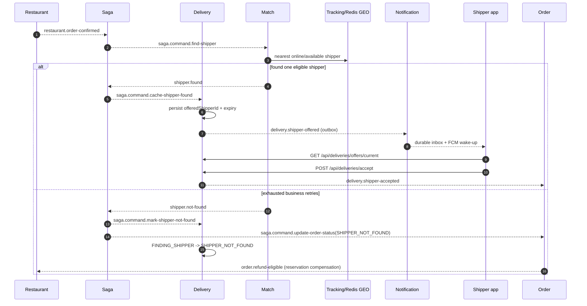

# Delivery Matching & Tracking Flow

## Contract MVP hiện tại

Luồng matching đi qua Saga/Kafka, offer được lưu bền vững trong Delivery trước
khi Notification đánh thức shipper. Tracking dùng Redis GEO + raw WebSocket qua
Gateway; không dùng gRPC và Notification STOMP đã bị xóa khỏi service.

## Location realtime

- Shipper publish vị trí qua raw WebSocket `/ws/shipper-locations` tại Gateway.
- Tracking xác thực JWT qua JWKS trong handshake để xác định shipper; client
  không được tự khai `X-User-Id` hoặc shipper ID.
- Tracking lưu heartbeat/location vào Redis và phát `shipper.location-updated`.
- Match duy trì GEO replica riêng từ event, chỉ chọn heartbeat online còn mới.
- Customer/restaurant/shipper/admin chỉ subscribe delivery mà mình có quyền xem;
  Tracking kiểm participant qua internal Delivery endpoint.
- Offer recovery dùng REST `GET /api/deliveries/offers/current`, không dùng raw
  location socket hoặc Delivery/Notification STOMP.

## Nhánh rematch và terminal

- Offer reject hoặc exact-generation timeout: Delivery quay lại
  `FINDING_SHIPPER`; Saga rematch và loại shipper vừa từ chối.
- Shipper hủy assignment trước pickup: giải phóng availability rồi rematch.
- Order cancellation: `saga.command.cancel-delivery` đưa Delivery về `CANCELLED`
  và `saga.command.stop-matching` mang `matchingSessionId` hiện hành. Match ghi
  durable tombstone `(deliveryId, matchingSessionId)` trước projection Redis;
  stop-before-find làm find cùng session `CANCELLED` không query GEO. Reserve và
  release kiểm session atomically, nên in-flight find không giữ shipper sau
  cancel và stale stop không xóa offer rematch mới.
- Hết retry/candidate: command riêng `saga.command.mark-shipper-not-found` đưa
  Delivery về `SHIPPER_NOT_FOUND`; không dùng cancellation command. Order vẫn
  giữ terminal status riêng nhưng phát `order.refund-eligible` với immutable
  monetary snapshot để Settlement/Promotion/Flash-sale xử lý idempotent.

## Proof còn mở

Gate B8 vẫn phải chứng minh bằng PostgreSQL/Kafka/Redis/raw WebSocket thật:
duplicate/replay, crash sau commit, offer expiry, concurrent accept, Redis
reorder/failure, token revocation và COD failure matrix. Publisher authority đã
chốt một active connection/shipper, new-generation supersession và disconnect
grace 30 giây; live same/cross-instance reconnect, hard-crash và crash-during-grace
recovery đã PASS.
