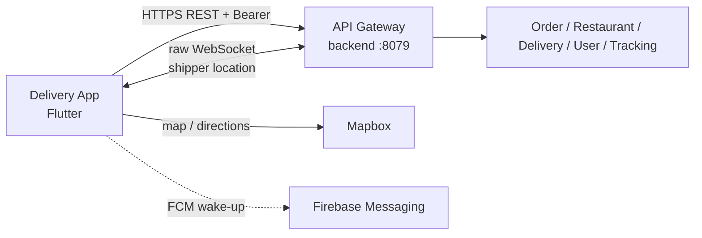

# Delivery App

Ứng dụng Flutter dành cho khách hàng của nền tảng Delivery: tìm nhà hàng,
chọn món, tạo đơn COD, theo dõi quá trình giao hàng và quản lý hồ sơ/địa chỉ.

## Vai trò trong hệ thống



App chỉ dùng **Gateway origin** được cấu hình bởi `API_BASE_URL`; app tự thêm
`/api` đúng một lần. App gửi Bearer access token, refresh một lần khi protected
request trả `401`, và dùng raw Gateway WebSocket cho location tracking. App
không gọi trực tiếp service port, database, Kafka hoặc gửi `Internal-Token`.

## Chức năng MVP

| Khu vực | Chức năng |
| --- | --- |
| Auth/session | Đăng ký/đăng nhập khách hàng, refresh session, quên mật khẩu theo contract, biometric khi thiết bị hỗ trợ |
| Catalog | Trang chủ, tìm kiếm nhà hàng, xem danh sách/chi tiết nhà hàng và menu |
| Cart/checkout | Giỏ hàng theo một nhà hàng, chỉnh số lượng, chọn địa chỉ, checkout preview và tạo đơn COD với quote/idempotency key |
| Orders | Lịch sử đơn phân trang, chi tiết đơn, trạng thái/timeline, hủy đơn trong boundary được backend cho phép và refresh tracking |
| Tracking | Xem vị trí shipper realtime khi đơn đang giao; Mapbox là adapter bản đồ/directions |
| Profile/address | Xem/cập nhật hồ sơ và tạo, sửa, xóa, đặt mặc định địa chỉ giao hàng |
| Notification | Durable inbox và FCM wake-up; sự kiện push chỉ đánh thức app, dữ liệu nghiệp vụ vẫn lấy từ Gateway |

Giá, phí, giảm giá, trạng thái order và dữ liệu giao hàng từ backend là
authoritative. Local cart chỉ là bản nháp để tạo checkout request.

## Capability ngoài MVP hoặc đang gated

Source tree có thể còn code cho các màn/capability chưa được mở trong runtime.
Các mục sau không được hiểu là public contract hiện tại:

- Voucher/flash-sale checkout và stacking: default-off, chỉ mở khi backend và
  rollout policy có proof tương ứng.
- Support chat, livestream/Agora và các luồng Firebase/Firestore mở rộng: chưa
  thuộc navigation MVP đã xác minh.
- Online payment, settlement UI, refund, payout hoặc các capability admin:
  thuộc backend/client khác hoặc chưa có contract người dùng được duyệt.

## Kiến trúc code

```text
lib/
  core/
    config/          Gateway origin, compile-time flags và runtime config
    network/         Dio, auth interceptor, response/DTO primitives
    routing/         GoRouter, guards và route composition
    storage/         Hive, SharedPreferences và storage ports
    services/        location, socket, push, deep link, upload và platform ports
    design_system/   theme, tokens và reusable UI
  features/
    auth/ catalog/ cart/ orders/ profile/ user_address/
    notification/ settings/ splash/ debug/
```

Feature code tách application/view model, domain, data/adapter và presentation.
Riverpod là dependency-injection boundary: production dependencies được lắp tại
`AppDependencies`; test override repository, storage, push, location, socket và
Mapbox port bằng fake mà không khởi tạo plugin thật. Dio/Retrofit gọi backend;
Hive/SharedPreferences giữ local state/session; Mapbox xử lý bản đồ/directions;
Firebase cung cấp notification/crash reporting theo cấu hình deployment.

## Cài đặt và chạy local

### Yêu cầu

- Flutter SDK theo `.fvmrc` và FVM
- Xcode/Android Studio nếu chạy thiết bị tương ứng
- Gateway local hoặc staging có thể truy cập từ thiết bị
- Mapbox public access token cho bản đồ

### Cấu hình

```bash
cp .env.example .env
# Điền MAPBOX_ACCESS_TOKEN trong .env bằng token local của bạn
```

`API_BASE_URL` là **origin** của Gateway, không thêm `/api`. Có thể truyền bằng
compile-time define:

```bash
# Android emulator
fvm flutter run --dart-define=API_BASE_URL=http://10.0.2.2:8079

# iOS simulator hoặc Gateway staging
fvm flutter run --dart-define=API_BASE_URL=https://gateway.example.com
```

Thiết bị thật phải dùng hostname/IP mà thiết bị truy cập được, không dùng
`localhost` của máy developer. Android native build có thể cần
`MAPBOX_ACCESS_TOKEN`/`MAPBOX_DOWNLOADS_TOKEN` qua Gradle property hoặc env; xem
[MAPBOX_SETUP.md](MAPBOX_SETUP.md). Firebase config và credential production do
deployment cung cấp, không commit vào source.

### Cài dependency và generate code

```bash
fvm flutter pub get
fvm dart run build_runner build --delete-conflicting-outputs
fvm flutter run
```

## Validation

```bash
fvm flutter analyze
fvm flutter test
fvm flutter test --coverage
fvm dart run tool/coverage_policy.dart
```

Widget/provider tests dùng fake dependency và không yêu cầu Firebase, Mapbox,
Hive, SharedPreferences, native GPS hay network thật. Device Mapbox, background
GPS và FCM delivery là smoke checks riêng; xem [TESTING.md](TESTING.md).

## Đọc tiếp

- [Danh sách màn hình và chức năng](docs/SCREENS_AND_FEATURES.md)
- [Testing strategy](TESTING.md)
- [Mapbox setup](MAPBOX_SETUP.md)
- [Customer app architecture và cross-repository boundary](https://github.com/hoanganhnth/delivery_backend/blob/main/docs/platform/system/clients.md)
- [Platform product overview](https://github.com/hoanganhnth/delivery_backend/blob/main/docs/platform/product/overview.md)
- [Editable system architecture](https://github.com/hoanganhnth/delivery_backend/blob/main/docs/platform/ARCHITECTURE.md)
