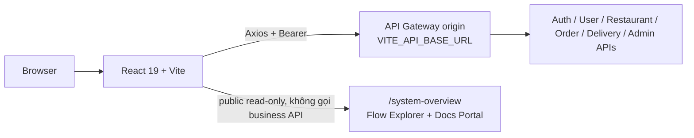

# Delivery Web

Web application cho ba surface của nền tảng Delivery: storefront khách hàng,
portal chủ nhà hàng và portal quản trị hệ thống. Repo cũng cung cấp
`/system-overview`, một handbook kỹ thuật public chỉ đọc để tra cứu kiến trúc và
contract của toàn platform.

## Vai trò trong hệ thống



Client chỉ gọi Gateway origin và thêm prefix `/api` theo endpoint contract. Axios
quản lý Bearer access token và single-flight refresh khi protected request trả
`401`; refresh token mới được lưu trước khi retry request đang chờ. Browser không
được gọi service port, Config Server, Eureka, database, Kafka hoặc gửi
`Internal-Token`.

Role và resource ownership do resource service kiểm tra bằng Auth JWKS. Client có
thể dùng role để điều hướng UI, nhưng không được coi role/ID do browser gửi là
nguồn quyền hạn.

## Các surface và chức năng

### Storefront khách hàng (`USER`)

| Route | Chức năng |
| --- | --- |
| `/`, `/restaurants`, `/restaurants/:restaurantId` | Duyệt/tìm nhà hàng, xem thông tin và menu đang bán |
| `/customer/login`, `/customer/register`, `/verify-email` | Đăng nhập, đăng ký qua Auth → User handoff và xác nhận email |
| `/cart` | Giỏ hàng localStorage, chỉ giữ món của một nhà hàng, chỉnh số lượng/ghi chú |
| `/customer/addresses` | Tạo, sửa, xóa và chọn địa chỉ mặc định; lấy tọa độ bằng browser Geolocation hoặc nhập tay |
| `/customer/checkout` | Checkout preview từ server, hiển thị quote và tạo đơn COD bằng idempotency key |
| `/customer/orders`, `/customer/orders/:orderId` | Lịch sử/chi tiết đơn; refresh trạng thái định kỳ khi tab đang visible và hủy trong boundary trước pickup |

Quote, phí, giảm giá, tổng tiền và order state từ backend là authority. Tổng tiền
trong local cart chỉ mang tính tham khảo.

### Portal chủ nhà hàng (`SHOP_OWNER`)

| Route | Chức năng |
| --- | --- |
| `/restaurant/dashboard` | Entry point và shortcut nghiệp vụ nhà hàng |
| `/restaurant/orders` | Xem đơn phân trang, lọc trạng thái, confirm/reject đơn pending và retry khi lỗi |
| `/restaurant/menu` | Tạo, sửa, xóa và tìm kiếm món theo restaurant ownership |
| `/restaurant/profile` | Xem/cập nhật thông tin, địa chỉ, tọa độ, giờ mở cửa và ảnh nhà hàng |
| `/restaurant/reviews` | Xem rating đã được admin duyệt |
| `/restaurant/vouchers` | Xem và gửi shop voucher theo contract hiện tại |
| `/restaurant/catalog-import` | Import tuần tự restaurant/menu với preview/validation và lỗi theo record |

### Portal admin (`ADMIN`)

| Route | Chức năng |
| --- | --- |
| `/admin/dashboard` | KPI, xu hướng đơn/GMV, breakdown trạng thái và top nhà hàng từ analytics contract khi projection khả dụng |
| `/admin/orders` | Xem, phân trang và lọc đơn toàn hệ thống |
| `/admin/shippers` | Xem danh sách shipper, tab online/offline và tìm kiếm local |
| `/admin/ratings` | Approve/reject rating và retry mutation khi backend lỗi |
| `/admin/coupons` | Tạo/xóa platform coupon và duyệt shop voucher pending |
| `/admin/flash-sales` | Tạo campaign, đổi trạng thái, xem item và approve item |
| `/admin/catalog-import` | Import catalog theo contract admin |

Read page luôn phân biệt loading, empty, error và retry; mutation khóa submit
trùng trong lúc request đang chạy.

### Technical system handbook

`/system-overview` và `/system-overview/docs` là public, read-only:

- Flow Explorer cho workflow, actor, service, API, event, state và happy/failure
  path.
- Architecture overlay, service/contract index và searchable Markdown Docs Portal.
- Nội dung là snapshot được generate từ allowlist canonical; không gọi backend
  runtime, không có business action/Try-it console, không hiển thị secret hay
  customer data.

Handbook là surface kỹ thuật độc lập, không thuộc navigation business portal và
không yêu cầu đăng nhập.

## Kiến trúc code

```text
src/
  app/                 AppDependenciesProvider và production composition root
  routes/              RoleRoute và route guards
  services/api/        Axios client, session, endpoint và typed contract adapters
  modules/
    auth/              Login, registration, session recovery
    customer/          Storefront, cart, address, checkout và orders
    restaurant/        Owner portal, menu/order/profile/review/import
    admin/              Dashboard, moderation, coupon/flash-sale/catalog admin
    system-handbook/   Public Flow Explorer và generated Docs Portal
  components/          Layout và UI primitives dùng chung
  test/                Test dependencies, routed harness và builders
```

Runtime dùng React 19, Vite, TypeScript, React Router, Tailwind/PostCSS và
Axios. `AppDependenciesProvider` là composition boundary: production adapter
được lắp một lần; test thay auth, restaurant, menu, order, session, notification,
clock và delay port bằng fake thay vì module-mock feature internals.

## Giới hạn MVP

Các capability sau không được hiểu là public MVP chỉ vì source hoặc component
có thể tồn tại:

- Online payment, settlement, withdrawal và refund UI.
- Browser realtime shipper map, rating/reorder/notification customer, Firebase
  chat và livestream.
- User administration CRUD chưa có route canonical.
- Dashboard nhà hàng chi tiết, export lịch sử và financial reporting nâng cao
  chờ analytics ownership/backfill gate.
- Voucher/flash-sale checkout activation; reservation/campaign management không
  đồng nghĩa checkout đã bật.
- Direct service ports, `/api/api`, `Internal-Token`, gRPC, STOMP và SockJS.

## Cài đặt và chạy local

### Yêu cầu

- Node.js theo CI/repository baseline
- npm
- Gateway local hoặc staging có thể truy cập từ browser

### Cấu hình và dev server

```bash
npm install
cp .env.example .env.local
# Sửa VITE_API_BASE_URL thành Gateway origin, ví dụ http://localhost:8079
npm run dev
```

`VITE_API_BASE_URL` là origin, không thêm `/api`; client endpoint constants đã
có prefix đó. `.env.local` bị Git ignore. Không đưa token hoặc credential thật
vào README, source hay bundle.

## Validation

```bash
# Gate standalone của delivery_web/CI
npm run verify:ci

# Khi chạy trong workspace polyrepo
npm run handbook:docs:check
npm run handbook:check
npm run verify
```

Các lệnh test bổ sung:

```bash
npm run test:coverage
npm run test:e2e:coverage
```

Mocked Playwright E2E an toàn cho pull request. Live E2E chỉ được chạy với
disposable backend sandbox theo [TESTING.md](TESTING.md), không dùng production
hoặc shared staging URL.

## Đọc tiếp

- [Danh sách chức năng và route](APP_FEATURES.md)
- [Web action-contract matrix](docs/action-contract-matrix.md)
- [Testing strategy](TESTING.md)
- [Platform product overview](https://github.com/hoanganhnth/delivery_backend/blob/main/docs/platform/product/overview.md)
- [Editable system architecture](https://github.com/hoanganhnth/delivery_backend/blob/main/docs/platform/ARCHITECTURE.md)
- [Cross-repository client contract](https://github.com/hoanganhnth/delivery_backend/blob/main/docs/platform/system/clients.md)
