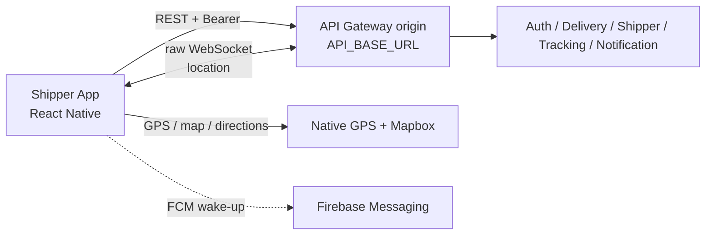

# Shipper App

Ứng dụng React Native dành cho shipper của nền tảng Delivery: nhận offer giao
hàng, cập nhật lifecycle giao, chia sẻ vị trí, xem lịch sử và quản lý hồ sơ.

## Vai trò trong hệ thống



App chỉ giao tiếp với backend qua Gateway bằng Bearer token. FCM là wake-up best
effort, không phải nguồn dữ liệu offer; sau notification hoặc process restart,
app khôi phục offer canonical bằng `GET /api/deliveries/offers/current`. App
không gọi service port nội bộ và không dùng `Internal-Token`.

## Chức năng MVP

| Khu vực | Chức năng |
| --- | --- |
| Auth/session | Password login, Google login với role `SHIPPER`, lưu session/device identity, single-flight refresh và logout dọn local session |
| Offer | Recover current offer, xem chi tiết, accept/reject và cancel assignment theo contract Delivery |
| Giao hàng | Lifecycle `ASSIGNED → PICKED_UP → DELIVERING → DELIVERED`; xử lý trạng thái/exception theo capability flag được phép |
| Tracking | Main map với GPS native, raw Gateway WebSocket location và Mapbox directions |
| Lịch sử | Danh sách lịch sử bounded, order/delivery detail và màn hình hoàn tất giao |
| Thông báo | Durable notification inbox; FCM chỉ đánh thức app để đọc lại dữ liệu qua Gateway |
| Hồ sơ | Profile, ratings, documents và settings theo API hiện hành |

Một offer chỉ được accept sau khi app đọc được dữ liệu hiện tại từ backend.
App không tự tạo identity, earnings, tier, notification count, customer data
hoặc GPS route giả làm fallback.

## Kiến trúc code

Mọi production screen theo luồng:

```text
Route → ViewModel → View
```

- `View` chỉ render immutable state và phát discriminated `ViewEvent`; không
  import Redux, navigation, repository, storage, native service, `Alert` hoặc
  runtime configuration.
- `ViewModel` sở hữu event, validation, loading/error feedback, navigation port,
  timer, lifecycle effect và feature command.
- `Route` chỉ nối navigation với ViewModel và View.

```text
src/
  app/          composition root, navigation, store, bootstrap, overlay
  config/       env và Gateway runtime config
  core/         API/session/platform contracts và generic adapters
  shared/       UI primitives, tokens, formatters, pure helpers
  features/
    auth/            login/session
    delivery/        offers, lifecycle, history, detail, success
    notifications/   inbox và push adapters
    shipper/         profile, ratings, documents
    tracking/        GPS, Mapbox, WebSocket, map state
```

`createAppStore` lắp Redux Toolkit và các repository port; `AppRuntimeProvider`
cấp scheduler, lifecycle, GPS, feedback, media picker, social identity, push và
tracking configuration. Production native adapters được tạo tại `src/app/`;
test dùng `test-support/testDependencies.ts` và không khởi tạo SDK thật.

## Boundary auth và dữ liệu

- `API_BASE_URL` là Gateway origin, không thêm `/api` hoặc trỏ vào service
  riêng. Android emulator mặc định dùng `http://10.0.2.2:8079`, iOS simulator
  dùng `http://localhost:8079` nếu không cấu hình khác.
- Protected `401` dùng một refresh in-flight; login/social-login `401` giữ
  nguyên lỗi và không refresh trước session. Logout luôn clear local state kể cả
  khi remote revoke thất bại.
- Raw WebSocket dùng Gateway path `/ws/shipper-locations` với Bearer handshake.
  Socket có heartbeat/reconnect và phải tôn trọng delivery-room authorization.
- `shipper.id` là identity canonical của fulfilment; không thay bằng user-provided
  header hoặc dữ liệu local không xác minh.

## Capability bị ẩn hoặc chưa có contract

Các mục này có thể xuất hiện trong tài liệu/source lịch sử nhưng không thuộc
navigation production MVP hiện tại:

- Shipper self-registration cho tới khi Auth → Shipper profile có onboarding
  atomic/recoverable.
- Forgot/change password, settlement balance, payout, withdrawal, tip,
  incentive và weekly tier khi backend chưa có contract được duyệt.
- Fake GPS route, STOMP/SockJS notification và direct service-port access.
- Batch offer chỉ bật theo `BATCH_OFFER_ENABLED`/canary policy; không suy diễn
  từ việc code hoặc test fixture tồn tại.

## Cài đặt và chạy local

### Yêu cầu

- Node.js `>=18` và npm
- Android Studio/JDK cho Android hoặc Xcode/CocoaPods cho iOS
- Mapbox access token và Gateway có thể truy cập từ thiết bị

### Cấu hình

```bash
cp .env.example .env
# Điền API_BASE_URL, MAPBOX_ACCESS_TOKEN và provider ID nếu cần
npm install
```

`MAPBOX_DOWNLOADS_TOKEN` là credential build riêng: cấp qua process environment
hoặc `~/.gradle/gradle.properties`, không ghi vào client `.env` và không commit.
FCM/Google provider cũng cần cấu hình native/deployment tương ứng.

### Metro và app

```bash
npm start
npm run android
# hoặc
npm run ios
```

Metro của app dùng port `8070`; Gateway backend dùng port `8079`.

## Validation

```bash
npm run typecheck
npm run lint
npm run verify:architecture
npm test -- --runInBand

# Full repository gate
npm run verify
npm run verify:coverage
```

Unit/integration tests dùng fake repository, clock, GPS, push, Mapbox và socket.
Device Mapbox, background GPS, native permissions và FCM delivery cần smoke
check riêng; xem [TESTING.md](TESTING.md).

## Đọc tiếp

- [Architecture](docs/ARCHITECTURE.md)
- [Authentication contract](docs/AUTH_CONTRACT.md)
- [MVP screen policy](docs/SCREEN_POLICY.md)
- [Testing strategy](TESTING.md)
- [Feature documentation lịch sử](VIETNAMESE_FEATURE_DOCUMENTATION.md)
- [Platform product overview](https://github.com/hoanganhnth/delivery_backend/blob/main/docs/platform/product/overview.md)
- [Cross-repository client contract](https://github.com/hoanganhnth/delivery_backend/blob/main/docs/platform/system/clients.md)
- [Delivery lifecycle và system architecture](https://github.com/hoanganhnth/delivery_backend/blob/main/docs/platform/ARCHITECTURE.md)
