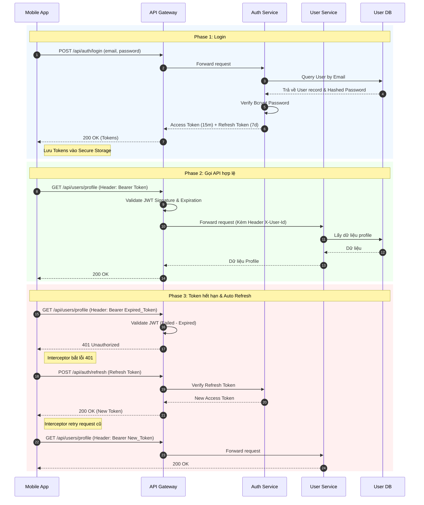

# 🔐 Auth & User Management

## 1. Đặc tả (Specification)
**Mục tiêu:** Quản lý toàn bộ vòng đời của người dùng (Customer, Shipper, Admin), bao gồm quá trình xác thực (Authentication), phân quyền (Authorization) và quản lý hồ sơ cá nhân.

**Microservices liên quan:**
- `api-gateway`: Route request và xác thực Access Token (JWT Signature validation).
- `auth-service`: Cấp phát JWT, xử lý logic đăng nhập, verify Refresh Token, tích hợp Social Login.
- `user-service`: Quản lý thông tin hồ sơ của Customer và Admin (Tên, SĐT, Địa chỉ).
- `shipper-service`: Quản lý hồ sơ chuyên biệt của Shipper (Bằng lái xe, CCCD, Biển số xe, Trạng thái hoạt động).

## 2. Danh sách Use Cases

| Mã UC | Tên Use Case | Nền tảng | Trạng thái |
|-------|--------------|----------|------------|
| UC-1.1 | Đăng ký / Đăng nhập (Email/Password) | All | ✅ Done |
| UC-1.2 | Đăng nhập Social (Google, Facebook) | Customer App | ✅ Done |
| UC-1.3 | Cập nhật hồ sơ Customer (Avatar, SĐT) | Customer App | ✅ Done |
| UC-1.4 | Cập nhật hồ sơ Shipper (CCCD, Biển số) | Shipper App | ✅ Done |
| UC-1.5 | Quản lý sổ địa chỉ giao hàng | Customer App | ✅ Done |
| UC-1.6 | Quản lý Users (Khóa tài khoản, Phân quyền) | Admin Web | 🔧 Partial |
| UC-1.7 | Tự động Refresh Token (Silent Login) | Mobile Apps | ✅ Done |

## 3. Luồng nghiệp vụ (Business Flow)

### 3.1. Phân quyền và Routing tại Gateway
1. Khi user đăng nhập thành công, `auth-service` trả về Access Token (TTL ngắn, ví dụ: 15 phút) và Refresh Token (TTL dài, ví dụ: 7 ngày).
2. Các request tiếp theo từ App phải đính kèm header `Authorization: Bearer <Access_Token>`.
3. `api-gateway` chặn request lại, tự động parse JWT và kiểm tra chữ ký (Signature). 
4. Nếu hợp lệ, Gateway forward request vào các service bên trong, đồng thời inject thêm header nội bộ (ví dụ: `X-User-Id`, `X-User-Role`) để các microservices phía sau không cần parse lại JWT.

### 3.2. Cấu trúc an toàn cho Shipper
Hồ sơ Shipper yêu cầu bảo mật cao do chứa dữ liệu nhạy cảm (CCCD, Bằng lái). Do đó, thông tin này được tách riêng ra `shipper-service`, không nằm chung trong bảng User thông thường để tối ưu query và phân chia rõ ràng context.

## 4. Biểu đồ tuần tự (Sequence Diagram)

### 4.1. Luồng Authentication & Tự động Refresh Token
Dưới đây là luồng xử lý khi User gọi một API cần xác thực (ví dụ: Lấy thông tin cá nhân). Nếu Access Token hết hạn, hệ thống tự động sử dụng Refresh Token để gia hạn mà không làm gián đoạn trải nghiệm người dùng.

