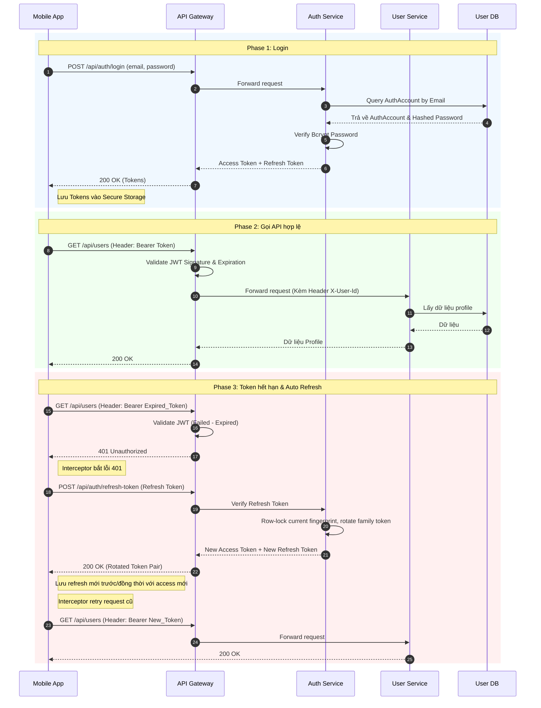

# 🔐 Auth & User Management

## 1. Đặc tả (Specification)
**Mục tiêu:** Quản lý toàn bộ vòng đời của người dùng (Customer, Shipper, Admin), bao gồm quá trình xác thực (Authentication), phân quyền (Authorization) và quản lý hồ sơ cá nhân.

**Microservices liên quan:**
- `api-gateway`: Route request và xác thực Access Token (JWT Signature validation).
- `auth-service`: Cấp phát JWT, xử lý logic đăng nhập, verify Refresh Token, tích hợp Social Login.
- `user-service`: Quản lý thông tin hồ sơ của Customer và Admin (Tên, SĐT, Địa chỉ).
- `shipper-service`: Quản lý hồ sơ chuyên biệt của Shipper (Bằng lái xe, CCCD, Biển số xe, Trạng thái hoạt động).

## 2. Danh sách Use Cases

| Mã UC | Tên Use Case | Nền tảng | Trạng thái |
|-------|--------------|----------|------------|
| UC-1.1 | Đăng ký / Đăng nhập (Email/Password) | All | ✅ Done |
| UC-1.2 | Đăng nhập Social (Google) | Customer App | ✅ Done |
| UC-1.3 | Cập nhật hồ sơ Customer (Avatar, SĐT) | Customer App | ✅ Done |
| UC-1.4 | Cập nhật hồ sơ Shipper (CCCD, Biển số) | Shipper App | ✅ Done |
| UC-1.5 | Quản lý sổ địa chỉ giao hàng | Customer App | ✅ Done |
| UC-1.6 | Quản lý Users (Khóa tài khoản, Phân quyền) | Admin Web | 🔧 Partial |
| UC-1.7 | Tự động Refresh Token (Silent Login) | Mobile Apps | ✅ Done |
| UC-1.8 | Forgot/reset password và email verification | All | ✅ Done |

Public registration chỉ tạo `USER` hoặc `SHOP_OWNER`. `ADMIN` và `SHIPPER` cần
operator provisioning; SHIPPER chỉ được mở self-registration sau khi có luồng
tạo Auth + User + Shipper profile atomic/recoverable. Existing SHIPPER đã được
provision vẫn có thể dùng password/social login bình thường.

Password account mới phải xác minh email trước khi login. Existing account được
grandfather khi migration; Google login chỉ đánh dấu verified sau khi Google đã
xác nhận đúng email. Reset/verification dùng token one-time có expiry và chỉ lưu
digest. Provider, threat model, rate limit, session revocation và incident flow:
`../runbooks/account-recovery-email-verification.md`.

Local runtime harness dùng one-shot runner trong auth-service để tạo fixture đặc
quyền bằng AuthService + User internal provisioning, không qua public
self-registration hoặc SQL patching:

- `OperatorShipperProvisioningRunner`: bật bằng
  `APP_OPERATOR_SHIPPER_PROVISIONING_ENABLED=true` cùng email/password env cho
  SHIPPER fixture.
- `OperatorAdminProvisioningRunner`: bật bằng
  `APP_OPERATOR_ADMIN_PROVISIONING_ENABLED=true` cùng email/password env cho
  ADMIN fixture.

Hai runner không mở public API, không ghi log password, chỉ resume account cùng
role và cùng password; existing account lệch role/password hoặc inactive sẽ
fail-closed. Public self-registration vẫn không được tạo `ADMIN` hoặc `SHIPPER`.

## 3. Luồng nghiệp vụ (Business Flow)

### 3.1. Phân quyền và Routing tại Gateway
1. Khi user đăng nhập thành công, `auth-service` trả về Access Token TTL 15 phút
   và Refresh Token/session TTL 7 ngày. Mỗi device session có một token family
   độc lập. Mỗi refresh bắt buộc trả cả access token và refresh token mới; token
   cũ chuyển sang `ROTATED` và mọi reuse sẽ revoke toàn family của device đó.
   Logout/device revoke vô hiệu family phía server; access token đã cấp hiện
   stateless-valid tới khi hết 15 phút.
2. Các request tiếp theo từ App phải đính kèm header `Authorization: Bearer <Access_Token>`.
3. `api-gateway` chặn request lại, tự động parse JWT và kiểm tra chữ ký (Signature). 
4. Nếu hợp lệ, Gateway forward request vào các service bên trong, đồng thời strip header identity từ client rồi inject `X-User-Id` và `X-Role` lấy từ JWT.

### 3.2. Cấu trúc an toàn cho Shipper
Hồ sơ Shipper yêu cầu bảo mật cao do chứa dữ liệu nhạy cảm (CCCD, Bằng lái). Do đó, thông tin này được tách riêng ra `shipper-service`, không nằm chung trong bảng User thông thường để tối ưu query và phân chia rõ ràng context.

## 4. Biểu đồ tuần tự (Sequence Diagram)

### 4.1. Luồng Authentication & Tự động Refresh Token
Dưới đây là luồng xử lý khi User gọi một API cần xác thực (ví dụ: Lấy thông tin cá nhân). Nếu Access Token hết hạn, hệ thống tự động sử dụng Refresh Token để gia hạn mà không làm gián đoạn trải nghiệm người dùng.

```mermaid
sequenceDiagram
    autonumber
    participant App as Mobile App
    participant GW as API Gateway
    participant Auth as Auth Service
    participant User as User Service
    participant DB as User DB

    %% Đăng nhập ban đầu
    rect rgb(240, 248, 255)
        Note over App, DB: Phase 1: Login
        App->>GW: POST /api/auth/login (email, password)
        GW->>Auth: Forward request
        Auth->>DB: Query AuthAccount by Email
        DB-->>Auth: Trả về AuthAccount & Hashed Password
        Auth->>Auth: Verify Bcrypt Password
        Auth-->>GW: Access Token + Refresh Token
        GW-->>App: 200 OK (Tokens)
        Note right of App: Lưu Tokens vào Secure Storage
    end

    %% Gọi API thông thường
    rect rgb(240, 255, 240)
        Note over App, DB: Phase 2: Gọi API hợp lệ
        App->>GW: GET /api/users (Header: Bearer Token)
        GW->>GW: Validate JWT Signature & Expiration
        GW->>User: Forward request (Kèm Header X-User-Id)
        User->>DB: Lấy dữ liệu profile
        DB-->>User: Dữ liệu
        User-->>GW: Dữ liệu Profile
        GW-->>App: 200 OK
    end

    %% Gọi API khi Token hết hạn
    rect rgb(255, 240, 240)
        Note over App, DB: Phase 3: Token hết hạn & Auto Refresh
        App->>GW: GET /api/users (Header: Bearer Expired_Token)
        GW->>GW: Validate JWT (Failed - Expired)
        GW-->>App: 401 Unauthorized
        
        %% App bắt lỗi 401 và tự động gọi refresh
        Note right of App: Interceptor bắt lỗi 401
        App->>GW: POST /api/auth/refresh-token (Refresh Token)
        GW->>Auth: Verify Refresh Token
        Auth->>Auth: Row-lock current fingerprint, rotate family token
        Auth-->>GW: New Access Token + New Refresh Token
        GW-->>App: 200 OK (Rotated Token Pair)
        Note right of App: Lưu refresh mới trước/đồng thời với access mới
        
        %% Retry request ban đầu
        Note right of App: Interceptor retry request cũ
        App->>GW: GET /api/users (Header: Bearer New_Token)
        GW->>User: Forward request
        User-->>App: 200 OK
    end
```

### 4.2. Refresh-token family và reuse

- `auth_session.token_family_id` là boundary theo device. Đăng nhập cùng account
  trên device khác tạo family khác; login lại cùng device revoke family cũ.
- `auth_refresh_token` chỉ lưu SHA-256 fingerprint, không lưu raw bearer token.
  Row hiện tại có state `CURRENT`; refresh thành công đổi nó sang `ROTATED` và
  insert đúng một successor `CURRENT` trong cùng transaction.
- Refresh bằng token `ROTATED`/`REVOKED` là reuse: Auth lock row, revoke mọi token
  trong family và deactivate session, commit revocation rồi trả 401. Hai refresh
  đồng thời vì vậy không thể tạo hai descendant còn valid.
- `POST /api/auth/logout` revoke family tìm được từ current hoặc historical token.
  `DELETE /api/auth/sessions/{deviceId}` cho account đã xác thực revoke riêng
  device được chọn; các device khác tiếp tục refresh độc lập.
- Web, Flutter và Shipper chỉ refresh protected request 401, dùng một in-flight
  promise/queue, retry mỗi request đúng một lần và phát session-expired một lần
  khi refresh bị revoke/invalid. Login, refresh và logout 401 không tự refresh.
