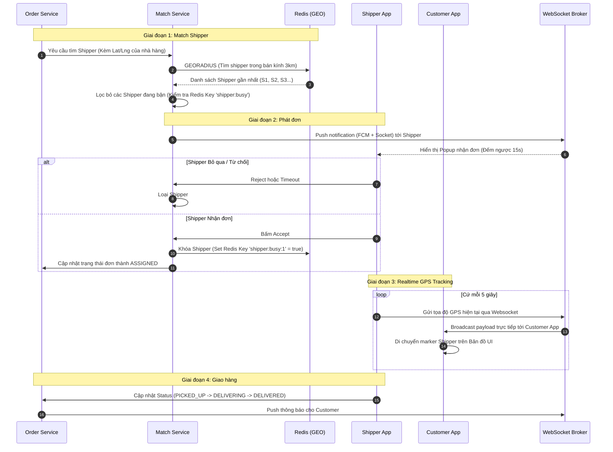

# 🛵 Delivery Matching & Tracking Flow

## 1. Đặc tả luồng
Giải quyết bài toán làm sao để tìm được Shipper phù hợp nhất (gần nhà hàng nhất, đang rảnh) và cách thức duy trì vị trí của Shipper trên bản đồ của Khách hàng theo thời gian thực.
Sử dụng **Redis GEO** cho tính toán tọa độ siêu tốc và **WebSocket** cho Real-time communication.

## 2. Biểu đồ tuần tự (Sequence Diagram)

