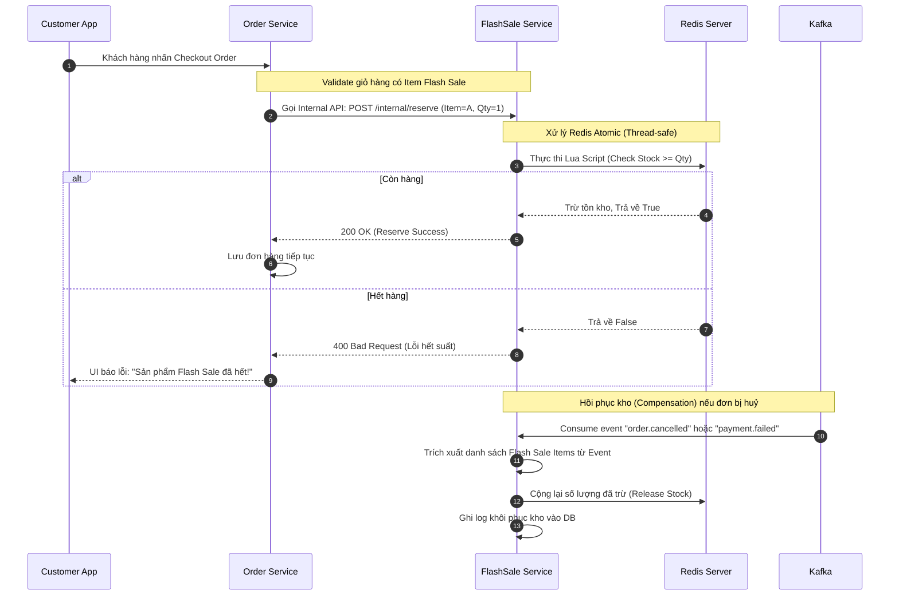

# ⚡ Flash Sale & Stock Reservation Flow

## 1. Đặc tả luồng
Flash sale là tính năng đòi hỏi hiệu năng cực cao và rủi ro quá bán (Over-selling) lớn nhất do lượng truy cập đột biến. Vì vậy, số lượng tồn kho (Stock) được quản lý trực tiếp bằng **Redis Atomic Counters** kết hợp Lua scripts. Database quan hệ (PostgreSQL) chỉ lưu thông tin hiển thị chứ không dùng để xử lý trừ kho realtime.

## 2. Biểu đồ tuần tự (Sequence Diagram)

