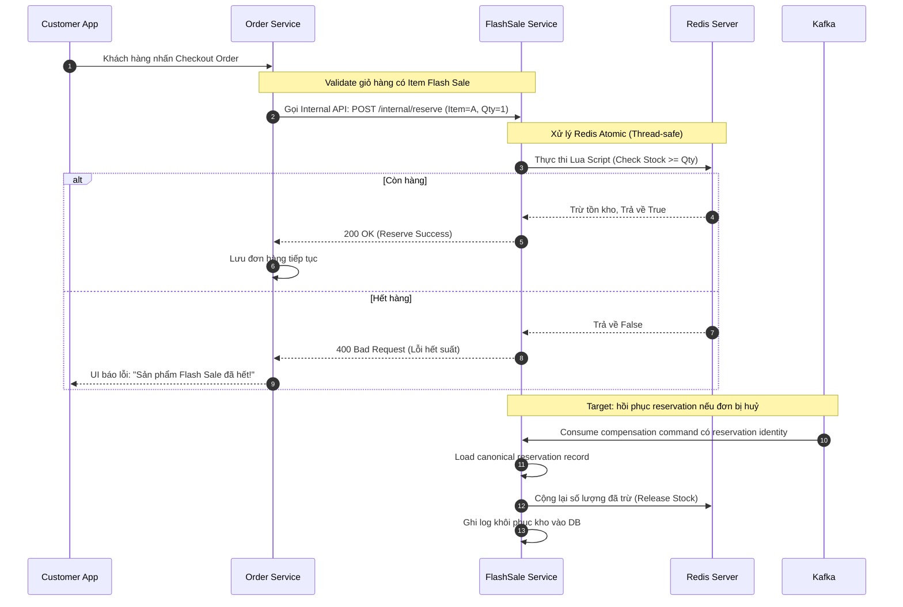

# ⚡ Flash Sale & Stock Reservation Flow

> **Trạng thái COD MVP:** toàn bộ flash-sale checkout đang tắt. Internal reserve
> trả `503` khi `FLASHSALE_CHECKOUT_ENABLED=false`; không có cancellation consumer
> đang hoạt động. Canonical `order.cancelled` không mang item list, nên không đủ
> dữ liệu để hoàn stock an toàn. Sequence bên dưới là **target contract**, chỉ được
> triển khai sau khi có reservation record, stable identity, outbox và replay proof.
> Redis reservation config/service không được tạo trong runtime mặc định khi flag
> checkout tắt. Recurring campaign reset dùng một bounded database update thay vì
> load toàn bộ item vào JVM.

## 1. Đặc tả luồng
Flash sale là tính năng đòi hỏi hiệu năng cực cao và rủi ro quá bán (Over-selling) lớn nhất do lượng truy cập đột biến. Vì vậy, số lượng tồn kho (Stock) được quản lý trực tiếp bằng **Redis Atomic Counters** kết hợp Lua scripts. Database quan hệ (PostgreSQL) chỉ lưu thông tin hiển thị chứ không dùng để xử lý trừ kho realtime.

## 2. Biểu đồ tuần tự (Sequence Diagram)

```mermaid
sequenceDiagram
    autonumber
    participant App as Customer App
    participant Order as Order Service
    participant FS as FlashSale Service
    participant Redis as Redis Server
    participant Kafka as Kafka

    App->>Order: Khách hàng nhấn Checkout Order
    Note over Order, FS: Validate giỏ hàng có Item Flash Sale
    Order->>FS: Gọi Internal API: POST /internal/reserve (Item=A, Qty=1)
    
    Note over FS, Redis: Xử lý Redis Atomic (Thread-safe)
    FS->>Redis: Thực thi Lua Script (Check Stock >= Qty)
    alt Còn hàng
        Redis-->>FS: Trừ tồn kho, Trả về True
        FS-->>Order: 200 OK (Reserve Success)
        Order->>Order: Lưu đơn hàng tiếp tục
    else Hết hàng
        Redis-->>FS: Trả về False
        FS-->>Order: 400 Bad Request (Lỗi hết suất)
        Order-->>App: UI báo lỗi: "Sản phẩm Flash Sale đã hết!"
    end

    Note over FS, Kafka: Target: hồi phục reservation nếu đơn bị huỷ
    Kafka->>FS: Consume compensation command có reservation identity
    FS->>FS: Load canonical reservation record
    FS->>Redis: Cộng lại số lượng đã trừ (Release Stock)
    FS->>FS: Ghi log khôi phục kho vào DB
```
