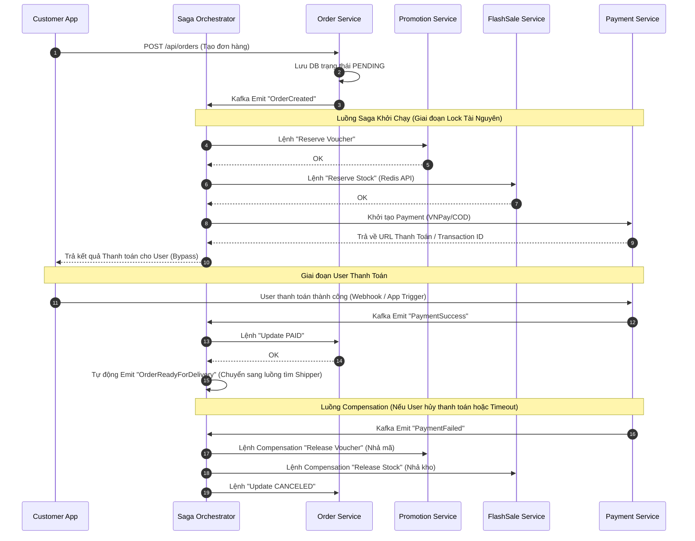

# 🛒 Order Lifecycle Flow (Saga Pattern)

## 1. Đặc tả luồng
Đây là luồng quan trọng nhất và phức tạp nhất hệ thống. Do sử dụng Microservices, một thao tác đặt hàng liên quan tới rất nhiều Database khác nhau (Order DB, Promotion DB, FlashSale DB, Payment DB, Delivery DB). 
Hệ thống sử dụng **Saga Orchestration Pattern** (Quản lý tập trung qua `saga-orchestrator-service`) để quản lý transaction phân tán. Nếu 1 bước thất bại, hệ thống tự động phát ra event "Rollback" (Compensation) để trả lại tiền/voucher/kho hàng, tránh tình trạng mất mát dữ liệu.

## 2. Biểu đồ tuần tự (Sequence Diagram)

