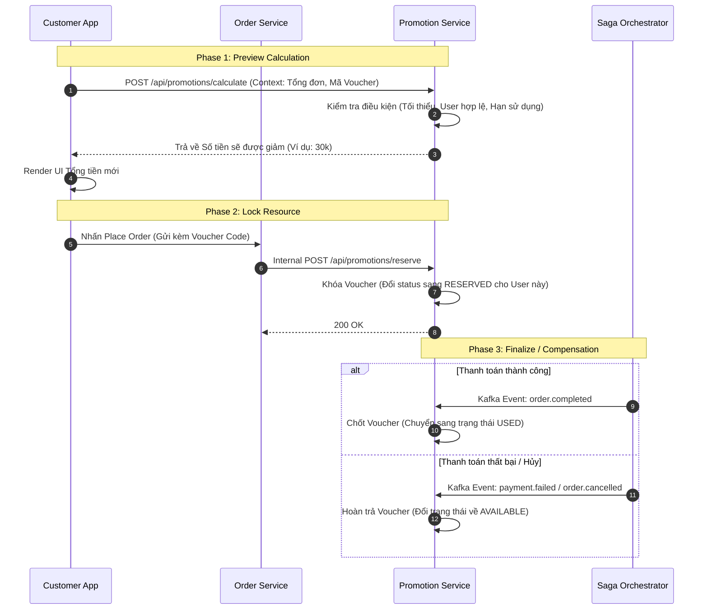

# 🎟️ Promotion & Voucher Flow

## 1. Đặc tả luồng
Quy trình áp dụng mã giảm giá trong hệ thống Microservices không thể thực hiện chung 1 bước, mà được chia làm 3 pha riêng biệt:
- **Calculate (Tính toán):** Chỉ tính thử số tiền giảm trên giao diện, không khóa voucher.
- **Reserve (Khóa/Tạm giữ):** Khóa voucher lại khi user bắt đầu bấm thanh toán, để user khác không cướp được mã giới hạn.
- **Compensation (Hoàn trả):** Tự động nhả voucher ra nếu thanh toán thất bại.

## 2. Biểu đồ tuần tự (Sequence Diagram)

