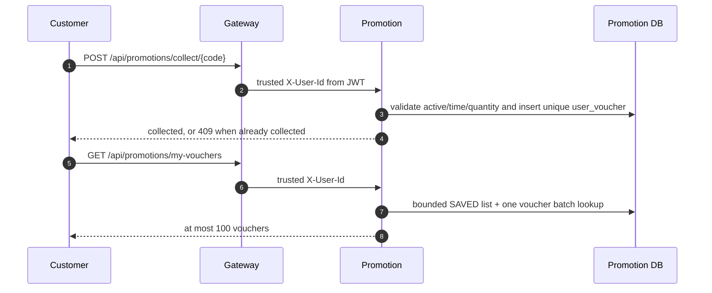

# Promotion and voucher boundary

## COD MVP status

Voucher wallet/catalog remains available, but voucher checkout is disabled:

- users may collect a currently active voucher and list at most 100 saved vouchers;
- admin may create/list/deactivate platform vouchers;
- merchant may list vouchers, while legacy merchant creation stays disabled because
  owner user ID is not a restaurant ID;
- `calculate` and internal `reserve` fail with `503` while checkout recovery is
  unproven, and neither path is routed publicly by Gateway.

Promotion uses Flyway V1 plus Hibernate `validate`; production schema mutation is
not delegated to Hibernate.

Mọi success/error HTTP response của Promotion dùng canonical
`BaseResponse(status,message,data)`. Admin web không còn phải chấp nhận raw
`Voucher`, `List`, `String` hoặc body rỗng; lỗi validation/conflict/disabled giữ
HTTP status đúng và `status=0`, còn lỗi bất ngờ không phát nội dung exception.

## Current retained flow

```mermaid
sequenceDiagram
    autonumber
    participant U as Customer
    participant G as Gateway
    participant P as Promotion
    participant DB as Promotion DB

    U->>G: POST /api/promotions/collect/{code}
    G->>P: trusted X-User-Id from JWT
    P->>DB: validate active/time/quantity and insert unique user_voucher
    P-->>U: collected, or 409 when already collected
    U->>G: GET /api/promotions/my-vouchers
    G->>P: trusted X-User-Id
    P->>DB: bounded SAVED list + one voucher batch lookup
    P-->>U: at most 100 vouchers
```

Collecting does not consume quantity; checkout reservation is the future boundary
that would own `usedQuantity` and `SAVED -> RESERVED -> USED`.

## Target checkout prerequisites

Before `calculate`/`reserve` can be exposed, the implementation needs:

- canonical discount calculation that changes the exact order monetary contract;
- a durable reservation record with stable request/order identity;
- row-lock/atomic quantity allocation and duplicate-request handling;
- order outbox plus idempotent commit/release compensation;
- PostgreSQL concurrency and Kafka crash/restart/reorder proof;
- client migration only after backend contract freeze.

The old check-then-increment reserve implementation is retained behind the closed
boundary only as compatibility code; its presence is not authority to enable the
feature.
