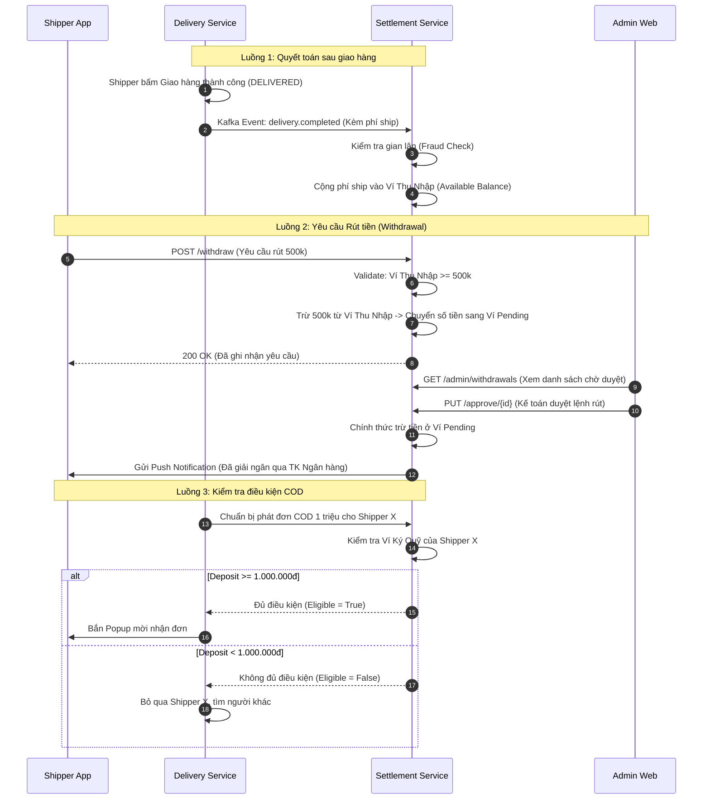

# 💰 Settlement & Finance Flow

## 1. Đặc tả luồng
Luồng xử lý tài chính cực kỳ khắt khe của hệ thống, quản lý tiền bạc của Shipper. Hệ thống phân chia rõ ràng 2 loại ví ảo:
- **Ví thu nhập (Earnings Wallet):** Lưu trữ tiền công ship, tiền thưởng, tiền hoàn thành đơn. Từ ví này Shipper có thể rút ra ngân hàng.
- **Ví ký quỹ (Deposit Wallet):** Số tiền Shipper nạp trước vào hệ thống để làm "tài sản thế chấp" khi nhận các đơn hàng thu tiền mặt (COD - Cash On Delivery).

## 2. Biểu đồ tuần tự (Sequence Diagram)

