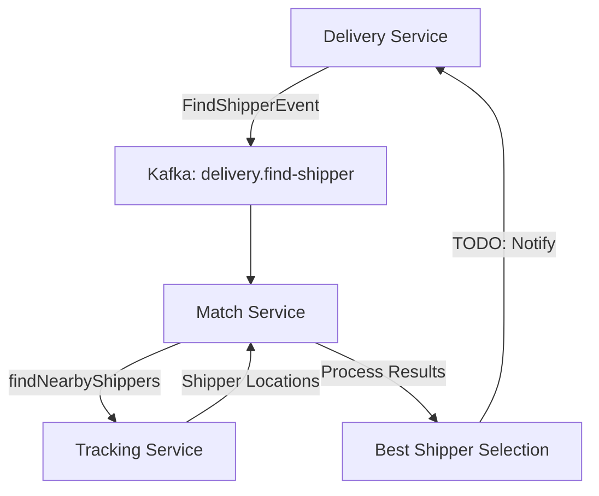

# 🚀 **Match Service - Event-Driven Integration**

## 📋 **Architecture Overview**



## 🎯 **Event Processing Flow**

### **1. Incoming Event: FindShipperEvent**
```json
{
  "deliveryId": 12345,
  "orderId": 67890,
  "pickupAddress": "123 Restaurant St",
  "pickupLat": 10.762622,
  "pickupLng": 106.660172,
  "deliveryAddress": "456 Customer Ave",
  "deliveryLat": 10.786785,
  "deliveryLng": 106.700806,
  "estimatedDeliveryTime": "2024-08-04T11:00:00",
  "notes": "Giao hàng nhanh",
  "createdAt": "2024-08-04T10:30:00",
  "eventType": "FIND_SHIPPER_REQUESTED",
  "timestamp": "2024-08-04T10:30:05"
}
```

### **2. Auto Processing Steps**
1. **FindShipperEventListener** nhận event từ Kafka
2. **Convert** event → FindNearbyShippersRequest
3. **Call** MatchService.findNearbyShippers() 
4. **Query** Tracking Service cho shipper locations
5. **Process** results và select best shipper
6. **Log** matching results
7. **TODO**: Notify Delivery Service with assignment

## 🔧 **Implementation Details**

### **Event Listener Configuration**
```java
@KafkaListener(topics = KafkaTopicConstants.FIND_SHIPPER_TOPIC)
public void handleFindShipperEvent(
    @Payload FindShipperEvent event,
    Acknowledgment acknowledgment) {
    
    // ✅ Convert event to request
    FindNearbyShippersRequest request = createFindShippersRequest(event);
    
    // ✅ Reactive call với WebFlux
    matchService.findNearbyShippers(request, systemUserId, systemRole)
        .subscribe(
            shippers -> processFoundShippers(event, shippers),
            error -> handleError(event, error)
        );
}
```

### **Search Parameters**
- **Location**: Pickup location (restaurant) để tìm shipper gần nhất
- **Radius**: 5km default search radius
- **Limit**: Maximum 10 shippers per request
- **User Context**: System user với role SYSTEM

### **Error Handling**
- ✅ **Graceful Degradation**: Acknowledge even on errors
- ✅ **Logging**: Comprehensive error tracking
- ✅ **Non-blocking**: Reactive processing với WebFlux
- ✅ **Retry Logic**: Kafka built-in retry mechanism

## 🧪 **Testing Workflow**

### **End-to-End Test:**
```bash
# 1. Create order in Order Service
POST http://localhost:8084/api/orders

# 2. Delivery Service auto:
#    - Creates delivery record
#    - Publishes FindShipperEvent

# 3. Match Service auto:
#    - Receives FindShipperEvent
#    - Calls findNearbyShippers()
#    - Queries Tracking Service
#    - Logs found shippers

# 4. Monitor logs:
tail -f match-service.log | grep "📥\|🚚\|🎯"
```

### **Kafka Monitoring:**
```bash
# Monitor find-shipper topic
kafka-console-consumer.bat --bootstrap-server localhost:9092 --topic delivery.find-shipper --from-beginning

# Check consumer group
kafka-consumer-groups.bat --bootstrap-server localhost:9092 --describe --group match-service
```

## 📊 **Current vs Future State**

### **✅ Current Implementation:**
- Event listener setup
- Automatic event processing  
- Integration với existing findNearbyShippers()
- Comprehensive logging
- Error handling

### **🚀 Future Enhancements:**
- **Shipper Scoring Algorithm**: Distance + rating + availability
- **Auto Assignment**: Best shipper auto-assignment
- **Response Events**: ShipperMatchedEvent, NoShipperAvailableEvent
- **Delivery Service Integration**: API calls to assign shipper
- **Metrics & Monitoring**: Success rates, response times
- **Dead Letter Queue**: Failed event handling

## 🎯 **Benefits**

### **Event-Driven Architecture:**
- ✅ **Loose Coupling**: Services communicate via events
- ✅ **Scalability**: Async processing
- ✅ **Reliability**: Kafka message guarantees
- ✅ **Observability**: Full event tracing

### **Business Logic:**
- ✅ **Auto Matching**: Immediate shipper search when delivery created
- ✅ **Real-time**: No manual intervention needed
- ✅ **Efficient**: Pickup location-based search
- ✅ **Fault Tolerant**: Graceful error handling

### **Performance:**
- ✅ **Non-blocking**: WebFlux reactive processing
- ✅ **Parallel**: Multiple deliveries processed simultaneously
- ✅ **Optimized**: Direct integration với existing services

---

**🎯 Match Service bây giờ tự động xử lý shipper matching khi có delivery mới được tạo!**
