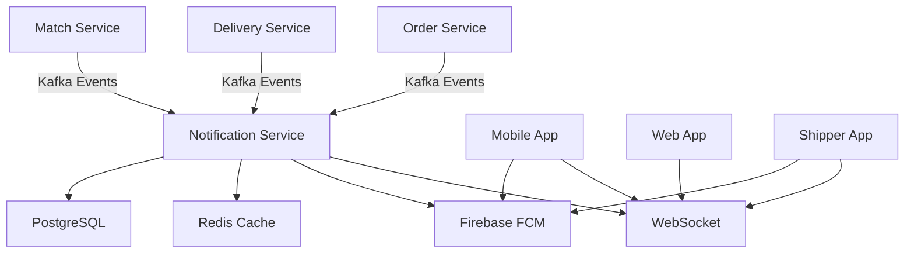

# 🔔 Notification Service - Real-time Notification System

## 📋 **Tổng quan**

Notification Service là microservice chuyên xử lý thông báo real-time cho hệ thống delivery với:

✅ **WebSocket** - Real-time notifications cho users đang online  
✅ **Redis** - Session management và caching  
✅ **Firebase FCM** - Push notifications cho mobile apps  
✅ **Kafka Integration** - Nhận events từ các services khác  
✅ **PostgreSQL** - Lưu trữ notification history  

## 🏗️ **Architecture Overview**



## 🔧 **Tech Stack**

| **Component** | **Technology** | **Purpose** |
|---------------|----------------|-------------|
| **Framework** | Spring Boot 3.5.3 | Core application framework |
| **WebSocket** | Spring WebSocket + STOMP | Real-time communication |
| **Cache** | Redis | Session management + caching |
| **Push Notifications** | Firebase FCM | Mobile push notifications |
| **Message Queue** | Apache Kafka | Event-driven communication |
| **Database** | PostgreSQL | Notification persistence |
| **Mapping** | MapStruct | Entity-DTO mapping |

## 📡 **WebSocket Configuration**

### Connection Endpoints
```javascript
// WebSocket connection with SockJS
const socket = new SockJS('/ws');
const stompClient = Stomp.over(socket);

// Connect and subscribe to user notifications
stompClient.connect({}, function(frame) {
    // Subscribe to personal notifications
    stompClient.subscribe('/topic/user/' + userId, function(message) {
        const notification = JSON.parse(message.body);
        handleNotification(notification);
    });
    
    // Subscribe to broadcast notifications
    stompClient.subscribe('/topic/notifications', function(message) {
        const notification = JSON.parse(message.body);
        handleBroadcastNotification(notification);
    });
});
```

### Message Types
```javascript
// Notification message
{
    "type": "NOTIFICATION",
    "userId": 123,
    "title": "Đơn hàng đã được tạo",
    "message": "Đơn hàng #456 từ Nhà hàng ABC đã được tạo thành công",
    "notificationType": "ORDER_CREATED",
    "priority": "MEDIUM",
    "relatedEntityId": 456,
    "relatedEntityType": "ORDER",
    "timestamp": "2025-08-05T10:30:00"
}

// Typing indicator
{
    "type": "TYPING",
    "userId": 123,
    "message": "John is typing...",
    "timestamp": "2025-08-05T10:30:00"
}

// Status update
{
    "type": "STATUS_UPDATE",
    "userId": 123,
    "message": "Order status updated to PREPARING",
    "timestamp": "2025-08-05T10:30:00"
}
```

## 🗃️ **Redis Integration**

### Session Management
```java
// Store user WebSocket session
redisService.storeUserSession(userId, sessionId);

// Check if user is online
boolean isOnline = redisService.isUserOnline(userId);

// Remove session on disconnect
redisService.removeUserSession(userId, sessionId);
```

### FCM Token Management
```java
// Store FCM token for push notifications
redisService.storeFcmToken(userId, fcmToken);

// Get all tokens for user
Set<Object> tokens = redisService.getUserFcmTokens(userId);

// Remove invalid token
redisService.removeFcmToken(userId, fcmToken);
```

### Notification Caching
```java
// Cache notification for quick access
redisService.cacheNotification(notificationId, notification);

// Get cached notification
Object cached = redisService.getCachedNotification(notificationId);
```

## 📱 **Firebase Push Notifications**

### Setup
1. Add `firebase-service-account.json` to `src/main/resources/`
2. Configure Firebase project credentials
3. Enable FCM API in Firebase Console

### Token Registration
```http
POST /api/firebase/register-token
Headers:
  X-User-Id: 123
  Content-Type: application/json

Body:
{
  "token": "firebase_fcm_token_here"
}
```

### Push Notification Flow
```java
// Send push notification to user
firebaseService.sendPushNotificationToUser(
    userId, 
    "Đơn hàng đã được tạo", 
    "Đơn hàng #456 từ Nhà hàng ABC", 
    Map.of("orderId", "456", "type", "ORDER_CREATED")
);

// Send topic-based notification (broadcast)
firebaseService.sendToTopic(
    "all_users", 
    "Thông báo hệ thống", 
    "Hệ thống sẽ bảo trì vào 2h sáng", 
    Map.of("type", "SYSTEM")
);
```

## 📨 **Kafka Event Integration**

### Consuming Events

#### Order Events
```java
@KafkaListener(topics = "order.created")
public void handleOrderCreatedEvent(@Payload OrderEvent event) {
    notificationService.sendOrderCreatedNotification(
        event.getUserId(),
        event.getOrderId(),
        event.getRestaurantName()
    );
}

@KafkaListener(topics = "order.status-updated")
public void handleOrderStatusUpdatedEvent(@Payload OrderEvent event) {
    notificationService.sendOrderStatusNotification(
        event.getUserId(),
        event.getOrderId(),
        event.getStatus(),
        event.getRestaurantName()
    );
}
```

#### Delivery Events
```java
@KafkaListener(topics = "delivery.status-updated")
public void handleDeliveryStatusUpdatedEvent(@Payload DeliveryEvent event) {
    notificationService.sendDeliveryStatusNotification(
        event.getUserId(),
        event.getDeliveryId(),
        event.getStatus(),
        event.getShipperName()
    );
}
```

#### Match Events (from Match Service)
```java
@KafkaListener(topics = "match.shipper-found")
public void handleMatchFoundEvent(@Payload MatchEvent event) {
    // Thông báo cho shipper về order phù hợp
    notificationService.sendShipperMatchFoundNotification(
        event.getShipperId(),
        event.getOrderId(),
        event.getRestaurantName(),
        event.getPickupAddress(),
        event.getDeliveryAddress(),
        event.getDistance(),
        event.getEstimatedPrice(),
        event.getEstimatedTime()
    );
}

@KafkaListener(topics = "match.shipper-accepted")
public void handleMatchAcceptedEvent(@Payload MatchEvent event) {
    // Thông báo cho customer về shipper đã nhận đơn
    notificationService.sendCustomerShipperAcceptedNotification(
        event.getUserId(),
        event.getOrderId(),
        event.getShipperName(),
        event.getShipperPhone(),
        event.getEstimatedTime()
    );
}
```

## 🛠️ **API Endpoints**

### Notification Management
```http
# Send notification
POST /api/notifications/send
Headers: X-User-Id: 123, X-Role: ADMIN

# Get user notifications
GET /api/notifications/user/123
Headers: X-User-Id: 123

# Get unread notifications
GET /api/notifications/unread
Headers: X-User-Id: 123

# Get unread count
GET /api/notifications/unread-count
Headers: X-User-Id: 123

# Mark as read
PUT /api/notifications/456/read
Headers: X-User-Id: 123

# Mark all as read
PUT /api/notifications/mark-all-read
Headers: X-User-Id: 123

# Delete notification
DELETE /api/notifications/456
Headers: X-User-Id: 123
```

### Firebase Token Management
```http
# Register FCM token
POST /api/firebase/register-token
Headers: X-User-Id: 123
Body: {"token": "fcm_token_here"}

# Unregister FCM token
POST /api/firebase/unregister-token
Headers: X-User-Id: 123
Body: {"token": "fcm_token_here"}
```

## 📊 **Database Schema**

### Notifications Table
```sql
CREATE TABLE notifications (
    id SERIAL PRIMARY KEY,
    user_id BIGINT NOT NULL,
    title VARCHAR(255) NOT NULL,
    message TEXT NOT NULL,
    type VARCHAR(50) NOT NULL,
    priority VARCHAR(20) DEFAULT 'MEDIUM',
    status VARCHAR(20) DEFAULT 'PENDING',
    is_read BOOLEAN DEFAULT FALSE,
    related_entity_id BIGINT,
    related_entity_type VARCHAR(50),
    data TEXT,
    sent_at TIMESTAMP,
    read_at TIMESTAMP,
    created_at TIMESTAMP DEFAULT CURRENT_TIMESTAMP,
    updated_at TIMESTAMP DEFAULT CURRENT_TIMESTAMP,
    creator_id BIGINT
);

-- Indexes for performance
CREATE INDEX idx_notifications_user_id ON notifications(user_id);
CREATE INDEX idx_notifications_user_status ON notifications(user_id, status);
CREATE INDEX idx_notifications_user_read ON notifications(user_id, is_read);
CREATE INDEX idx_notifications_created_at ON notifications(created_at);
```

## 🎯 **Notification Types**

| **Type** | **Description** | **Priority** | **Target** | **Channels** |
|----------|-----------------|--------------|------------|--------------|
| `ORDER_CREATED` | Order được tạo thành công | MEDIUM | Customer | WebSocket + Push |
| `ORDER_CONFIRMED` | Order được xác nhận | LOW | Customer | WebSocket + Push |
| `ORDER_PREPARING` | Đang chuẩn bị order | LOW | Customer | WebSocket |
| `ORDER_READY` | Order sẵn sàng | HIGH | Customer | WebSocket + Push |
| `ORDER_PICKED_UP` | Order đã được lấy | HIGH | Customer | WebSocket + Push |
| `ORDER_DELIVERED` | Order đã giao thành công | HIGH | Customer | WebSocket + Push |
| `ORDER_CANCELLED` | Order bị hủy | MEDIUM | Customer | WebSocket + Push |
| `MATCH_FOUND` | Tìm thấy order phù hợp | HIGH | Shipper | WebSocket + Push |
| `DELIVERY_REQUEST` | Yêu cầu giao hàng | HIGH | Shipper | WebSocket + Push |
| `SHIPPER_ACCEPTED` | Shipper đã nhận đơn | HIGH | Customer | WebSocket + Push |
| `SHIPPER_CONFIRMED` | Xác nhận nhận đơn | MEDIUM | Shipper | WebSocket |
| `DELIVERY_STARTED` | Bắt đầu giao hàng | HIGH | Customer | WebSocket + Push |
| `DELIVERY_COMPLETED` | Hoàn thành giao hàng | HIGH | Customer | WebSocket + Push |

## 🚀 **Deployment & Configuration**

### Environment Variables
```bash
# Database
SPRING_DATASOURCE_URL=jdbc:postgresql://localhost:5432/notification_service_db
SPRING_DATASOURCE_USERNAME=postgres
SPRING_DATASOURCE_PASSWORD=your_password

# Redis
SPRING_DATA_REDIS_HOST=localhost
SPRING_DATA_REDIS_PORT=6379

# Kafka
SPRING_KAFKA_BOOTSTRAP_SERVERS=localhost:9092

# Firebase
FIREBASE_SERVICE_ACCOUNT_KEY_PATH=classpath:firebase-service-account.json
```

### Docker Compose
```yaml
version: '3.8'
services:
  notification-service:
    build: .
    ports:
      - "8087:8087"
    environment:
      - SPRING_PROFILES_ACTIVE=docker
    depends_on:
      - postgres
      - redis
      - kafka

  postgres:
    image: postgres:15
    environment:
      POSTGRES_DB: notification_service_db
      POSTGRES_USER: postgres
      POSTGRES_PASSWORD: 123456
    ports:
      - "5432:5432"

  redis:
    image: redis:7-alpine
    ports:
      - "6379:6379"

  kafka:
    image: confluentinc/cp-kafka:latest
    ports:
      - "9092:9092"
```

## 📈 **Monitoring & Logging**

### Key Metrics to Monitor
- WebSocket connection count
- Notification delivery success rate
- Push notification delivery rate
- Redis cache hit rate
- Kafka consumer lag
- Database query performance

### Log Analysis
```bash
# WebSocket connections
grep "🔌" logs/notification-service.log

# Notification sending
grep "📤\|📡\|📱" logs/notification-service.log

# Kafka event processing
grep "📥\|✅\|💥" logs/notification-service.log

# Error tracking
grep "💥\|ERROR" logs/notification-service.log
```

## 🔄 **Event Flow Examples**

### Match Service Flow
```
1. Order Service tạo order → Match Service
2. Match Service tìm shipper phù hợp → Kafka: MatchFoundEvent
3. Notification Service nhận event → Send notification to shipper
4. Shipper accept/reject → Match Service → Kafka: MatchAcceptedEvent
5. Notification Service → Send confirmation to customer & shipper
```

### Order Created Flow
```
1. User tạo order → Order Service
2. Order Service → Kafka: OrderCreatedEvent
3. Notification Service nhận event
4. Tạo notification trong DB
5. Check user online → Send WebSocket
6. Get FCM tokens → Send push notification
7. Update notification status: SENT
```

### Delivery Status Flow
```
1. Shipper cập nhật status → Delivery Service
2. Delivery Service → Kafka: DeliveryStatusUpdatedEvent
3. Notification Service nhận event
4. Tạo delivery notification
5. Send real-time notification qua WebSocket
6. Send push notification nếu user offline
```

---

**🎯 Kết luận**: Notification Service cung cấp hệ thống thông báo real-time comprehensive với WebSocket, Redis caching, Firebase push notifications và Kafka event integration. Hỗ trợ đầy đủ các notification types cho delivery workflow! 🚀
