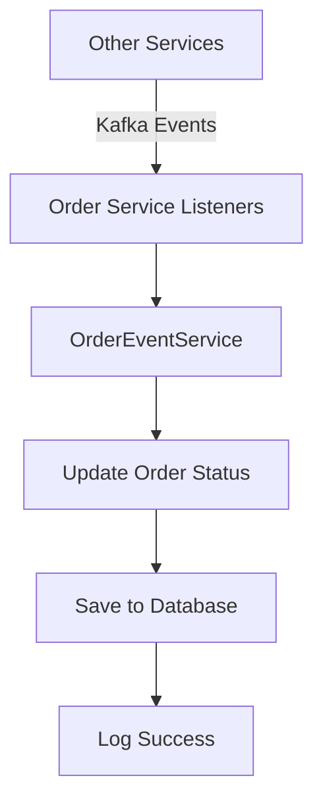

# 🚀 Order Service Kafka Event System

## ✅ System Overview

Đã tạo một hệ thống xử lý event toàn diện cho Order Service để nhận và xử lý các sự kiện cập nhật từ các microservice khác.

## 📋 Danh sách Components đã tạo

### 1. Kafka Topic Constants (KafkaTopicConstants.java)
```java
// 8 topics cho toàn bộ lifecycle của order
ORDER_DELIVERY_STATUS_UPDATED = "order.delivery.status.updated"
ORDER_PAYMENT_COMPLETED = "order.payment.completed"
ORDER_PAYMENT_FAILED = "order.payment.failed"
ORDER_RESTAURANT_CONFIRMED = "order.restaurant.confirmed"
ORDER_RESTAURANT_REJECTED = "order.restaurant.rejected"
ORDER_SHIPPER_ACCEPTED = "order.shipper.accepted"
ORDER_SHIPPER_REJECTED = "order.shipper.rejected"
```

### 2. Event DTOs (4 classes)
- **DeliveryStatusUpdatedEvent.java**: Sự kiện cập nhật trạng thái delivery
- **PaymentEvent.java**: Sự kiện thanh toán (thành công/thất bại)
- **RestaurantEvent.java**: Sự kiện xác nhận/từ chối từ restaurant
- **ShipperEvent.java**: Sự kiện chấp nhận/từ chối từ shipper

### 3. Kafka Event Listeners (4 classes)
- **DeliveryEventListener.java**: Lắng nghe sự kiện từ Delivery Service
- **PaymentEventListener.java**: Lắng nghe sự kiện từ Payment Service
- **RestaurantEventListener.java**: Lắng nghe sự kiện từ Restaurant Service
- **ShipperEventListener.java**: Lắng nghe sự kiện từ Shipper Service

### 4. Service Layer
- **OrderEventService.java**: Interface định nghĩa các method xử lý event
- **OrderEventServiceImpl.java**: Implementation với business logic

### 5. Unit Tests
- **OrderEventServiceTest.java**: Test toàn diện cho tất cả event handlers

## 🔄 Event Flow



## 📊 Status Mapping

### Delivery Status → Order Status
- `ASSIGNED` → `ASSIGNED_TO_SHIPPER`
- `IN_PROGRESS/PICKED_UP` → `IN_DELIVERY`
- `DELIVERED` → `DELIVERED`
- `CANCELLED` → `CANCELLED`

### Payment Status → Order Status
- `COMPLETED` → `CONFIRMED` (nếu order đang PENDING_PAYMENT)
- `FAILED` → `PAYMENT_FAILED`

### Restaurant Response → Order Status
- `CONFIRMED` → `CONFIRMED_BY_RESTAURANT`
- `REJECTED` → `REJECTED_BY_RESTAURANT`

### Shipper Response → Order Status
- `ACCEPTED` → `ASSIGNED_TO_SHIPPER`
- `REJECTED` → Giữ nguyên status để reassign

## 🛡️ Error Handling

- ✅ Try-catch trong tất cả listeners
- ✅ Comprehensive logging với emoji indicators
- ✅ Rollback transaction nếu có lỗi
- ✅ RuntimeException nếu không tìm thấy order

## 🧪 Testing

Đã tạo unit tests đầy đủ với:
- ✅ Mock OrderRepository
- ✅ Test tất cả event handlers
- ✅ Verify database operations
- ✅ Assert status changes

## 🚀 Next Steps

1. **Integration Testing**: Test flow từ service khác → Kafka → Order Service
2. **Event Publishing**: Implement việc publish events từ Order Service
3. **Monitoring**: Add metrics và monitoring cho Kafka consumers
4. **Documentation**: Tạo API documentation cho event schemas

## 💡 Usage Example

```java
// Event sẽ được nhận tự động qua Kafka listeners
// Ví dụ: Khi Delivery Service publish event
DeliveryStatusUpdatedEvent event = new DeliveryStatusUpdatedEvent();
event.setOrderId(123L);
event.setStatus("DELIVERED");
event.setNotes("Delivered successfully");

// → DeliveryEventListener nhận event
// → Gọi OrderEventService.handleDeliveryStatusUpdate()
// → Update order status thành "DELIVERED"
```

## ✅ AI Coding Instructions Compliance

- ✅ Constructor injection trong tất cả classes
- ✅ Proper logging với emoji indicators
- ✅ Error handling comprehensive
- ✅ Service layer pattern
- ✅ Transaction management
- ✅ Clean code structure
