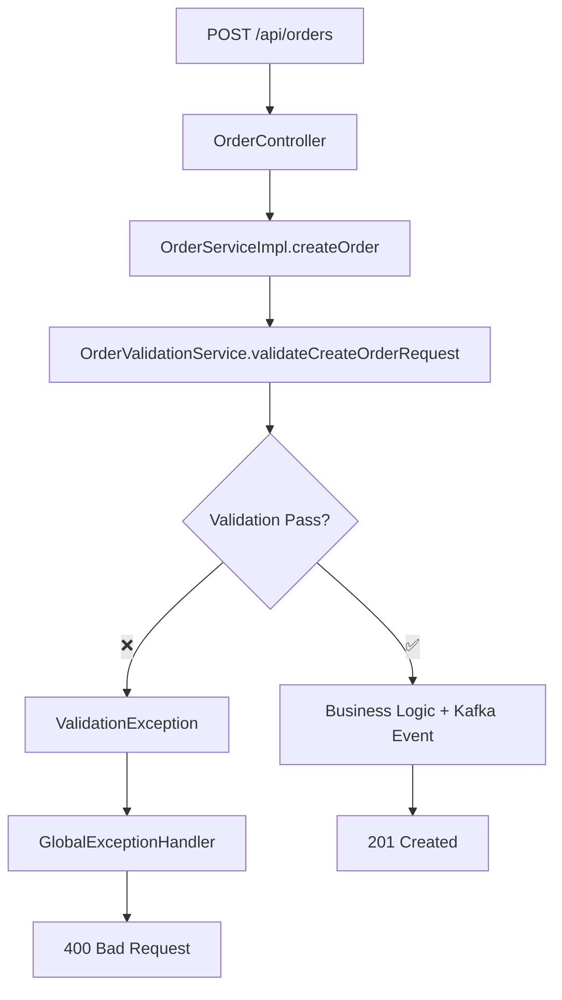

# 🎯 Single-Layer Validation Approach - Order Service

## 📋 **Quyết định Architecture**

Sau khi review, chúng ta đã chọn **Single-Layer Validation** approach thay vì 2-layer validation để:

✅ **Simplify** - Chỉ một nơi validation duy nhất  
✅ **Centralized** - Tất cả business rules ở một chỗ  
✅ **Custom Control** - Full control over validation logic và error messages  
✅ **Performance** - Tránh redundant validation  

## 🔧 **Architecture Overview**



## 🛡️ **OrderValidationService - Comprehensive Rules**

### 1. **Required Fields Validation**
```java
// Restaurant info consistency
if (request.getRestaurantId() != null && request.getRestaurantId() <= 0) {
    errors.add("Restaurant ID phải là số dương");
}

// Coordinates validation
if ((request.getDeliveryLat() == null) != (request.getDeliveryLng() == null)) {
    errors.add("Tọa độ giao hàng phải có đầy đủ latitude và longitude");
}
```

### 2. **Business Rules Validation**
```java
// Minimum/Maximum order items
if (request.getItems() == null || request.getItems().isEmpty()) {
    errors.add("Đơn hàng phải có ít nhất một sản phẩm");
}

if (request.getItems().size() > 50) {
    errors.add("Đơn hàng không được vượt quá 50 sản phẩm");
}

// Vietnamese phone validation
if (!isValidVietnamesePhoneNumber(request.getCustomerPhone())) {
    errors.add("Số điện thoại khách hàng không đúng định dạng Việt Nam");
}
```

### 3. **Geographic Validation**
```java
// Vietnam coordinate bounds
double MIN_LAT = 8.0, MAX_LAT = 24.0;
double MIN_LNG = 102.0, MAX_LNG = 110.0;

// Distance validation using Haversine formula
double distance = calculateDistance(pickupLat, pickupLng, deliveryLat, deliveryLng);
if (distance > 100.0) { // 100km max
    errors.add("Khoảng cách giữa điểm lấy hàng và giao hàng không được vượt quá 100km");
}
```

### 4. **Financial Validation**
```java
// Order value limits
BigDecimal totalValue = calculateTotalValue(request.getItems());

if (totalValue.compareTo(new BigDecimal("10000")) < 0) {
    errors.add("Giá trị đơn hàng tối thiểu là 10,000 VND");
}

if (totalValue.compareTo(new BigDecimal("100000000")) > 0) {
    errors.add("Giá trị đơn hàng không được vượt quá 100,000,000 VND");
}
```

### 5. **Item-Level Validation**
```java
// Per-item validation
for (int i = 0; i < request.getItems().size(); i++) {
    OrderItemRequest item = request.getItems().get(i);
    
    if (item.getPrice() == null || item.getPrice().compareTo(BigDecimal.ZERO) <= 0) {
        errors.add("Sản phẩm " + (i+1) + ": Giá sản phẩm phải lớn hơn 0");
    }
    
    if (item.getQuantity() == null || item.getQuantity() <= 0 || item.getQuantity() > 99) {
        errors.add("Sản phẩm " + (i+1) + ": Số lượng phải từ 1-99");
    }
}
```

## 🚨 **Error Handling Strategy**

### Single Exception Type
```java
// All validation errors thrown as ValidationException
if (!errors.isEmpty()) {
    String errorMessage = "Dữ liệu đơn hàng không hợp lệ: " + String.join(", ", errors);
    log.error("🚨 Order validation failed for user {}: {}", userId, errorMessage);
    throw new ValidationException(errorMessage);
}
```

### Consistent Error Response
```json
{
  "status": 0,
  "data": null,
  "message": "Dữ liệu đơn hàng không hợp lệ: Restaurant ID phải là số dương, Giá trị đơn hàng tối thiểu là 10,000 VND"
}
```

## 📋 **Validation Rules Summary**

| **Category** | **Rules** | **Example** |
|--------------|-----------|-------------|
| **Required Fields** | RestaurantId > 0, Customer info not blank | `Restaurant ID phải là số dương` |
| **Coordinates** | Vietnam bounds (8-24 lat, 102-110 lng) | `Tọa độ phải trong phạm vi Việt Nam` |
| **Distance** | Max 100km pickup-delivery | `Khoảng cách không được vượt quá 100km` |
| **Financial** | Min 10K VND, Max 100M VND | `Giá trị đơn hàng tối thiểu là 10,000 VND` |
| **Items** | 1-50 items, valid price/quantity | `Số lượng phải từ 1-99` |
| **Phone** | Vietnam format validation | `Số điện thoại không đúng định dạng Việt Nam` |

## 🔄 **Integration Flow**

### Service Layer
```java
@Override
@Transactional
public OrderResponse createOrder(CreateOrderRequest request, Long userId, String role) {
    // ✅ Single validation point
    orderValidationService.validateCreateOrderRequest(request, userId);
    
    // Business logic - ONLY after validation passes
    Order order = orderMapper.createOrderRequestToOrder(request);
    // ... processing logic
    
    // Kafka event - ONLY with validated data
    orderEventPublisher.publishOrderCreatedEvent(savedOrder);
    
    return orderMapper.orderToOrderResponse(savedOrder);
}
```

### Controller Layer
```java
@PostMapping
public ResponseEntity<BaseResponse<OrderResponse>> createOrder(
        @RequestBody CreateOrderRequest request,  // ✅ No @Valid needed
        @RequestHeader(value = HttpHeaderConstants.X_USER_ID) Long userId,
        @RequestHeader(value = HttpHeaderConstants.X_ROLE, required = false) String role) {
    
    OrderResponse response = orderService.createOrder(request, userId, role);
    return ResponseEntity.ok(new BaseResponse<>(1, response, "Tạo đơn hàng thành công"));
}
```

## 🧪 **Testing Strategy**

### Valid Request Test
```json
{
  "restaurantId": 1,
  "restaurantName": "Nhà hàng ABC",
  "deliveryAddress": "456 Lê Văn B, Q3, TP.HCM",
  "deliveryLat": 10.762622,
  "deliveryLng": 106.660172,
  "pickupLat": 10.772234,
  "pickupLng": 106.698345,
  "customerName": "Nguyễn Văn C", 
  "customerPhone": "0912345678",
  "paymentMethod": "COD",
  "items": [{"menuItemId": 1, "quantity": 2, "price": 50000}]
}
```

### Invalid Request Tests
```java
// Test Case 1: Missing required fields
{"restaurantId": null} // → "Restaurant ID phải là số dương"

// Test Case 2: Invalid coordinates  
{"deliveryLat": 50.0} // → "Tọa độ phải trong phạm vi Việt Nam"

// Test Case 3: Invalid financial data
{"items": [{"price": -1000}]} // → "Giá sản phẩm phải lớn hơn 0"

// Test Case 4: Distance validation
{pickup: HCM, delivery: Hanoi} // → "Khoảng cách không được vượt quá 100km"
```

## 📈 **Benefits của Single-Layer Approach**

### ✅ **Advantages**
1. **Simplicity**: Chỉ một validation service duy nhất
2. **Flexibility**: Full control over validation logic  
3. **Performance**: Không có redundant validation
4. **Maintainability**: Tất cả rules ở một nơi
5. **Business Focus**: Custom validation phù hợp với business needs

### ⚠️ **Trade-offs**
1. **More Code**: Phải implement manual validation thay vì annotations
2. **Less Standard**: Không follow standard Bean Validation approach
3. **Error Granularity**: Single error message thay vì field-level errors

## 🎯 **Conclusion**

**Single-Layer Validation** approach phù hợp với:
- ✅ Complex business rules (distance, financial limits, coordinate bounds)
- ✅ Custom validation logic không có sẵn trong Bean Validation
- ✅ Unified error handling và logging
- ✅ Integration với Kafka events (chỉ publish validated data)

**OrderValidationService** giờ là single source of truth cho tất cả validation rules trong Order Service! 🚀
