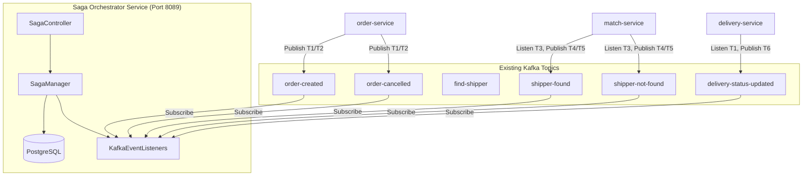

# Saga Orchestrator Service — Architecture Design (PostgreSQL + Existing Topics)

## Bối cảnh hiện tại

Hệ thống microservices gồm **13 services** sử dụng **Kafka** làm event bus. Saga orchestrator hiện tại là **stub**.
Theo yêu cầu của bạn, kiến trúc mới sẽ tuân thủ:
1. **Database**: Sử dụng **PostgreSQL** để đảm bảo tính bền vững (Persistence) của Saga state.
2. **Kafka Strategy**: **Giữ nguyên các topics hiện có** của các service (order, delivery, match...). Orchestrator sẽ đóng vai trò là Subscriber để lắng nghe và điều phối trạng thái.
3. **Port Fix**: Đổi port của `saga-orchestrator-service` từ `8090` sang **`8089`** để tránh conflict với `tracking-service`.

---

## 1. Kiến trúc tổng quan

Saga Orchestrator sẽ theo dõi vòng đời của một đơn hàng bằng cách lắng nghe các sự kiện (Events) được phát ra từ các microservices khác và lưu trữ trạng thái hiện tại vào PostgreSQL.



---

## 2. Các luồng xử lý chính

### A. Luồng Đặt hàng (Order Creation)
1. **User** gọi `POST /api/create-order` tới Orchestrator.
2. **Orchestrator** gọi REST sang `order-service` để tạo đơn (PENDING).
3. **Orchestrator** tạo bản ghi Saga trong PostgreSQL với trạng thái `ORDER_CREATED`.
4. **Orchestrator** lắng nghe Topic `order.created` (hoặc reply từ service).
5. Khi nhận được event, Orchestrator cập nhật bước tiếp theo: Thông báo cho `delivery-service`.

### B. Luồng Tìm Shipper (Matching)
1. **Orchestrator** lắng nghe Topic `shipper.matched` từ `match-service`.
2. Nếu nhận được `shipper.matched`: Cập nhật Saga -> Chuyển sang bước gán đơn (Assign).
3. Nếu nhận được `no-shipper-available`: Thực hiện **Compensation** (Huỷ đơn hàng, hoàn tiền nếu có).

---

## 3. Database Schema (PostgreSQL)

Sử dụng JPA để quản lý các bảng sau:

```sql
-- Lưu thông tin tổng quát của một chuỗi Saga
CREATE TABLE saga_instances (
    id              UUID PRIMARY KEY,
    type            VARCHAR(50), -- ORDER_CREATION, CANCELLATION
    status          VARCHAR(50), -- STARTED, COMPLETED, FAILED, COMPENSATING
    order_id        BIGINT,
    payload         JSONB,       -- Dữ liệu context của đơn hàng
    created_at      TIMESTAMP DEFAULT NOW(),
    updated_at      TIMESTAMP DEFAULT NOW()
);

-- Lưu lịch sử chi tiết từng bước (Step)
CREATE TABLE saga_steps (
    id              SERIAL PRIMARY KEY,
    saga_id         UUID REFERENCES saga_instances(id),
    step_name       VARCHAR(100),
    status          VARCHAR(30), -- SUCCESS, FAILURE, COMPENSATED
    executed_at     TIMESTAMP
);
```

---

## 4. Kế hoạch triển khai (Phased)

### Phase 1: Infrastructure & Port Fix
- Đổi port sang `8089`.
- Cấu hình kết nối PostgreSQL trong `application.properties`.
- Định nghĩa Entity `SagaInstance` và `SagaStep`.

### Phase 2: Listener Integration (Sử dụng Topic có sẵn)
- Kết nối `KafkaEventListener` với các topic hiện có: `order-created`, `shipper-matched`, v.v.
- Viết logic cập nhật trạng thái vào DB khi nhận Event.

### Phase 3: Orchestration Logic
- Triển khai `SagaManager` để quyết định bước tiếp theo dựa trên trạng thái hiện tại trong DB.
- Xử lý các trường hợp timeout (ví dụ: chờ shipper accept quá lâu).

### Phase 4: Compensation (Rollback)
- Viết logic tự động gọi REST huỷ đơn (`order-service/cancel`) nếu các bước sau thất bại.

---

## 5. Verification Plan
- Kiểm tra logs của Saga Orchestrator khi thực hiện đặt hàng trên App.
- Truy vấn DB PostgreSQL để xác nhận trạng thái các bước được lưu đúng.
1. **Order Creation Flow**: Đặt 1 đơn hàng từ delivery_app → Kiểm tra `saga_instances` table → Xác nhận tất cả steps completed.
2. **Cancellation Flow**: Huỷ đơn đang có shipper → Kiểm tra shipper được release, delivery cancelled, order cancelled.
3. **Shipper Not Found**: Đặt đơn khi không có shipper online → Kiểm tra retry logic + compensation sau max retries.
4. **Kafka Monitoring**: Dùng `kafka-console-consumer` để verify messages trên từng topic.

> [!TIP]
> Bạn nên bắt đầu từ **Phase 1 + Phase 2** trước vì Order Creation là luồng quan trọng nhất và sẽ thiết lập nền tảng cho các saga khác.
